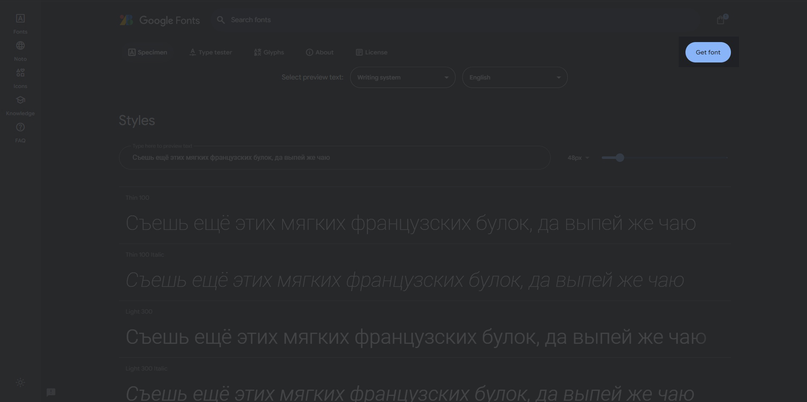
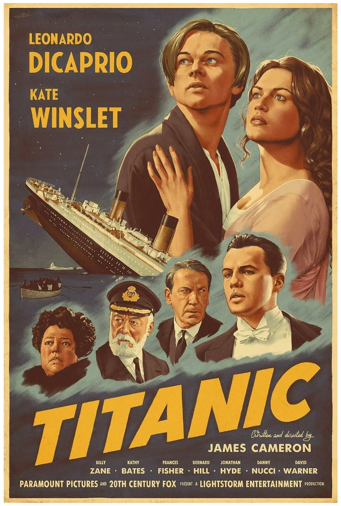

# HTML и CSS

- [Урок 1. Введение в HTML и CSS](#урок-1-введение-в-html-и-css)
- [Урок 2. Базовые теги](#урок-2-базовые-теги)
- [Урок 3. Атрибуты тегов в HTML](#урок-3-атрибуты-тегов-в-html)
- [Урок 4. Вложенность тегов. Блочные и строчные теги.](#урок-4-вложенность-тегов-блочные-и-строчные-теги)
- [Урок 5. Введение в CSS](#урок-5-введение-в-css)
- [Урок 6. Базовая стилизация.](#урок-6-базовая-стилизация)
- [Урок 7: Семантическая разметка и использование семантических тегов.](#урок-7-семантическая-разметка-и-использование-семантических-тегов)
- [Урок 8: Шрифты в CSS. Google Fonts](#урок-8-шрифты-в-css-google-fonts)
- [Урок 9: Расширенная работа с селекторами и наследование](#урок-9-расширенная-работа-с-селекторами-и-наследование)
- [Урок 10: Flexbox](#урок-10-flexbox)
- [Урок 11: CSS Grid Layout](#урок-11-css-grid-layout)
- [Урок 12: Адаптивная верстка. Работа с медиа-запросами](#урок-12-адаптивная-верстка-работа-с-медиа-запросами)
- [Урок 13. Стилизация input](#урок-13-стилизация-input)

## Урок 1. Введение в HTML и CSS

### 1.1 Что такое HTML?

`HTML` **(HyperText Markup Language)** - это **язык разметки гипертекста**, используемый для **создания структуры и содержимого веб-страниц**. Он помогает **браузерам** понимать, как отображать **элементы на странице**.

**Пример простейшего HTML-документа**:

```html
<!DOCTYPE html>
<html>
  <head>
    <title>Моя первая страница</title>
    <style></style>
  </head>
  <body>
    <h1>Заголовок страницы</h1>
    <p>Это мой первый параграф.</p>
  </body>
</html>
```

**В этом примере**:

- `<!DOCTYPE html>` - объявление **типа** документа. Это декларация типа документа `(DOCTYPE)`, которая указывает браузеру, что документ написан на `HTML5`. Она должна быть **первой строкой в HTML-документе**.
- `<html>` - **корневой** элемент документа. **Основной тег**, который содержит все остальные теги HTML-документа.
- `<head>` - содержит **метаинформацию** о странице. Тег, который содержит **метаинформацию о документе**, такие как заголовок, ссылки на стили и скрипты.
- `<title>` - **заголовок** страницы, отображаемый в строке заголовков браузера.
- `<body>` - содержит **основное содержимое** страницы.
- `<h1>` и `<p>` - элементы **заголовка** и **параграфа** соответственно.

### 1.2 Роль HTML в веб-разработке

- **Структурная разметка**: `HTML` определяет **структуру веб-страницы**, указывая, что является **заголовком**, **параграфом**, **ссылкой**, **изображением** и т.д.
- **Содержимое страницы**: `HTML` **содержит все текстовое и графическое содержимое страницы**.
- **Связи между страницами**: `HTML` позволяет создавать **гиперссылки, которые связывают страницы между собой**.

### 1.3 HTML5

`HTML5` — это пятая и последняя **значительная версия языка гипертекстовой разметки** (HTML), используемого для структурирования и представления гипертекстовых документов в Интернете. Несмотря на то, что HTML5 часто рассматривается как отдельная версия, она теперь больше считается **«живым стандартом»**, постоянно обновляемым на основе обратной связи от разработчиков, поставщиков и других заинтересованных сторон.

### 1.4 Основные особенности HTML5:

- **Новые элементы и атрибуты**: Введены новые **семантические элементы**, такие как `<header>`, `<nav>`, `<main>`, `<section>`, `<article>`, `<aside>`, `<footer>`, а также элементы для мультимедиа, такие как `<video>` и `<audio>`.
- **Улучшенная поддержка мультимедиа**: Возможность добавлять **видео** и **аудио** без использования сторонних плагинов, таких как Flash.
- **Локальное хранилище и кэширование**: Поддержка **локального хранения данных** и **кэширования веб-приложений** для офлайн-работы.
- **Геолокация и `drag-and-drop`**: Возможности геолокации и перетаскивания элементов.
- **Улучшенная совместимость**: Улучшение совместимости между браузерами и упрощение рендеринга страниц.

### 1.5 Другие версии HTML

1. `HTML 1.0`: Первая версия HTML, выпущенная в 1993 году.
2. `HTML 2.0`: Выпущена в 1995 году, добавила поддержку **таблиц** и **форм**.
3. `HTML 3.2`: Рекомендована W3C в 1997 году, включала расширения для презентации, такие как элементы `<center>` и `<font>`.
4. `HTML 4.0` и `HTML 4.01`: Выпущены в 1998 и 1999 годах соответственно, подчеркивали разделение презентации и структуры, а также улучшали доступность.
5. `XHTML 1.0` и `XHTML 1.1`: Выпущены в 2000 и 2001 годах, представляли собой более строгую, основанную на XML версию HTML.

### 1.6 Переход к HTML5 и «Живому Стандарту»:

- `HTML5`: Официально рекомендована `W3C` **(World Wide Web Consortium)** в октябре 2014 года, но теперь считается частью **«Живого Стандарта» HTML**, который постоянно обновляется.
- `HTML Living Standard`: Поддерживается `WHATWG` **(Web Hypertext Application Technology Working Group)** и `W3C`, представляет собой непрерывно обновляемый стандарт, не привязанный к конкретным версиям.

Таким образом, `HTML5` является последней значительной версией `HTML`, после которой стандарт перешел к концепции **«Живого Стандарта»**, обеспечивая постоянное развитие и обновление языка.

### 1.7 Что такое CSS?

`CSS` **(Cascading Style Sheets)** - это **язык таблиц стилей**, используемый для **стилизации** и **компоновки** веб-страниц. `CSS` позволяет **изменять внешний вид элементов** `HTML`, **добавляя цвета**, **шрифты**, **размеры** и другие стили.

**Пример простейшего CSS-кода**:

```html
<style>
  body {
    background-color: #f2f2f2; /* Цвет фона */
    font-family: Arial, sans-serif; /* Шрифт */
  }

  h1 {
    color: #00698f; /* Цвет текста заголовка */
    font-size: 24px; /* Размер шрифта заголовка */
  }
</style>
```

**В этом примере**:

- `body` - **селектор**, **выбирающий элемент `<body>`**.
- `background-color` - **свойство**, **изменяющее цвет фона**.
- `font-family` - **свойство**, **изменяющее шрифт**.
- `h1` - **селектор**, **выбирающий элементы `<h1>`**.
- `color` - **свойство**, **изменяющие цвет текста заголовков соответственно**.
- `font-size` - **свойство**, **изменяющие размер текста заголовков соответственно**.

### 1.8 Роль CSS в веб-разработке

- **Стилизация**: `CSS` позволяет **добавлять цвета, шрифты, размеры** и другие стили к элементам `HTML`, делая страницу **более привлекательной**.
- **Компоновка**: `CSS` помогает **расположить элементы на странице**, создавая **адаптивные и респонсивные дизайны**.
- **Анимация и интерактивность**: `CSS` может добавлять **анимации и другие декоративные элементы**, улучшая пользовательский опыт.

### 1.9 Настройка VSCode.

#### 1. Установка Visual Studio Code

- **Скачайте VSCode**: Перейдите на **официальный сайт VSCode**(https://code.visualstudio.com/) и скачайте установочный файл для Windows.
- **Установите VSCode**: Запустите установочный файл и следуйте инструкциям на экране.

#### 2. Установка и настройка плагинов

#### Плагин **Prettier**

- **Описание**: `Prettier` — это плагин, который **автоматически форматирует код**, чтобы он был более читабельным и последовательным.
- **Установка**:

  - Откройте `VSCode`.
  - Перейдите в раздел `"Extensions"` (Расширения) в левой панели.
  - В поисковом поле введите `"Prettier"` и выберите плагин `"Prettier - Code formatter"`.
  - Нажмите на кнопку `"Install"` для установки.

- **Настройка для `HTML`, `CSS`, `JS`**:

  - Открыть файл настроек `settings.json`:
    - **Используйте сочетание клавиш**: Нажмите `Ctrl + ,` (это откроет настройки в графическом интерфейсе).
    - **Перейдите к файлу `JSON`**: В **правом верхнем углу окна настроек вы увидите значок с открытой папкой или ссылку на `"Open Settings (JSON)"`**. Нажмите на него, чтобы открыть файл `settings.json` для редактирования.
  - В файле настроек **добавьте**:
    ```json
    "[html]": {
        "editor.defaultFormatter": "esbenp.prettier-vscode"
    },
    "[css]": {
        "editor.defaultFormatter": "esbenp.prettier-vscode"
    },
    "[javascript]": {
        "editor.defaultFormatter": "esbenp.prettier-vscode"
    },
    ```

- **Настройка горячей клавиши для Prettier**:

  - откройте файл клавиатурных сокращений `(Ctrl + K, Ctrl + S)` и найдите команду `"Format Document"`. Вы можете изменить сочетание клавиш **на любое**.

#### Плагин **HTML to CSS completion suggestions**

- **Описание**: Этот плагин предлагает **автодополнение CSS-селекторов** на основе **классов** и **идентификаторов**, определенных в **HTML-файлах**.
- **Установка**:
  - Перейдите в раздел `"Extensions"` (Расширения) в левой панели.
  - В поисковом поле введите `"HTML to CSS completion suggestions"` и выберите соответствующий плагин.
  - Нажмите на кнопку `"Install"` для установки.
- **Настройка**:
  - После установки, плагин будет **работать автоматически**, предлагая автодополнение **CSS-селекторов** при написании **CSS-кода**.

#### Плагин **IntelliSense for CSS class names in HTML**

- **Описание**: Этот плагин улучшает `IntelliSense` для **CSS-классов** в **HTML-файлах**, предлагая **автодополнение** и **подсказки**.
- **Установка**:
  - Перейдите в раздел `"Extensions"` (Расширения) в левой панели.
  - В поисковом поле введите `"IntelliSense for CSS class names in HTML"` и выберите соответствующий плагин.
  - Нажмите на кнопку `"Install"` для установки.
- **Настройка**:
  - После установки, плагин будет работать автоматически, предлагая автодополнение и подсказки для CSS-классов при написании HTML-кода.

#### Плагин **Live Server**

- **Описание**: `Live Server` — это плагин, который позволяет** запускать локальный сервер для тестирования веб-страниц в реальном времени**.
- **Установка**:
  - Перейдите в раздел `"Extensions"` (Расширения) в левой панели.
  - В поисковом поле введите `"Live Server"` и выберите соответствующий плагин.
  - Нажмите на кнопку `"Install"` для установки.
- Настройка:
  - После установки, вы можете **запустить `Live Server`**, кликнув **правой кнопкой мыши на файл HTML и выбрав `"Open with Live Server"`**.
  - `Live Server` будет запущен, и вы сможете видеть **изменения на вашей веб-странице в реальном времени**.

## Урок 2. Базовые теги

### 2.1 Тег

`Тег` — это **элемент, который используется для создания структуры и оформления веб-страницы**. Каждый тег обозначает определённый **тип содержимого или функциональности**. Теги заключаются **в угловые скобки**, например, `<tagname>`, и могут иметь **открывающий и закрывающий элементы**. **Закрывающий тег** обозначается с **косой чертой**, например, `</tagname>`.

### 2.2 Тег `<html>`

Тег `<html>` является **корневым элементом любого HTML-документа**.

Он служит **контейнером** для всех других элементов и тегов, которые составляют **структуру веб-страницы**.

Этот тег **указывает браузеру**, что содержимое между открывающим `<html>` и закрывающим `</html>` тегами **является HTML-кодом**.

**Пример**:

```html
<!DOCTYPE html>
<html lang="ru">
  <head>
    <meta charset="UTF-8" />
    <meta name="viewport" content="width=device-width, initial-scale=1.0" />
    <title>Пример страницы</title>
  </head>
  <body>
    <h1>Добро пожаловать на мою страницу!</h1>
    <p>Это пример использования тега &lt;html&gt;.</p>
  </body>
</html>
```

### 2.3 Для чего нужен тег `<html>`:

- **Определение документа**: Тег `<html>` сообщает браузеру, что это **HTML-документ**, что позволяет ему правильно интерпретировать и отображать содержимое.
- **Структурирование**: Он помогает организовать **структуру страницы**, так как все другие элементы, такие как `<head>` и `<body>`, должны находиться **внутри этого тега**.
- **Указание языка**: Атрибут `lang` может быть использован для указания **языка документа**, что важно для доступности и `SEO`.

Теги могут также содержать атрибуты, которые предоставляют дополнительную информацию о элементе. Например, тег `` для вставки изображения требует атрибут `src`, указывающий путь к изображению.

### 2.4 Тег `<head>`

**Тег `<head>`** является частью **HTML-документа** и используется для определения **метаданных о веб-странице**.

**Метаданные** — это информация, которая **не отображается непосредственно на странице, но важна для браузеров, поисковых систем** и других сервисов.

**Пример**:

```html
<!DOCTYPE html>
<html lang="ru">
  <head>
    <meta charset="UTF-8" />
    <meta name="viewport" content="width=device-width, initial-scale=1.0" />
    <meta
      name="description"
      content="Это пример страницы с использованием тега head."
    />
    <title>Пример страницы</title>
    <link rel="stylesheet" href="styles.css" />
    <script src="script.js"></script>
  </head>
  <body>
    <h1>Добро пожаловать на мою страницу!</h1>
    <p>Это пример использования тега &lt;head&gt;.</p>
  </body>
</html>
```

Внутри тега `<head>` могут находиться различные элементы, такие как:

- `<title>`: задает **заголовок страницы**, который отображается на вкладке браузера.
- `<meta>`: предоставляет **информацию о странице**, такую как кодировка, описание, ключевые слова и автор.
- `<link>`: используется для **подключения внешних ресурсов**, таких как **таблицы стилей (CSS)**.
- `<script>`: позволяет подключать **JavaScript-файлы**.

### 2.5 Для чего нужен тег `<head>`

- **Определение заголовка страницы**: Заголовок, указанный в теге `<title>`, отображается в заголовке окна браузера и в результатах поиска.
- **Метаданные**: Тег `<head>` позволяет добавлять **метаданные, которые помогают поисковым системам индексировать страницу и определять ее содержание**.
- **Подключение ресурсов**: С помощью тегов `<link>` и `<script>` можно подключать внешние **стили** и **скрипты**, что позволяет улучшить **функциональность и внешний вид страницы**.

### 2.6 Тег `<body>`

**Тег `<body>`** определяет **основное содержимое веб-страницы, которое отображается в браузере**.

Все элементы, которые пользователь видит на странице, такие как **текст**, **изображения**, **ссылки**, **таблицы** и другие медиафайлы, располагаются внутри этого тега.

Тег `<body>` следует за тегом `<head>` и является важной частью структуры **HTML-документа**.

**Пример**:

```html
<!DOCTYPE html>
<html lang="ru">
  <head>
    <meta charset="UTF-8" />
    <meta name="viewport" content="width=device-width, initial-scale=1.0" />
    <title>Пример страницы</title>
  </head>
  <body>
    <h1>Добро пожаловать на мою страницу!</h1>
    <p>Это пример использования тега &lt;body&gt;.</p>
    
    <a href="https://google.com">Перейти на сайт</a>
  </body>
</html>
```

**Тег `<body>`** является ключевым элементом для отображения контента на веб-странице и играет важную роль в структуре HTML-документа.

### 2.7 Теги `<h1>`-`<h6>`, `<p>`, ``, `<a>`.

1. **Теги заголовков**: `<h1>` - `<h6>`

   **Теги `<h1>` до `<h6>`** используются для создания **заголовков различного уровня**. `<h1>` — это заголовок самого высокого уровня, а `<h6>` — самого низкого.

   Они помогают **структурировать контент** и делают его более доступным для пользователей и поисковых систем.

   Эти теги важны для `SEO`, так как поисковые системы используют их для понимания структуры и иерархии контента на странице. Заголовки также улучшают читаемость текста.

   **Пример использования**:

   ```html
   <!-- Заголовок первого уровня -->
   <h1>Главный заголовок страницы</h1>
   <!-- Заголовок второго уровня -->
   <h2>Подзаголовок первого уровня</h2>
   <!-- Заголовок третьего уровня -->
   <h3>Подзаголовок второго уровня</h3>
   ```

2. **Тег `<p>`**

   Тег `<p>` используется для определения параграфа текста. Он автоматически добавляет отступы сверху и снизу, что улучшает читаемость.

   Этот тег помогает структурировать текст, разбивая его на логические блоки, что делает его более удобным для восприятия.

   **Пример использования**:

   ```html
   <p>Это пример параграфа текста. Он содержит информацию о чем-то важном.</p>
   ```

3. **Тег ``**

   **Тег ``** используется для **вставки изображений на веб-страницу**. Он является самозакрывающимся, то есть не требует закрывающего тега.

   Этот тег позволяет добавлять **визуальный контент**, который может улучшить восприятие информации и сделать страницу более привлекательной.

   **Пример использования**:

   ```html
   <!-- Вставка изображения с альтернативным текстом -->
   
   ```

4. **Тег `<a>`**

   **Тег `<a>`** используется для создания **гиперссылок**. Он позволяет пользователям переходить на **другие страницы или ресурсы**.

   Этот тег важен для **навигации** по веб-сайту и для **связи с внешними ресурсами**. Он также помогает улучшить `SEO`, связывая страницы между собой.

   **Пример использования**:

   ```html
   <!-- Гиперссылка на внешний ресурс -->
   <a href="https://example.com">Перейти на сайт</a>
   ```

**В Заключении**

Эти теги являются **основными строительными блоками HTML-документов** и играют ключевую роль в создании структурированного и доступного контента на веб-страницах.

Использование **заголовков**, **параграфов**, **изображений** и **ссылок** помогает организовать информацию и улучшить взаимодействие с пользователями.

### Практика. Теги.

1. **Создание личной страницы**

   - **Задание**: Создайте простую личную страницу, используя теги `<html>`, `<head>`, `<h1>`, `<p>`, и ``. Включите заголовок с **вашим именем**, **краткое описание о себе** и **изображение** (например, ваше фото или любое другое изображение).

2. **Страница с любимыми книгами**

   - **Задание**: Создайте страницу, на которой перечислены ваши любимые книги. Используйте теги `<h2>` для названий книг и `<p>` для краткого описания каждой книги. Добавьте ссылки на страницы с информацией о каждой книге, используя тег `<a>`.

3. **Галерея изображений**

   - **Задание**: Создайте простую галерею изображений. Используйте теги `<h1>` для заголовка страницы, а также теги `` для вставки изображений. Каждое изображение должно иметь подпись, написанную с помощью тега `<p>`.

4. **Страница с рецептом**

   - **Задание**: Создайте страницу с рецептом вашего любимого блюда. Используйте тег `<h1>` для названия рецепта, теги `<h2>` для названий ингредиентов и шагов приготовления, а также теги `<p>` для описания каждого шага. Добавьте ссылку на видео с приготовлением блюда с помощью тега `<a>`.

5. **Контактная информация**
   - **Задание**: Создайте страницу с вашей контактной информацией. Используйте тег `<h1>` для заголовка "Контакты", теги `<p>` для указания вашего адреса, номера телефона и электронной почты. Добавьте ссылку на вашу страницу в социальных сетях с помощью тега `<a>`.

## Урок 3. Атрибуты тегов в HTML

### 3.1 Атрибуты в HTML

**Атрибуты в HTML** — это **дополнительные параметры**, которые можно **добавлять к тегам** для **настройки их поведения и внешнего вида**.

Они **позволяют** разработчикам **задавать специфические характеристики элементов**, такие как **ссылки**, **размеры**, **идентификаторы** и многое другое.

**Атрибуты** всегда **записываются внутри открывающего тега** элемента и имеют следующую структуру: `имя="значение"`.

### 3.2 Примеры использования атрибутов

1. **Атрибут `src` для изображений.**

   Атрибут `src` используется в теге `` для указания пути к изображению.

   Например:

   ```html
   
   ```

2. **Атрибут `href` для ссылок.**

   Атрибут `href` используется в теге `<a>` для указания `URL`, на который будет вести ссылка.

   Например:

   ```html
   <a href="https://www.example.com">Перейти на Example</a>
   ```

3. **Атрибуты `width` и `height` для изображений.**

   Эти атрибуты задают размеры изображения в пикселях.

   Например:

   ```html
   
   ```

4. **Атрибут `target` для ссылок.**

   Атрибут target определяет, как будет открываться ссылка. Значение \_blank указывает, что ссылка должна открываться в новой вкладке или окне браузера.

   Например:

   ```html
   <a href="https://www.example.com" target="_blank">Открыть в новой вкладке</a>
   ```

5. **Атрибут `class` для стилизации.**

   Атрибут class позволяет назначать классы элементам, что может быть полезно для стилизации.

   Например:

   ```html
   <p class="important">Это важный текст.</p>
   ```

6. **Атрибут `id` для уникальной идентификации.**

   Атрибут id задает уникальный идентификатор для элемента.

   Например:

   ```html
   <h1 id="main-title">Заголовок страницы</h1>
   ```

7. **Атрибут `title` для подсказок.**

   Атрибут `title` предоставляет дополнительную информацию о элементе, которая отображается при наведении курсора.

   Например:

   ```html
   <a href="https://www.example.com" title="Перейти на Example">Example</a>
   ```

### 3.3 Типы атрибутов

**Атрибуты** в HTML можно **классифицировать на несколько типов** в зависимости от их назначения и использования. **Рассмотрим** основные типы атрибутов и приведем примеры для каждого из них.

1. **Стандартные атрибуты**

- **Атрибут `id`**

  **Атрибут `id` задает уникальный идентификатор для элемента на странице**. Он должен быть **уникальным в пределах документа**.

  ```html
  <h1 id="main-title">Главный заголовок</h1>
  <p id="first-paragraph">Это первый абзац текста.</p>
  ```

- **Атрибут `class`**

  **Атрибут `class` позволяет назначать классы элементам**, что может быть полезно для **группировки элементов** и **применения стилей**.

  ```html
  <p class="highlight">Этот текст выделен.</p>
  <div class="container">Содержимое контейнера.</div>
  ```

- **Атрибут `style`**

  **Атрибут `style` позволяет задавать инлайновые стили для элемента**. Это **не рекомендуется для больших проектов**, но может быть полезно для быстрого тестирования.

  ```html
  <p style="color: red; font-size: 20px;">
    Этот текст красного цвета и увеличенного размера.
  </p>
  ```

- **Атрибут `title`**

  **Атрибут `title` предоставляет дополнительную информацию о элементе**, которая отображается при наведении курсора.

  ```html
  <a href="https://www.example.com" title="Перейти на Example">Example</a>
  ```

2. **Атрибуты для ссылок**

- **Атрибут `href`**

  **Атрибут `href` указывает URL, на который ведет ссылка**.

  ```html
  <a href="https://www.example.com">Перейти на Example</a>
  ```

- **Атрибут `target`**

  **Атрибут `target` определяет, как будет открываться ссылка**. Например, значение `_blank` открывает ссылку в новой вкладке.

  ```html
  <a href="https://www.example.com" target="_blank">Открыть в новой вкладке</a>
  ```

- **Атрибут `rel`**

  **Атрибут `rel` указывает на отношения между текущим документом и документом, на который ссылается ссылка**. Например, `nofollow` говорит поисковым системам не следовать по этой ссылке.

  ```html
  <a href="https://www.example.com" rel="nofollow">Example</a>
  ```

3. **Атрибуты для изображений.**

- **Атрибут `src`**

  **Атрибут `src` указывает путь к изображению, которое будет отображаться**.

  ```html
  
  ```

- **Атрибут `alt`**

  **Атрибут alt предоставляет текстовое описание изображения, которое отображается, если изображение не может быть загружено**.

  ```html
  
  ```

- **Атрибуты `width` и `height`**

  **Эти атрибуты задают размеры изображения в пикселях**.

  ```html
  
  ```

4. **Дополнительные атрибуты**

- **Атрибут `data-*`**

  **Атрибуты, начинающиеся с `data-`, позволяют хранить пользовательские данные в элементах. Это может быть полезно для `JavaScript`**.

  ```html
  <div data-user-id="12345" data-role="admin">Пользователь</div>
  ```

- **Атрибут `aria-*`**

  **Атрибуты, начинающиеся с `aria-`, используются для улучшения доступности веб-страниц**. Они помогают вспомогательным технологиям понять структуру и поведение элементов.

  ```html
  <button aria-label="Закрыть">X</button>
  ```

### 3.4 Атрибуты и семантика

**Слово `"семантика"`** происходит от греческого слова `"semantikos"`, что **означает `"значащий"`** или **`"обозначающий"`**.

**В общем смысле семантика изучает значение слов, фраз и текстов**.

### 3.5 **Семантика в контексте атрибутов HTML**

**Правильное использование атрибутов** в HTML не только **улучшает семантику документа**, но и **делает его более доступным для поисковых систем** и вспомогательных технологий, таких как экранные читалки.

**Семантический HTML помогает браузерам и поисковым системам лучше понимать структуру** и **содержание страницы**, что может положительно сказаться на `SEO` и пользовательском опыте.

**Семантика в HTML относится к значению и роли элементов на странице**. Использование правильных атрибутов помогает уточнить это значение.

**Например**, атрибуты `alt`, `title`, `aria-*` и другие **могут значительно улучшить доступность и понимание контента**.

### 3.6 **Примеры хорошего и плохого кода**

- **Плохой код**:

  ```html
   <a href="https://www.example.com">Кликните здесь</a>
  ```

  **В этом примере отсутствуют важные атрибуты**. **У изображения нет атрибута `alt`**, что делает его недоступным для пользователей, использующих экранные читалки. **Ссылка не содержит описания**, что затрудняет понимание ее назначения.

- **Хороший код**:

  ```html
  
  <a href="https://www.example.com" title="Перейти на Example"
    >Перейти на сайт Example для получения дополнительной информации</a
  >
  ```

  **В этом примере атрибут `alt` предоставляет текстовое описание изображения**, что делает его доступным для пользователей с ограниченными возможностями. **Атрибут `title` в ссылке дает дополнительную информацию** о том, куда ведет ссылка, что улучшает пользовательский опыт.

- **Пример плохого SEO**:

  ```html
  <a href="https://www.example.com" title="Ссылка">Ссылка на сайт</a>
  ```

  **В этом примере ссылка не дает никакой информации о содержании страницы**, на которую она ведет. **Непонятный текст ссылки и отсутствие информативного атрибута title** могут негативно сказаться на SEO, так как поисковые системы не смогут понять, о чем идет речь.

- **Пример хорошего SEO**:

  ```html
  <a
    href="https://www.example.com/articles/seo-tips"
    title="Читать советы по SEO"
    >Читать советы по SEO для улучшения видимости вашего сайта</a
  >
  ```

  **Здесь ссылка более информативна и точно описывает содержание страницы**. Это помогает поисковым системам **лучше индексировать контент**, что может привести к более высокому ранжированию в результатах поиска.

### Практика. Атрибуты

1. **Создание ссылки**:

   - Напишите HTML-код, который создает ссылку на ваш любимый сайт с использованием атрибутов href и target.

2. **Изображение с атрибутами**:

   - Добавьте изображение на страницу с атрибутами src, alt, width и height. Убедитесь, что alt описывает изображение.

3. **Использование классов и идентификаторов**:

   - Создайте несколько элементов (например, заголовки и параграфы) и примените к ним атрибуты class и id.

4. **Создайте HTML-страницу "Простая веб-страница"**.
   - На странице должно быть три заголовка разных уровней с текстом типа "Заголовок первого уровня".
   - Под каждым заголовком должен быть абзац с текстом типа "Это абзац под первым заголовком".
   - В каждом заголовке должно быть описание при наведении типа "Это описание заголовка первого уровня".
   - Добавьте изображение с атрибутами: ссылка на изображение, текстовое описание изображения.

## Урок 4. Вложенность тегов. Блочные и строчные теги

### 4.1 Определение вложенности

**Вложенность тегов в HTML** — это способ **организации элементов документа, при котором один тег помещается внутри другого**. Это позволяет **создавать иерархическую структуру**, которая помогает браузерам **правильно интерпретировать и отображать содержимое страницы**. Вложенность является **основополагающим принципом HTML**, так как она определяет, как элементы **взаимодействуют друг с другом** и как они **визуально представлены на странице**.

### 4.2 Почему важна вложенность тегов?

1. **Структурирование контента**: Вложенность позволяет **организовать контент в логические группы**. Например, **заголовки могут содержать параграфы, а списки могут содержать элементы списка**. Это делает код более понятным и легким для чтения.
2. **Семантика**: Правильная вложенность **помогает передать смысл содержимого**. Например, если заголовок находится внутри секции, это указывает на то, что заголовок относится к содержимому этой секции.
3. **Стилизация**: Вложенность тегов позволяет **применять CSS-стили к группам элементов**. Например, можно стилизовать все параграфы внутри определенного блока, не затрагивая другие параграфы на странице.

**Пример вложенности тегов**

```html
<div class="article">
  <h1>Заголовок статьи</h1>
  <p>Это первый абзац статьи.</p>
  <p>Это второй абзац статьи.</p>
  <ul>
    <li>Первый пункт списка</li>
    <li>Второй пункт списка</li>
  </ul>
</div>
```

В этом примере тег `<div>` является блочным элементом, который содержит заголовок `<h1>`, два параграфа `<p>` и ненумерованный список `<ul>`. Это демонстрирует, как вложенность помогает организовать контент.

### 4.3 Зачем нужна вложенность?

**Вложенность тегов в HTML** не только упрощает структуру документа, но и **играет важную роль в его стилизации и доступности**. Рассмотрим несколько ключевых аспектов, почему вложенность необходима:

1. **Организация и логика**: Вложенность помогает создать логическую структуру документа. Например, если у вас есть разделы на странице, вы можете использовать теги `<section>` и `<article>`, чтобы четко обозначить, какие элементы относятся к какому разделу.

2. **Упрощение стилизации**: С помощью вложенности можно применять CSS-стили к определенным группам элементов. Например, если вы хотите изменить цвет текста всех заголовков внутри определенного блока, вы можете сделать это, используя селекторы CSS.

3. **Улучшение доступности**: Правильная вложенность помогает вспомогательным технологиям (например, экранным считывателям) лучше интерпретировать структуру страницы. Это делает контент более доступным для людей с ограниченными возможностями.

Пример использования вложенности для стилизации:

```html
<article>
  <h1>Рецепт борща</h1>
  <section>
    <h2>Ингредиенты</h2>
    <ul>
      <li>Свекла</li>
      <li>Картофель</li>
      <li>Морковь</li>
      <li>Лук</li>
      <li>Капуста</li>
    </ul>
  </section>
  <section>
    <h2>Приготовление</h2>
    <p>Сначала очистите и нарежьте все овощи.</p>
    <p>Затем положите их в кастрюлю с водой и доведите до кипения.</p>
    <p>После этого добавьте специи и варите на медленном огне.</p>
  </section>
</article>
```

В этом примере:

- Тег `<article>` используется для обозначения основного содержимого рецепта.
- Внутри `<article>` находятся два `<section>`, каждая из которых содержит заголовок и соответствующий контент.
- В первой секции перечислены ингредиенты с помощью ненумерованного списка `<ul>`, а во второй секции описан процесс приготовления с помощью параграфов `<p>`.

### 4.4 Блочные теги.

**Блочные теги в HTML** — это элементы, которые **занимают всю ширину доступного пространства и начинают с новой строки**. Они используются для **создания структуры и организации контента на веб-странице**. Блочные теги могут содержать другие блочные и строчные элементы, что делает их важными для построения макета страницы.

**Основные характеристики блочных тегов**:

- **Занимают всю ширину**: Блочные элементы **растягиваются на всю доступную ширину контейнера, в котором они находятся**.
- **Начинают с новой строки**: Каждый блочный элемент **начинается с новой строки, что помогает разделять различные секции контента**.
- **Могут содержать другие элементы**: Блочные теги могут **содержать как другие блочные, так и строчные элементы**.

**Примеры блочных тегов**:

- `<div>`: Используется для **группировки других элементов и создания контейнеров**.
- `<h1>`, `<h2>`, `<h3>`, и т.д.: **Заголовки**, которые обозначают иерархию контента.
- `<p>`: **Параграф**, который используется для отображения текстового контента.
- `<ul>` и `<ol>`: **Ненумерованные** и **нумерованные** **списки** соответственно.

**Пример вложенности блочных тегов**:

```html
<div class="container">
  <h1>Заголовок статьи</h1>
  <p>Это первый абзац статьи.</p>
  <div class="content">
    <h2>Подзаголовок</h2>
    <p>Это абзац, который находится внутри вложенного блока.</p>
    <ul>
      <li>Первый пункт списка</li>
      <li>Второй пункт списка</li>
    </ul>
  </div>
</div>
```

**В этом примере**:

- Внешний `<div class="container">` содержит заголовок `<h1>`, параграф `<p>` и вложенный `<div class="content">`.
- Внутренний `<div>` содержит подзаголовок `<h2>`, **параграф** и **ненумерованный список `<ul>`**, демонстрируя, как блочные теги могут быть вложены друг в друга.

### 4.5 Тег `<div>`

**Тег `<div>`** — это один из самых **универсальных блочных элементов** в HTML. Он **используется для группировки других элементов** и **создания контейнеров**, что позволяет организовать структуру страницы.

### 4.6 Применение тега `<div>`:

- **Группировка элементов**: `<div>` позволяет объединять различные элементы, чтобы их можно было обрабатывать как единое целое.
- **Создание макета**: С помощью `<div>` можно создавать различные секции на странице, такие как заголовки, контент и подвал.
- **Семантическая разметка**: Хотя `<div>` сам по себе не несет семантической нагрузки, его использование в сочетании с другими тегами помогает структурировать контент.

**Пример использования тега `<div>`**:

```html
<div class="header">
  <h1>Добро пожаловать на мой сайт</h1>
</div>
<div class="main-content">
  <h2>О нас</h2>
  <p>Мы предоставляем лучшие услуги в области веб-разработки.</p>
</div>
<div class="footer">
  <p>© 2024 Все права защищены.</p>
</div>
```

В этом примере:

- Тег `<div class="header">` используется для создания заголовка сайта.
- Тег `<div class="main-content">` содержит основной контент страницы.
- Тег `<div class="footer">` используется для создания подвала сайта.

### 4.7 Строчные теги.

**Строчные теги в HTML** — это элементы, которые **не начинают новую строку и занимают только ту ширину, которая необходима для их содержимого**. Они обычно используются **для выделения частей текста внутри блочных элементов** и **не влияют на поток документа так, как это делают блочные теги**.

**Основные характеристики строчных тегов**:

- **Не занимают всю ширину**: Строчные элементы **занимают только ту ширину, которая необходима для их содержимого, и не создают разрывов между строками**.
- **Могут быть вложены**: Строчные теги **могут быть вложены в блочные элементы и другие строчные элементы**, что позволяет создавать сложные структуры текста.
- **Используются для выделения**: Строчные теги часто **применяются для выделения текста, добавления ссылок или изменения семантики текста**.

**Примеры строчных тегов**:

- `<span>`: Используется для **выделения части текста без изменения его семантики**.
- `<a>`: Создает **гиперссылку на другую страницу или ресурс**.
- `<strong>`: **Указывает на важность текста**, обычно отображается **жирным шрифтом**.
- `<em>`: **Указывает на выделение текста**, обычно отображается **курсивом**.

**Пример вложенности строчных тегов**:

```html
<div>
  <h1>Добро пожаловать на мой сайт</h1>
  <p>Это <strong>важный</strong> текст, который мы хотим выделить.</p>
  <p>
    Для получения дополнительной информации, посетите
    <a href="https://example.com">наш сайт</a>.
  </p>
  <p>Вы также можете <em>подписаться</em> на нашу рассылку.</p>
</div>
```

В этом примере:

- Тег `<div>` является **блочным элементом**, который содержит заголовок `<h1>` и несколько параграфов `<p>`.
- Внутри параграфов используются **строчные теги** `<strong>`, `<a>` и `<em>` для выделения текста, создания ссылок и подчеркивания важности.

### 4.8 Тег `<span>`

**Тег `<span>`** — это **строчный элемент**, который используется для **выделения части текста или группировки элементов внутри блочных тегов**. Он не имеет **семантического значения**, но позволяет применять стили и манипулировать содержимым.

**Применение тега `<span>`**:

- **Выделение текста**: `<span>` **позволяет выделить часть текста внутри другого элемента**, например, параграфа или заголовка.
- **Группировка элементов**: С помощью `<span>` **можно объединять элементы для дальнейшей обработки**, например, с помощью JavaScript.
- **Семантическая нейтральность**: Поскольку <span> не имеет предопределенного значения, его можно использовать в различных контекстах без изменения семантики документа.

**Пример использования тега `<span>`**:

```html
<p>
  В этом предложении <span>выделенный текст</span> находится внутри параграфа.
</p>
<p>
  Вы можете <span style="color: red;">изменить цвет</span> текста с помощью
  JavaScript.
</p>
```

В этом примере:

- Тег `<span>` используется для выделения текста "выделенный текст" внутри параграфа.
- Во втором параграфе `<span>` используется для изменения цвета текста, что демонстрирует его гибкость в использовании.

### 4.9 Комбинирование блочных и строчных тегов

**Комбинирование блочных и строчных тегов** в HTML позволяет **создавать логически структурированные и визуально привлекательные веб-страницы**. Правильное использование этих тегов помогает **организовать контент**, **улучшить его читаемость и семантику**.

**Правила вложенности**

- **Блочные теги могут содержать строчные теги**: Это **основное правило**, которое позволяет использовать строчные элементы внутри блочных. Например, вы можете использовать теги `<strong>`, `<em>`, `<span>` и `<a>` внутри параграфов `<p>` или заголовков `<h1>`.
- **Строчные теги не могут содержать блочные теги**: Строчные элементы, такие как `<span>` или `<a>`, не должны содержать блочные элементы, такие как `<div>`, `<p>`, `<h1>`. Это правило **помогает сохранить структуру документа** и избежать неожиданных результатов при отображении.
- **Логическая структура**: Используйте **блочные теги для создания основных разделов страницы** (например, заголовков, параграфов, списков), а **строчные теги для выделения текста внутри этих разделов**. Это помогает создать четкую иерархию контента.

**Пример правильного комбинирования блочных и строчных тегов**

```html
<div>
  <h1>Заголовок статьи</h1>
  <p>Это <strong>важный</strong> текст, который мы хотим выделить.</p>
  <p>
    Для получения дополнительной информации, посетите
    <a href="https://example.com">наш сайт</a>.
  </p>
  <p>Вы также можете <em>подписаться</em> на нашу рассылку.</p>
</div>
```

В этом примере:

- `<div>` является блочным элементом, который содержит заголовок `<h1>` и несколько параграфов `<p>`.
- Внутри параграфов используются строчные теги `<strong>`, `<a>` и `<em>` для выделения текста, создания ссылок и подчеркивания важности.

### 4.10 Практические примеры

**Пример: Использование блочных и строчных тегов в списке**

```html
<div>
  <h2>Мои любимые фрукты</h2>
  <ul>
    <li>Яблоки</li>
    <li>Бананы <span>(особенно спелые)</span></li>
    <li>Вишня <strong>сладкая</strong></li>
  </ul>
</div>
```

**В этом примере**:

- `<div>` используется для группировки заголовка и списка.
- `<h2>` — это блочный элемент, который обозначает подзаголовок.
- `<ul>` — ненумерованный список, который содержит блочные элементы `<li>`.
- Внутри второго и третьего пунктов списка используются строчные теги `<span>` и `<strong>` для выделения текста.

### 4.11 Что такое Lorem Ipsum

**Lorem Ipsum** — это стандартный **текст-заполнитель**, который используется в веб-дизайне и печати для **демонстрации шрифтов, макетов и визуальных элементов**. Этот текст помогает **дизайнерам и разработчикам сосредоточиться на визуальных аспектах проекта, не отвлекаясь на содержание**.

**Почему используется Lorem Ipsum?**

- **Заполнение пространства**: **Lorem Ipsum** позволяет **заполнить пространство в макете**, чтобы увидеть, как будет выглядеть конечный продукт, не имея готового контента.
- **Сохранение фокуса на дизайне**: Использование **бессмысленного текста помогает избежать влияния содержания на восприятие дизайна**. Это позволяет сосредоточиться на **шрифтах**, **цветах** и **компоновке**.
- **Универсальность**: **Lorem Ipsum является универсальным текстом**, который можно использовать в различных проектах, независимо от темы или содержания.

### 4.12 Lorem Ipsum и Emmet

`Emmet` позволяет использовать несколько конструкций для генерации текста `Lorem Ipsum`:

- `lorem` → : Вводите `lorem` и нажимаете `Tab`, чтобы вставить **30 слов Lorem Ipsum**.
- `lorem10` → : Вводите `lorem10` и нажимаете `Tab`, чтобы вставить **10 слов**.
- `lorem*3` → : Вводите `lorem*3` и нажимаете `Tab`, чтобы вставить **3 раза по 30 слов**.

**Пример использования**:

```html
<!DOCTYPE html>
<html lang="ru">
  <head>
    <meta charset="UTF-8" />
    <meta name="viewport" content="width=device-width, initial-scale=1.0" />
    <title>Пример с Lorem Ipsum</title>
  </head>
  <body>
    <h1>Заголовок статьи</h1>
    <p>lorem10</p>
    <p>lorem*5</p>
  </body>
</html>
```

### Практика. Вложенность тегов. Блочные и строчные теги.

1. Создайте HTML-документ, в котором будет:

   - Заголовок `<h1>`, содержащий вложенный тег `<span>`. Заголовок должен быть "Информация о животных из Красной книги", а слово "Красной" выделите с помощью `<span>`.
   - Список `<ul>`, содержащий три элемента `<li>`. Каждый элемент должен содержать ссылку `<a>`. Используйте следующие значения: "Тигр", "Амурский леопард", "Белый медведь".

2. Создайте HTML-документ с несколькими уровнями вложенности, используя теги `<div>`:

   - В первом `<div>` должен быть заголовок первого уровня `<h1>` и картинка ``. Заголовок должен быть "Тигры". На картинке должны быть изображены тигры.
   - Во втором `<div>` должен быть заголовок второго уровня `<h2>` "Амурский тигр" и описание картинки (можно использовать Lorem Ipsum) в двух параграфах `<p>`.

3. Создайте HTML-документ с несколькими уровнями вложенности, используя теги `<div>`:
   - Начать документ с заголовка `<h1>`. Заголовок должен быть "Информация о животных из Красной книги".
   - В первом `<div>` должен быть список `<ul>`, содержащий три элемента `<li>`. Каждый элемент должен содержать ссылку `<a>`. Используйте следующие значения: "Тигр", "Амурский леопард", "Белый медведь".
   - Во втором `<div>` должен быть заголовок `<h2>` со значением "Тигр", картинка `` с изображением тигра, описание тигра в трех параграфах `<p>`.
   - В третьем и четвертом `<div>` проделать аналогичную работу. Добавить `<h2>`, `` и три `<p>`.
   - Каждая ссылка из первого `<div>` должна переводить на соответствующие блоки.

## Урок 5. Введение в CSS

### 5.1 Определение CSS

**CSS (Cascading Style Sheets)** — это **язык стилей, предназначенный для описания внешнего вида и форматирования веб-страниц**, написанных на HTML, XHTML или XML.
Он **позволяет** разработчикам **задавать стили для различных элементов документа, таких как цвет текста, шрифты, отступы, размеры и расположение элементов на странице**. **CSS** работает по принципу **каскадирования**, что означает, что стили могут **наследоваться от родительских элементов** и **переопределяться в дочерних, что дает гибкость в управлении стилями**.

### 5.2 Роль CSS в веб-разработке

**CSS играет ключевую роль в веб-разработке**, так как он **отделяет** **содержание** (HTML) от его **представления**. Это разделение **упрощает поддержку и обновление веб-сайтов**, позволяя разработчикам изменять внешний вид страниц без необходимости редактирования HTML-кода.
Кроме того, **использование CSS способствует улучшению производительности**, так как стили могут быть вынесены в отдельные файлы, которые кэшируются браузером, что уменьшает время загрузки страниц.

**CSS также позволяет создавать адаптивные и отзывчивые дизайны**, которые автоматически **подстраиваются** под **различные размеры экранов и устройства**. Это особенно важно в **современном веб-дизайне**, где пользователи обращаются к сайтам с различных устройств, включая мобильные телефоны, планшеты и настольные компьютеры.

### 5.3 Применение CSS

CSS используется для множества задач, связанных с визуальным оформлением веб-страниц. Вот основные области применения:

- **Изменение цвета и шрифтов**: `CSS` позволяет **задавать цвета текста** и **фона**, а также **выбирать шрифты** и **их размеры**, что помогает создать уникальный стиль для сайта.
- **Управление расположением элементов**: С помощью `CSS` можно **задавать отступы**, **границы** и **размеры элементов**, а также **управлять их расположением на странице с помощью различных моделей** (например, `Flexbox` и `Grid`).
- **Добавление анимаций и эффектов**: `CSS` предоставляет **возможности для создания анимаций** и **переходов**, что делает интерфейсы более интерактивными и привлекательными для пользователей.
- **Улучшение пользовательского опыта**: Правильное использование `CSS` позволяет **создавать удобные** и **интуитивно понятные интерфейсы**, что значительно **улучшает взаимодействие пользователей с сайтом**.
- **Адаптивный дизайн**: `CSS` позволяет создавать **адаптивные макеты, которые автоматически подстраиваются под размеры экрана**, обеспечивая комфортное использование сайта на любых устройствах.

### 5.4 Основные элементы синтаксиса

**CSS (Cascading Style Sheets)** состоит из **правил**. **Правила** в CSS представляют собой **инструкции**, которые определяют, как элементы HTML должны **отображаться на веб-странице**. Каждое **правило состоит из двух основных компонентов**: `селектора` и `блока объявлений`.

- **Селектор** указывает на элемент(ы) HTML, к которому **применяется правило**. Это может быть **тег**, **класс**, **идентификатор** или **комбинация этих элементов**.
- **Блок объявлений** содержит **одно или несколько свойств и их значения**, заключенные в фигурные скобки `{}`. Каждое **свойство** и **значение** разделяются двоеточием `:`, а **разные декларации** — точкой с запятой `;`.

  Пример:

  ```css
  h1 {
    color: blue;
    font-size: 24px;
  }
  ```

  В этом примере `h1` — это **селектор, который указывает на все заголовки первого уровня**, а **блок объявлений** содержит два **свойства**: `color` и `font-size`.

### 5.5 Способы подключения CSS

**В HTML/CSS существует три основных способа подключения стилей к веб-странице**:

1. **Встроенные стили (`Inline Styles`)**

   **Встроенные стили** применяются **непосредственно к HTML-элементам с помощью атрибута `style`**. Этот метод позволяет **быстро применить стили к конкретному элементу**, но он **не масштабируется и затрудняет поддержку и повторное использование кода**.

   Пример:

   ```html
   <h1 style="color: blue; font-size: 24px;">
     Заголовок со встроенными стилями
   </h1>
   ```

2. **Внутренние стили (`Internal Styles`)**

   **Внутренние стили** размещаются в **разделе `<head>` HTML-документа**, внутри тега `<style>`. Этот метод **позволяет применять стили ко всем элементам страницы, но он также не масштабируется и затрудняет повторное использование кода**.

   Пример:

   ```html
   <head>
     <style>
       h1 {
         color: blue;
         font-size: 24px;
       }
     </style>
   </head>
   ```

3. **Внешние стили (`External Styles`)**

   **Внешние стили** хранятся в **отдельном `CSS-файле`**, который **подключается** к HTML-документу с помощью тега `<link>`. Этот метод **является наиболее предпочтительным, так как он обеспечивает масштабируемость, повторное использование кода и лучшую организацию проекта**.

   Пример:

   ```html
   <head>
     <link rel="stylesheet" href="styles.css" />
   </head>
   ```

### 5.6 Преимущества и недостатки каждого метода:

1. **Встроенные стили** (Inline Styles):

   - **Преимущества**: Быстрое применение стилей к конкретному элементу.
   - **Недостатки**: Не масштабируются, затрудняют поддержку и повторное использование кода.

2. **Внутренние стили** (Internal Styles):

   - **Преимущества**: Можно применять стили ко всем элементам страницы.
   - **Недостатки**: Не масштабируются, затрудняют повторное использование кода.

3. **Внешние стили** (External Styles):
   - **Преимущества**: Обеспечивают масштабируемость, повторное использование кода, лучшую организацию проекта.
   - **Недостатки**: Требуют дополнительного файла и подключения.

**Для большинства проектов рекомендуется использовать `внешние стили`, так как они обеспечивают наилучшую масштабируемость и организацию кода. Это позволяет легко поддерживать и обновлять стили, а также повторно использовать их на разных страницах.**

### 5.7 Пример CSS-правила

- **Изменение цвета текста**:

  ```css
  p {
    color: green;
  }
  ```

- **Изменение фона элемента**:

  ```css
  div {
    background-color: lightgray;
  }
  ```

- **Установка отступов**:

  ```css
  h2 {
    margin: 20px;
  }
  ```

### 5.8 Комментарии в CSS

**Комментарии** в CSS используются для **документирования кода** и **пояснения его структуры**. Они **помогают** разработчикам лучше **понимать**, что **делает тот или иной фрагмент кода**, и могут быть полезны при совместной работе над проектом.

- Формат комментариев:
  ```css
  /* Это комментарий */
  ```
- Пример использования комментариев:

  ```css
  /* Задаем стили для заголовков */
  h1 {
    color: blue; /* Цвет заголовка */
  }

  /* Задаем стили для абзацев */
  p {
    font-size: 16px; /* Размер шрифта абзаца */
  }
  ```

**Комментарии могут быть размещены в любом месте CSS-кода и не влияют на его выполнение. Это позволяет временно отключать определенные стили или добавлять пояснения к коду**.

### 5.9 Селекторы

**Селекторы в CSS** — это **конструкции, которые используются для выбора элементов `HTML`**, **к которым будут применены стили**. Они позволяют разработчикам **точно нацеливать элементы, чтобы задать им определенные визуальные характеристики**.

**HTML-разметка**:

```html
<!DOCTYPE html>
<html lang="ru">
  <head>
    <meta charset="UTF-8" />
    <meta name="viewport" content="width=device-width, initial-scale=1.0" />
    <title>Пример селекторов в CSS</title>
    <link rel="stylesheet" href="styles.css" />
  </head>
  <body>
    <h1 class="title">Заголовок страницы</h1>
    <p class="description">Это пример параграфа с классом.</p>
    <p id="unique-paragraph">Это уникальный параграф с идентификатором.</p>
    <div class="container">
      <p>Параграф внутри контейнера.</p>
    </div>
  </body>
</html>
```

### 5.10 **Примеры базовых селекторов**:

- **Селектор по тегу**: **Выбирает все элементы определенного типа**. Например, чтобы изменить цвет текста всех заголовков `h1`, можно использовать следующий CSS-код:

  ```css
  h1 {
    color: blue;
  }
  ```

- **Селектор по классу**: **Используется для выбора элементов с определенным классом**. Например, чтобы изменить цвет текста для всех элементов с **классом `description`**, можно написать:

  ```css
  .description {
    color: green;
  }
  ```

- **Селектор по идентификатору**: **Выбирает уникальный элемент с заданным идентификатором**. Например, чтобы изменить фон для элемента с **идентификатором `unique-paragraph`**, используйте:

  ```css
  #unique-paragraph {
    background-color: yellow;
  }
  ```

### 5.11 **Простые и сложные селекторы**

- **Простые селекторы**: Это базовые селекторы, такие как селекторы по тегу, классу и идентификатору, которые мы рассмотрели выше.
- **Сложные селекторы**: Эти селекторы используют комбинаторы для выбора элементов на основе их взаимного расположения. Например:
  Селектор `div > p` выбирает все параграфы, которые являются непосредственными дочерними элементами `div`.
  Селектор `.container > p` выбирает все параграфы внутри элементов с классом `container`.

**Пример сложного селектора**:

```css
.container > p {
  font-weight: bold;
}
```

### 5.12 Основные свойства CSS

**HTML-разметка**:

```html
<!DOCTYPE html>
<html lang="ru">
  <head>
    <meta charset="UTF-8" />
    <meta name="viewport" content="width=device-width, initial-scale=1.0" />
    <title>Пример основных свойств CSS</title>
    <link rel="stylesheet" href="styles.css" />
  </head>
  <body>
    <h1 class="title">Заголовок страницы</h1>
    <p class="description">Это пример параграфа.</p>
    <div class="box">Это контейнер с отступами и границей.</div>
  </body>
</html>
```

1. **Цвета**

   **Свойство `color`** используется для **изменения цвета текста**, а `background-color` — для **изменения цвета фона элемента**. **Цвета** можно указывать **различными способами**:

   - **Hex-коды**: Например, `#f0f0f0`
   - **RGB**: Например, `rgb(240, 240, 240)`
   - **RGBA**: Например, `rgba(240, 240, 240, 0.5)`
   - **Имена цветов**: Например, `blue`

   **Примеры использования**:

   ```css
   .title {
     color: blue; /* Цвет текста заголовка */
   }

   .description {
     background-color: #f0f0f0; /* Цвет фона параграфа */
   }
   ```

2. **Шрифты**

   **Свойства**, связанные с **шрифтами**, включают:

   - `font-family`: Указывает **шрифт**
   - `font-size`: Устанавливает **размер шрифта**
   - `font-weight`: Указывает **толщину шрифта**
   - `font-style`: Определяет **стиль шрифта** (обычный, курсив и т.д.)

   Пример использования:

   ```css
   .title {
     font-family: "Arial", sans-serif; /* Шрифт заголовка */
     font-size: 24px; /* Размер заголовка */
     font-weight: bold; /* Толщина заголовка */
   }

   .description {
     font-style: italic; /* Курсив для текста параграфа */
   }
   ```

3. **Фон**

   **Свойства**, связанные с **фоном**, включают:

   - `background-color`: Цвет фона
   - `background-image`: Изображение фона
   - `background-repeat`: Определяет, повторяется ли изображение

   Пример использования:

   ```css
   .box {
     background-color: #e0e0e0; /* Цвет фона контейнера */
     background-image: url("background.jpg"); /* Изображение фона */
     background-repeat: no-repeat; /* Не повторять изображение */
   }
   ```

4. **Размеры и отступы**

   **Свойства**, связанные с **размерами элементов**, включают:

   - `width`: **Ширина** элемента
   - `height`: **Высота** элемента
   - `max-width`: **Максимальная ширина**
   - `max-height`: **Максимальная высота**
   - `margin`: **Внешние отступы**
   - `padding`: **Внутренние поля**

   Пример использования:

   ```css
   .box {
     width: 300px; /* Ширина контейнера */
     height: 200px; /* Высота контейнера */
     margin: 20px; /* Внешние отступы */
     padding: 10px; /* Внутренние поля */
   }
   ```

5. **Границы**

   **Свойства**, связанные с **границами**, включают:

   - `border-style`: Стиль границы (solid, dashed и т.д.)
   - `border-width`: Ширина границы
   - `border-color`: Цвет границы

   Пример использования:

   ```css
   .box {
     border-style: solid; /* Стиль границы */
     border-width: 2px; /* Ширина границы */
     border-color: black; /* Цвет границы */
   }
   ```

**Эти основные свойства CSS являются фундаментальными для создания визуально привлекательных и функциональных веб-страниц**.

### Практика. Введение в CSS.

**HTML-разметка**:

```html
<!DOCTYPE html>
<html lang="ru">
  <head>
    <meta charset="UTF-8" />
    <title>Практическое задание по CSS</title>
  </head>
  <body>
    <h1>Заголовок первого уровня</h1>
    <h2>Заголовок второго уровня</h2>
    <p>Это пример текста для задания.</p>

    <div class="animal-background">
      <h2>Животное</h2>
      <p>Это текст о животном.</p>
    </div>

    <div class="bordered-box">
      <h3>Информация</h3>
      <p>Этот блок содержит важную информацию.</p>
    </div>

    <p>Первый параграф с текстом.</p>
    <p>Второй параграф с текстом.</p>

    <a href="#">Это ссылка</a>

    <h3>Заголовок третьего уровня</h3>

    <div class="centered-box">
      <h2>Центрированный блок</h2>
      <p>Этот блок должен быть центрирован.</p>
    </div>

    

    <div class="light-gray-background">
      <h2>Светло-серый фон</h2>
      <p>Этот блок имеет светло-серый фон.</p>
    </div>
  </body>
</html>
```

**Задания**:

1. У заголовка первого уровня установить **желтый** цвет, а у заголовка второго уровня — **зеленый**.
2. У **первого блока** `div` установить **фоном картинку животного**, а **текст** сделать **белым**.
3. У **второго блока** `div` установить **красную границу**, а **текст** сделать **жирным**.
4. У **всех параграфов** установить **размер шрифта** `18px` и **отступы** `10px`.
5. У ссылки сделать **цвет** `красным`.
6. У **заголовка третьего уровня** установить **курсивный стиль** и **размер шрифта `22px`**.
7. У блока `div class="centered-box"` установить **максимальную ширину `600px`**.
8. У **изображения** установить **ширину** `100%` и **высоту** `авто`, чтобы оно адаптировалось к размеру контейнера.
9. У блока `div class="light-gray-background"` установить **фоновый** цвет **светло-серый** и добавить **внутренние отступы `20px`**.
10. У **заголовка первого уровня** установить **размер шрифта `36px`**.

## Урок 6. Базовая стилизация.

### 6.1 Принципы стилизации.

**Стилизация** играет ключевую роль в **создании визуальной структуры** и **восприятия веб-страницы**.

**Веб-страница без стилей** представляет собой лишь **грубую разметку**, которая **не предоставляет** пользователю **удобства взаимодействия** или **привлекательного интерфейса**.

**Понимание** базовых принципов стилизации помогает **контролировать расположение элементов**, их **размеры**, **цвета**, **отступы** и **поведение на различных экранах**.

**Правильная стилизация** делает страницу **удобной** для пользователя и **соответствует современным стандартам веб-разработки**.

- **Стилизация** улучшает **читаемость** и **удобство взаимодействия** с содержимым.
- **Стилизация** позволяет **адаптировать страницу** под различные устройства.
- **Стилизация** создает **визуальную идентичность**, улучшая **впечатление от бренда** или **продукта**.
- **Стилизация** помогает управлять элементами макета и их взаимодействием друг с другом.

### 6.2 Влияние базовой стилизации на макет страницы

**Базовая стилизация** — это набор инструментов и принципов, которые позволяют создавать **основную структуру страницы** и **управлять ее поведением**.

**Это включает**:

- **Управление размерами** и **отступами** (внешними и внутренними) элементов;
- **Создание сеток** для организации контента;
- **Применение позиционирования** для более точного контроля над размещением элементов.
- **Без базовой стилизации** страница выглядит как **набор блоков**, расположенных один за другим по вертикали. Стилизация добавляет **логику** и **эстетику**, контролируя, как **элементы отображаются** в зависимости от устройства, размера окна браузера и других факторов.

**HTML-разметка**:

```html
<!DOCTYPE html>
<html lang="ru">
  <head>
    <meta charset="UTF-8" />
    <meta name="viewport" content="width=device-width, initial-scale=1.0" />
    <title>Пример базовой стилизации</title>
    <link rel="stylesheet" href="styles.css" />
  </head>
  <body>
    <div class="header">
      <h1>Добро пожаловать на мой сайт</h1>
      <p>Это базовая структура веб-страницы.</p>
    </div>

    <div class="navigation">
      <p>Навигационная панель</p>
    </div>

    <div class="content">
      <h2>О нас</h2>
      <p>Это секция контента, где мы рассказываем что-то важное.</p>
    </div>

    <div class="footer">
      <p>Информация в подвале сайта</p>
    </div>
  </body>
</html>
```

**CSS (styles.css)**:

```css
/* Базовая стилизация */
body {
  font-family: Arial, sans-serif;
  margin: 0;
  padding: 0;
}

.header {
  background-color: #f8f8f8;
  padding: 20px;
  text-align: center;
}

.navigation {
  background-color: #333;
  color: white;
  padding: 10px;
}

.content {
  padding: 20px;
}

.footer {
  background-color: #f8f8f8;
  padding: 20px;
  text-align: center;
  margin-top: 20px;
}
```

### 6.3 Стилизация шрифтов

**Шрифты** — один из важнейших аспектов веб-страницы, которые **определяют визуальную идентичность и удобочитаемость контента**. `CSS` предлагает **гибкие возможности для стилизации шрифтов**, начиная от выбора **шрифта** до его **размеров** и **наклона**.

**Основные свойства для стилизации шрифтов**:

- `font-family` — задает **семейство шрифтов**.

  **Вы можете задать несколько вариантов шрифтов, если первый не поддерживается**.
  **Важно** использовать **шрифты**, **поддерживающие кириллицу** для русскоязычных сайтов.

  **Пример**:

  ```css
  body {
    font-family: "Arial", "Helvetica", sans-serif;
  }
  ```

- `font-size` — задает **размер шрифта**.

  Используются **единицы измерения**: `пиксели` (px), `em`, `rem`, `проценты`.

  **Пример**:

  ```css
  .header h1 {
    font-size: 36px;
  }
  ```

- `font-weight` — задает **толщину шрифта**.

  **Значения**: `normal` (по умолчанию), `bold`, а также числовые значения от `100` до `900`.

  **Пример**:

  ```css
  .content h2 {
    font-weight: bold;
  }
  ```

- `font-style` — задает **курсивное начертание текста**.

  **Возможные значения**: `normal` (обычный), `italic` (курсив), `oblique` (наклонный текст).

  **Пример**:

  ```css
  .content p {
    font-style: italic;
  }
  ```

- `font-variant` — управляет **отображением шрифта в малых прописных** (капитель).

  **Например**: `small-caps`.

  **Пример**:

  ```css
  Копировать код .navigation p {
    font-variant: small-caps;
  }
  ```

#### Дополнение в файл `styles.css` для шрифтов:

```css
/* Стилизация шрифтов */
body {
  font-family: "Arial", "Helvetica", sans-serif;
  font-size: 16px; /* Общий размер текста */
}

.header h1 {
  font-size: 36px;
  font-weight: bold;
}

.content h2 {
  font-size: 24px;
  font-weight: bold;
}

.content p {
  font-style: italic;
}

.navigation p {
  font-variant: small-caps;
  font-size: 18px;
}
```

### 6.4 Стилизация текста. Основные свойства для стилизации текста

**Стилизация текста** помогает **управлять отступами**, **расстоянием между строками**, **выравниванием** и **другими аспектами отображения текста** на странице.

- `text-align` — **выравнивает текст по горизонтали**.

  **Возможные значения**: `left` (по левому краю), `right` (по правому краю), `center` (по центру), `justify` (по ширине).

  **Пример**:

  ```css
  .header h1 {
    text-align: center;
  }
  ```

- `line-height` — **управляет высотой строки**.

  **Значение может быть в числовых единицах, процентах или относительных единицах (`em`)**.

  **Пример**:

  ```css
  .content p {
    line-height: 1.6;
  }
  ```

- `letter-spacing` — задает **расстояние между символами**.

  Можно использовать как **положительные**, так и **отрицательные** значения.

  **Пример**:

  ```css
  .navigation p {
    letter-spacing: 2px;
  }
  ```

- `text-transform` — управляет **преобразованием текста** (**заглавные** или **строчные** буквы).

  **Возможные значения**: `uppercase` (все заглавные), `lowercase` (все строчные), `capitalize` (первая буква каждого слова заглавная).

  **Пример**:

  ```css
  .footer p {
    text-transform: uppercase;
  }
  ```

- `text-decoration` — управляет **декорацией текста**, например, **подчеркиванием**.

  **Возможные значения**: `none` (без декорации), `underline` (подчеркнутый), `line-through` (зачеркнутый).

  **Пример**:

  ```css
  .navigation p {
    text-decoration: underline;
  }
  ```

#### **Дополнение** в файл `styles.css` для текста:

```css
/* Стилизация текста */
.header h1 {
  text-align: center;
}

.content p {
  line-height: 1.6;
}

.navigation p {
  letter-spacing: 2px;
  text-decoration: underline;
}

.footer p {
  text-transform: uppercase;
  text-align: center;
}
```

### 6.5 Box-model (Модель коробки).


**Box-model (модель коробки)** — это **ключевая концепция в `CSS`**, которая определяет, как **веб-элементы занимают пространство на странице** и **взаимодействуют с другими элементами**. **Каждый элемент** на веб-странице является прямоугольной **"коробкой"**, которая состоит из **четырёх основных областей**:

- `Content` (**Содержимое**) — **основная часть элемента**, где отображается контент (текст, изображения и т.д.).
- `Padding` (**Внутренний отступ**) — **пространство между содержимым и границей элемента**.
- `Border` (**Граница**) — **линия, которая окружает элемент**.
- `Margin` (**Внешний отступ**) — **пространство между границей элемента и другими элементами на странице**.

**Модель коробки важна**, потому что она **управляет тем, как размеры элементов и их отступы влияют на компоновку страницы**. Например, если вы задаете ширину и высоту элементу, они могут измениться в зависимости от внутренних отступов (padding), границ (border) и внешних отступов (margin).

### 6.6 Основные элементы модели коробки

- `Content` (**Содержимое**)

  **Это область, в которой находится основной контент элемента** — текст, изображения и т.д. Когда мы задаем ширину и высоту для элемента, это напрямую влияет на размеры контента.

  **Пример (добавим размеры контента)**:

  ```css
  .content {
    width: 400px;
    height: 200px;
    background-color: #f5f5f5;
  }
  ```

  Этот блок будет иметь **ширину** `400 пикселей` и **высоту** `200 пикселей`. Цвет фона используется для визуализации области контента.

- `Padding` (**Внутренний отступ**)

  `Padding` — это **пространство между содержимым элемента и его границей**. Он может быть задан для всех сторон сразу или отдельно для каждой стороны (сверху, справа, снизу, слева). Важно помнить, что `padding` **увеличивает размер элемента**, если используется стандартное значение `box-sizing: content-box`.

  **Пример (добавим padding)**:

  ```css
  .content {
    padding: 20px;
  }
  ```

  Теперь вокруг контента **появится пространство в `20` пикселей**. Это увеличивает внутреннюю область, не затрагивая границы элемента.

- `Border` (**Граница**)

  `Border` — это **граница, которая окружает элемент**. Она может быть **прозрачной** или **видимой**, с различными стилями (**сплошная**, **пунктирная** и т.д.) и **толщиной**.

  **Пример (добавим границу)**:

  ```css
  .content {
    border: 5px solid #333;
  }
  ```

  Этот код **создаст чёрную сплошную границу толщиной 5 пикселей вокруг элемента**.

- `Margin` (**Внешний отступ**)

  `Margin` — это **внешний отступ, который определяет расстояние между элементом и окружающими его элементами**. В отличие от `padding` и `border`, `margin` **не влияет на размеры самого элемента**, а только **создаёт пространство вокруг него**.

  **Пример (добавим margin)**:

  ```css
  .content {
    margin: 30px;
  }
  ```

  Этот код **создаст внешний отступ в 30 пикселей, отделяя элемент от других элементов на странице**.

### 6.7 Свойство `box-sizing`

`box-sizing` — это **CSS-свойство, которое определяет, каким образом рассчитываются размеры элемента**. Оно **задает**, **какие части** модели коробки (Box-model) **включены в указанные значения `ширины` и `высоты` элемента**.

`Box-model` состоит из четырёх основных частей:

- `Content` — **содержимое элемента**.
- `Padding` — **внутренний отступ** (пространство между содержимым и границей).
- `Border` — **граница элемента**.
- `Margin` — **внешний отступ** (пространство между элементом и соседними элементами).

**По умолчанию в CSS используется модель `box-sizing: content-box`**, которая включает **в расчёт размеров только содержимое элемента**, но `padding` и `border` **добавляются сверх указанных значений ширины и высоты**.

Однако есть **альтернативное значение `box-sizing: border-box`**, которое **изменяет расчётную модель и включает `padding` и `border` в общие размеры элемента**.

### 6.8 **У свойства box-sizing есть два основных значения**:

- `content-box` (по умолчанию):

  - **Ширина и высота** элемента задаются только для его **содержимого** (`content`).
  - **Внутренний отступ** (`padding`) и **границы** (`border`) **добавляются сверх указанных размеров**, что увеличивает итоговый размер элемента.

- `border-box`:

  - **Ширина и высота** элемента **включают в себя содержимое (`content`), `padding` и границы (`border`)**.
  - **Элементы сохраняют указанные размеры**, а **отступы и границы входят в общие размеры элемента**, что делает расчёт размеров более предсказуемым.

### 6.9 **Преимущества использования `box-sizing: border-box`**:

- **Предсказуемые размеры элементов**:

  При использовании `box-sizing: border-box`, указанные размеры (ширина и высота) включают в себя padding и границы. Это упрощает создание макетов, так как размеры остаются постоянными, независимо от наличия или размера внутренних отступов или границ.

- **Упрощение работы с адаптивными макетами**:

  В адаптивной верстке размеры элементов часто изменяются динамически, и контроль за их размерами становится проще, так как padding и границы не влияют на общие размеры элемента.

- **Устранение проблем с "вылезанием" за границы контейнера**:

  При использовании content-box, добавление padding и границ может привести к тому, что элемент выйдет за пределы родительского контейнера. С border-box это исключается, поскольку padding и границы учитываются внутри указанных размеров элемента.

- **Облегчение расчета размеров**:

  При верстке с использованием border-box дизайнеру не нужно вручную учитывать padding и границы при задании размеров элемента, что ускоряет процесс создания макета и уменьшает количество ошибок.

### 6.10 Почему часто перед началом верстки меняют значение `box-sizing`?

**Перед началом верстки** часто применяют глобальную настройку `box-sizing: border-box` ко всем элементам для упрощения управления их размерами. Это позволяет **избежать проблем, связанных с увеличением размеров элементов из-за padding и границ при использовании значения по умолчанию** (`content-box`).

**Пример кода для глобальной настройк**и:

```css
*,
*::before,
*::after {
  box-sizing: border-box;
}
```

**HTML-разметка (index.html)**:

```html
<!DOCTYPE html>
<html lang="ru">
  <head>
    <meta charset="UTF-8" />
    <meta name="viewport" content="width=device-width, initial-scale=1.0" />
    <title>Пример Box-model</title>
    <link rel="stylesheet" href="styles.css" />
  </head>
  <body>
    <div class="header">
      <h1>Добро пожаловать на мой сайт</h1>
      <p>Это базовая структура веб-страницы.</p>
    </div>

    <div class="navigation">
      <p>Навигационная панель</p>
    </div>

    <div class="content">
      <h2>О нас</h2>
      <p>Это секция контента, где мы рассказываем что-то важное.</p>

      <!-- Элемент для демонстрации Box-model -->
      <div class="content-box">
        <p>Демонстрация модели коробки (Box-model).</p>
      </div>
    </div>

    <div class="footer">
      <p>Информация в подвале сайта</p>
    </div>
  </body>
</html>
```

**CSS-файл (styles.css)**:

```css
/* Общие стили */
body {
  font-family: Arial, sans-serif;
  line-height: 1.6;
  margin: 0;
  padding: 0;
}

.header,
.navigation,
.footer {
  padding: 20px;
  background-color: #f8f8f8;
  text-align: center;
}

.content {
  padding: 20px;
}

/* Модель коробки для демонстрации */
.content-box {
  width: 400px;
  height: 200px;
  padding: 20px; /* Внутренний отступ */
  border: 5px solid #333; /* Граница */
  margin: 30px; /* Внешний отступ */
  background-color: #f5f5f5; /* Цвет фона для контента */
  box-sizing: border-box; /* Учет padding и границы в общих размерах */
}
```

### 6.11 Позиционирование элементов

**Позиционирование элементов** — это **механизм в CSS**, который позволяет **управлять расположением элементов на веб-странице относительно других элементов или относительно окна браузера**. Оно помогает **создавать более сложные макеты и контролировать визуальное расположение блоков с точностью**.

Элементы можно позиционировать по-разному в зависимости от контекста и задач, которые нужно решить, а также от того, как они взаимодействуют с другими элементами.

### 6.12 Типы позиционирования

**Существует пять основных типов позиционирования в CSS**:

- `Static` (статическое)
- `Relative` (относительное)
- `Absolute` (абсолютное)
- `Fixed` (фиксированное)
- `Sticky` (липкое)

1. `Static` (**Статическое позиционирование**)

   **По умолчанию, все элементы веб-страницы имеют статическое позиционирование**. Это означает, что **элементы располагаются в порядке потока документа, то есть друг за другом, как это предписывает HTML**. Статические элементы нельзя перемещать с помощью свойств `top`, `left`, `right` или `bottom`.

   **Пример статического позиционирования**:

   ```css
   .static-box {
     position: static;
     background-color: lightblue;
   }
   ```

   ```html
   <div class="static-box">Статический элемент</div>
   ```

2. `Relative` (**Относительное позиционирование**)

   **При относительном позиционировании элемент остаётся в потоке документа, но его можно сместить относительно его начальной позиции с помощью свойств `top`, `left`, `right`, или `bottom`**. Это полезно, когда нужно **подвинуть элемент, не влияя на остальные элементы в потоке**.

   **Пример относительного позиционирования**:

   ```css
   .relative-box {
     position: relative;
     top: 10px;
     left: 20px;
     background-color: lightgreen;
   }
   ```

   ```html
   <div class="relative-box">Относительно позиционированный элемент</div>
   ```

3. `Absolute` (**Абсолютное позиционирование**)

   **Абсолютно позиционированный элемент вырывается из общего потока и располагается относительно ближайшего родительского элемента с не-статическим позиционированием (например, `relative`, `absolute`, `fixed`)**. Если такого родителя нет, элемент позиционируется относительно окна браузера.

   **Пример абсолютного позиционирования**:

   ```css
   .absolute-box {
     position: absolute;
     top: 30px;
     left: 50px;
     background-color: lightcoral;
   }
   ```

   ```html
   <div class="absolute-box">Абсолютно позиционированный элемент</div>
   ```

4. `Fixed` (**Фиксированное позиционирование**)

   **Фиксированные элементы вырываются из общего потока и закрепляются относительно окна браузера, оставаясь на одном месте при прокрутке страницы**. Это часто используется для создания **навигационных панелей** или **кнопок, которые должны оставаться на экране при прокрутке**.

   **Пример фиксированного позиционирования**:

   ```css
   .fixed-box {
     position: fixed;
     top: 10px;
     right: 10px;
     background-color: lightgoldenrodyellow;
   }
   ```

   ```html
   <div class="fixed-box">Фиксированный элемент</div>
   ```

5. `Sticky` (**Липкое позиционирование**)

   **Липкие элементы комбинируют черты относительного и фиксированного позиционирования**. **Элемент** находится в **потоке документа, пока не достигает определённой позиции**, после чего **"прилипает"** к экрану и ведёт себя как фиксированный элемент. Это особенно полезно для создания меню, которое остаётся на экране при прокрутке, но только после определённой точки.

   Когда вы задаёте элементу `position: sticky`, его родитель автоматически становится **«липким»** контейнером! Очень важно это запомнить! Контейнер будет являться областью видимости для элемента. «Липкий» элемент не может выйти за пределы своего «липкого» контейнера.

   **Пример липкого позиционирования**:

   ```css
   .sticky-box {
     position: sticky;
     top: 0;
     background-color: lightpink;
   }
   ```

   ```html
   <div class="sticky-box">Липкий элемент</div>
   ```

### 6.13 Связи между типами позиционирования

- `Relative` + `Absolute`: **Абсолютно позиционированный элемент ориентируется на ближайшего предка с относительным (или любым не-статическим) позиционированием**. Это позволяет контролировать точное размещение элемента внутри контейнера.

- `Fixed` + `Sticky`: **Оба типа позиционирования `"вырываются"` из обычного потока страницы, но `fixed` прикрепляет элемент к экрану на постоянной основе, тогда как `sticky` вступает в силу, когда элемент достигает определённого положения на странице**.

- `Static`: **Этот тип позиционирования является базовым, и многие другие типы зависят от него**, если не было установлено никакого специального позиционирования.

**Примеры взаимосвязей**:

```css
.container {
  position: relative;
  width: 400px;
  height: 200px;
  background-color: lightgray;
}

.absolute-box {
  position: absolute;
  top: 50px;
  left: 50px;
  background-color: lightcoral;
}

.relative-box {
  position: relative;
  top: 20px;
  background-color: lightgreen;
}
```

```html
<div class="container">
  <div class="absolute-box">Абсолютно позиционированный элемент</div>
  <div class="relative-box">Относительно позиционированный элемент</div>
</div>
```

В этом примере `absolute-box` будет позиционироваться относительно контейнера с `position: relative`, а не всего окна браузера.

### 6.14 `z-index`

`z-index` определяет, в **каком порядке перекрываются элементы на странице по `оси Z`** (перпендикулярно экрану). Элементы с более **высоким значением z-index будут отображаться поверх элементов с более низким значением**.

#### **Когда применяется z-index?**

`z-index` работает **только для элементов, которые имеют позиционирование** (типы: `relative`, `absolute`, `fixed`, `sticky`). Без позиционирования свойство z-index не будет иметь эффекта.


#### Пример 1: Использование `z-index` для перекрытия элементов

**HTML (index.html)**:

```html
<!DOCTYPE html>
<html lang="en">
  <head>
    <meta charset="UTF-8" />
    <meta name="viewport" content="width=device-width, initial-scale=1.0" />
    <title>z-index Example</title>
    <link rel="stylesheet" href="styles.css" />
  </head>
  <body>
    <div class="box1">Box 1</div>
    <div class="box2">Box 2</div>
  </body>
</html>
```

**CSS (styles.css)**:

```css
body {
  margin: 0;
  padding: 0;
}

.box1 {
  width: 200px;
  height: 200px;
  background-color: lightblue;
  position: absolute; /* Абсолютное позиционирование */
  top: 100px;
  left: 100px;
  z-index: 1; /* Элемент будет находиться "ниже" второго */
}

.box2 {
  width: 150px;
  height: 150px;
  background-color: lightcoral;
  position: absolute; /* Абсолютное позиционирование */
  top: 150px;
  left: 150px;
  z-index: 2; /* Этот элемент будет перекрывать первый */
}
```

**Объяснение**:

- **Абсолютное позиционирование**: элементы `.box1` и `.box2` позиционируются **относительно ближайшего предка с установленным позиционированием** (в данном случае это будет `<body>`, так как у него нет других родительских элементов с позиционированием).
- `z-index`: у элемента `.box1` значение `z-index: 1`, а у элемента `.box2` — `z-index: 2`. Это позволяет элементу `.box2` **отображаться поверх элемента** `.box1`.

#### Особенности работы с `z-index`:

- **Наследование**: **дочерние элементы не могут выйти за пределы слоёв родительских элементов**. Если родительский элемент имеет меньший `z-index`, дочерний элемент не сможет отображаться поверх элементов вне родительского блока.
- **Автоматический порядок**: если не указано значение `z-index`, элементы будут **располагаться на основании их порядка в коде** (поздние элементы будут поверх ранних, если они пересекаются).


#### Пример 2: Работа с родительскими и дочерними элементами

**HTML (index.html)**:

```html
<!DOCTYPE html>
<html lang="en">
  <head>
    <meta charset="UTF-8" />
    <meta name="viewport" content="width=device-width, initial-scale=1.0" />
    <title>Parent and Child z-index</title>
    <link rel="stylesheet" href="styles.css" />
  </head>
  <body>
    <div class="parent">
      <div class="child1">Child 1</div>
      <div class="child2">Child 2</div>
    </div>
  </body>
</html>
```

**CSS (styles.css)**:

```css
body {
  margin: 0;
  padding: 0;
}

.parent {
  width: 300px;
  height: 300px;
  background-color: lightgreen;
  position: relative; /* Устанавливаем контекст позиционирования */
  top: 100px;
  left: 100px;
  z-index: 1; /* Родительский элемент с z-index: 1 */
}

.child1 {
  width: 100px;
  height: 100px;
  background-color: lightblue;
  position: absolute; /* Абсолютное позиционирование относительно .parent */
  top: 50px;
  left: 50px;
  z-index: 2; /* Дочерний элемент с более высоким z-index */
}

.child2 {
  width: 150px;
  height: 150px;
  background-color: lightcoral;
  position: absolute; /* Абсолютное позиционирование относительно .parent */
  top: 100px;
  left: 100px;
  z-index: 1; /* Дочерний элемент с более низким z-index */
}
```

**Объяснение**:

- Родительский элемент `.parent` имеет `position: relative` и `z-index: 1`, что устанавливает **контекст позиционирования для дочерних элементов**. Его значение `z-index` **контролирует его положение относительно других элементов на странице**.
- Дочерние элементы: `.child1` и `.child2` имеют абсолютное позиционирование внутри `.parent`. Элемент `.child1` с `z-index: 2` будет отображаться поверх элемента `.child2` с `z-index: 1`, хотя оба находятся внутри одного родителя.

#### Пример 3: Перекрытие с использованием фиксированного позиционирования

**HTML (index.html)**:

```html
<!DOCTYPE html>
<html lang="en">
  <head>
    <meta charset="UTF-8" />
    <meta name="viewport" content="width=device-width, initial-scale=1.0" />
    <title>Fixed z-index Example</title>
    <link rel="stylesheet" href="styles.css" />
  </head>
  <body>
    <div class="content">Main Content</div>
    <div class="fixed-box">Fixed Box</div>
  </body>
</html>
```

**CSS (styles.css)**:

```css
body {
  margin: 0;
  padding: 0;
}

.content {
  width: 100%;
  height: 1000px;
  background-color: lightyellow;
}

.fixed-box {
  width: 200px;
  height: 100px;
  background-color: lightgreen;
  position: fixed; /* Фиксированное позиционирование */
  top: 20px;
  right: 20px;
  z-index: 100; /* Большой z-index, чтобы элемент был всегда наверху */
}
```

**Объяснение**:

- **Фиксированное позиционирование**: элемент `.fixed-box` остаётся на одном и том же месте на экране при прокрутке страницы.
- `z-index`: значение `z-index: 100` гарантирует, что этот элемент всегда будет поверх основного контента страницы, независимо от его положения.

### Как позиционирование применяется на практике?

- **Создание сложных макетов**: **Абсолютное** и **относительное позиционирование** позволяет **размещать элементы поверх друг друга** или **смещать их относительно исходного положения**.

- **Фиксированные элементы для навигации**: `position: fixed` часто используется для **создания закреплённых навигационных панелей**, которые остаются на экране при прокрутке.

- **Липкие элементы**: **Липкое позиционирование удобно для создания меню или кнопок**, которые **появляются в поле зрения пользователя только после того, как он прокрутил страницу до определённого места**.

- **Смещённые блоки**: **Относительное позиционирование помогает сдвигать элементы на небольшие расстояния**, не нарушая потока документа, что особенно полезно при создании адаптивных макетов.

#### Заключение

**Позиционирование элементов** — важный инструмент для **управления макетом страницы**. Каждый тип позиционирования имеет свои **особенности и используется в различных ситуациях для достижения желаемого визуального эффекта**. Знание связей между типами позиционирования позволяет создавать **сложные макеты и контролировать их с точностью**.

**HTML-разметка**:

```html
<!DOCTYPE html>
<html lang="ru">
  <head>
    <meta charset="UTF-8" />
    <meta name="viewport" content="width=device-width, initial-scale=1.0" />
    <title>Пример позиционирования</title>
    <link rel="stylesheet" href="styles.css" />
  </head>
  <body>
    <div class="header">
      <h1>Пример применения различных типов позиционирования</h1>
    </div>

    <div class="container">
      <!-- Относительно позиционированный блок -->
      <div class="relative-box">Относительно позиционированный элемент</div>

      <!-- Абсолютно позиционированный блок -->
      <div class="absolute-box">Абсолютно позиционированный элемент</div>

      <!-- Фиксированный блок -->
      <div class="fixed-box">Фиксированный элемент</div>

      <!-- Липкий блок -->
      <div class="sticky-box">Липкий элемент</div>
    </div>

    <div class="content">
      <p>
        Этот текст находится в обычном статическом потоке и показывает, как
        элементы влияют на структуру страницы.
      </p>
    </div>
  </body>
</html>
```

**CSS файл styles.css**

```css
/* Общие стили */
body {
  font-family: Arial, sans-serif;
  margin: 0;
  padding: 0;
  box-sizing: border-box;
}

h1 {
  text-align: center;
  margin-bottom: 20px;
}

.container {
  position: relative;
  width: 100%;
  height: 300px;
  border: 1px solid #000;
  background-color: #f5f5f5;
  margin-bottom: 20px;
  padding: 10px;
}

/* Относительное позиционирование */
.relative-box {
  position: relative;
  top: 20px;
  left: 10px;
  width: 200px;
  height: 100px;
  background-color: lightgreen;
  padding: 10px;
}

/* Абсолютное позиционирование */
.absolute-box {
  position: absolute;
  top: 50px;
  left: 50px;
  width: 150px;
  height: 100px;
  background-color: lightcoral;
  padding: 10px;
}

/* Фиксированное позиционирование */
.fixed-box {
  position: fixed;
  top: 10px;
  right: 10px;
  width: 150px;
  height: 50px;
  background-color: lightgoldenrodyellow;
  padding: 10px;
  z-index: 999;
}

/* Липкое позиционирование */
.sticky-box {
  position: sticky;
  top: 0;
  width: 100%;
  height: 50px;
  background-color: lightpink;
  text-align: center;
  padding: 10px;
}

/* Стили для контента */
.content {
  padding: 20px;
  font-size: 16px;
}
```

### Практика. Базовая стилизация.

Создать HTML-разметку:
**HTML-разметка**:

```html
<!DOCTYPE html>
<html lang="en">
  <head>
    <meta charset="UTF-8" />
    <meta name="viewport" content="width=device-width, initial-scale=1.0" />
    <title>Document</title>
    <link rel="stylesheet" href="styles.css" />
  </head>
  <body>
    <div class="header">
      <h1>Основной заголовок</h1>
      <div class="nav">
        <ul>
          <li><a href="#section1">Раздел 1</a></li>
          <li><a href="#section2">Раздел 2</a></li>
          <li><a href="#section3">Раздел 3</a></li>
        </ul>
      </div>
    </div>
    <div class="main">
      <div class="section" id="section1">
        <h2>Раздел 1</h2>
        <p>Это первый параграф. Заполните lorem</p>
      </div>
      <div class="section" id="section2">
        <h2>Раздел 2</h2>
        <p>Это второй параграф. Заполните lorem</p>
        
      </div>
      <div class="section" id="section3">
        <h2>Раздел 3</h2>
        <p>Это третий параграф. Заполните lorem</p>
        
        
        
      </div>
    </div>
    <div class="whatsapp">
      <a href="https://web.whatsapp.com/"
        ></a>
    </div>
    <div class="footer">
      <p>Футер нашего сайта</p>
    </div>
  </body>
</html>
```

**Задания**:

1. Установить для всех заголовков `<h2>` размер шрифта 24px, сделать шрифт жирным, а внешнии отступы от текста сверху и снизу равными `15px`.
2. Установить размер шрифта для всех параграфов `18px` и внутренние отступы `10px`.
3. Примените `box-sizing: border-box` ко всем элементам.
4. Установить фон `#35424a` для `header` и `footer`, а также цвет текста белый.
5. Установить размер шрифта `32px` для заголовка первого уровня и отступы снизу `20px`.
6. Стилизация текста: выравнивание текста по ширине `justify` и межстрочный интервал `1.6`.
7. Примените внешнии отступы сверху и снизу `20px` и внутреннии отступы `20px` и границы `2px solid #dddddd` к секциям.
8. Установить размер изображения: ширина `100%` и максимальная ширина `300px`, а так же внешний отступ сверху `15px`.
9. Установить цвет ссылок внутри навигации белым и убрать подчеркивание.
10. Установить отступы между элементами списка навигации `10px` слева и справа. Убирать стандартные маркеры (точки, кружки или квадраты) у элементов списка. Выравнить содержимое блока по центру.
11. Установить для всех разделов фон светло-серый `#f9f9f9`.
12. Установить для всех секций закругленные углы `5px`.
13. Установить для всех изображений рамку в `1px` сплошную черного цвета.
14. Установить для подвала верхний отступ `30px` и текст по центру.
15. Установить для текста в подвале размер шрифта `14px` и цвет серый.
16. Элементы в списке выставить в одну строку с помощью `inline-block`.
17. Для `header` и `footer` установить внутренние отступы `20px`, а так же выравните текст по центу.
18. Выставить все заголовки второго уровня по центру экрана.
19. Иконку `whatsapp` сделать `fixed` и установить в правый нижний угол экрана. Убрать черную рамку в этой картинки. Установить ширину ярлыка `70px`.
20. У ссылки установить атрибут `target` так, что бы сайт открылся в новой вкладке браузера.
21. Картинки в третьей секции наложить друг на друга, как изображено на картинке.
    

CSS файл:

```css
/* 1. Установить для всех заголовков <h2> размер шрифта 24px, сделать шрифт жирным, а внешнии отступы от текста сверху и снизу равными 15px. */
h2 {
  font-size: 24px;
  font-weight: bold;
  margin-top: 15px;
  margin-bottom: 15px;
}

/* 2. Установить размер шрифта для всех параграфов 18px и внутренние отступы 10px. */
p {
  font-size: 18px;
  padding: 10px;
}

/* 3. Примените box-sizing: border-box ко всем элементам. */
* {
  box-sizing: border-box;
}

/* 4. Установить фон #35424a для header и footer, а также цвет текста белый. */
.header,
.footer {
  background-color: #35424a;
  color: #ffffff;
}

/* 5. Установить размер шрифта 32px для заголовка первого уровня и отступы снизу 20px. */
h1 {
  font-size: 32px;
  margin-bottom: 20px;
}

/* 6. Стилизация текста: выравнивание текста по ширине justify и межстрочный интервал 1.6. */
p {
  line-height: 1.6;
  text-align: justify;
}

/* 7. Примените внешнии отступы сверху и снизу 20px и внутреннии отступы 20px и границы 2px solid #dddddd к секциям. */
.section {
  margin: 20px 0;
  padding: 20px;
  border: 2px solid #dddddd;
}

/* 8. Установить размер изображения: ширина 100% и максимальная ширина 300px, а так же внешний отступ сверху 15px. */
img {
  width: 100%;
  max-width: 300px;
  margin-top: 15px;
}

/* 9. Установить цвет ссылок внутри навигации белым и убрать подчеркивание. */
.nav ul li a {
  color: #ffffff;
  text-decoration: none;
}

/* 10. Установить отступы между элементами списка навигации 10px слева и справа. Убирать стандартные маркеры (точки, кружки или квадраты) у элементов списка. Выравнить содержимое блока по центру. */
.nav ul {
  list-style: none;
  text-align: center;
}

/* 11. Установить для всех разделов фон светло-серый #f9f9f9. */
.section {
  background-color: #f9f9f9;
}

/* 12. Установить для всех секций закругленные углы 5px. */
.section {
  border-radius: 5px;
}

/* 13. Установить для всех изображений рамку в 1px сплошную черного цвета. */
img {
  border: 1px solid #000;
}

/* 14. Установить для подвала верхний отступ 30px и текст по центру. */
.footer {
  margin-top: 30px;
  text-align: center;
}

/* 15. Установить для текста в подвале размер шрифта 14px и цвет серый. */
.footer p {
  font-size: 14px;
  color: #777;
}

/* 16. Элементы в списке выставить в одну строку с помощью inline-block. */
.nav ul li {
  display: inline-block;
  margin: 0 10px;
}

/* 17. Для header и footer установить внутренние отступы 20px, а так же выравните текст по центу.*/
.header,
.footer {
  padding: 20px;
  text-align: center;
}

/* 18. Выставить все заголовки второго уровня по центру экрана. */
h2 {
  text-align: center;
}

/* 19. Иконку whatsapp сделать fixed и установить в правый нижний угол экрана. Убрать черную рамку в этой картинки. Установить ширину ярлыка 70px.*/
.whatsapp img {
  border: none;
  position: fixed;
  right: 10px;
  bottom: 10px;
  width: 70px;
}

/* 20. У ссылки установить атрибут target так, что бы сайт открылся в новой вкладке браузера. */

/* 21. Картинки в третьей секции наложить друг на друга, как изображено на картинке. */
#first_img {
  position: relative;
  z-index: 3;
}

#second_img {
  position: relative;
  right: 200px;
  z-index: 2;
}

#third_img {
  position: relative;
  right: 400px;
  z-index: 1;
}
```

## Урок 7: Семантическая разметка и использование семантических тегов.

### 7.1 Введение в семантическую разметку

**Семантика в HTML** — это использование тегов для **описания** не только структуры страницы, но и её **смысла**. Например, тег `<header>` обозначает **заголовочную часть**, а `<article>` — это **самостоятельный контент, такой как новость или блог**.

**Пример**:

```html
<header>
  <h1>Новости дня</h1>
</header>
<main>
  <article>
    <h2>Заголовок статьи</h2>
    <p>Текст статьи...</p>
  </article>
</main>
```

#### Зачем нужна семантическая разметка?

- **Доступность**: Семантические теги **помогают скринридерам и другим вспомогательным технологиям легко распознавать структуру страницы**.
- **SEO**: Поисковые системы **учитывают структуру страницы и семантические теги для улучшения индексации**.
- **Читаемость кода**: Семантические теги **делают код легче для понимания и сопровождения**.

#### Проблемы несемантических тегов

Использование `<div>` и `<span>` для всех элементов приводит к трудностям с поддержкой кода и снижает доступность.

### 7.2 Обзор семантических тегов

#### Заголовки (`<h1>-<h6>`)

**Заголовки структурируют документ по уровням важности**. `<h1>` — **главный заголовок** страницы, а `<h2>-<h6>` — **подзаголовки разного** уровня.

Пример:

```html
<h1>Главный заголовок</h1>
<h2>Подзаголовок уровня 2</h2>
<h3>Подзаголовок уровня 3</h3>
```

#### Основные семантические теги для организации контента

1. `<header>` — **Заголовочная часть страницы или раздела**. Может включать **заголовки**, **навигацию**, **логотипы**.

   ```html
   <header>
     <h1>Мой сайт</h1>
     <nav>
       <ul>
         <li><a href="#">Главная</a></li>
         <li><a href="#">О нас</a></li>
       </ul>
     </nav>
   </header>
   ```

2. `<nav>` — Для **навигационных элементов**, таких как меню или ссылки на страницы.

   ```html
   <nav>
     <ul>
       <li><a href="#">Главная</a></li>
       <li><a href="#">Контакты</a></li>
     </ul>
   </nav>
   ```

3. `<main>` — **Основное содержимое страницы**, уникальное для каждого документа.

   ```html
   <main>
     <article>
       <h2>Основной контент</h2>
       <p>Здесь расположен основной текст...</p>
     </article>
   </main>
   ```

4. `<section>` — Используется для **выделения тематических разделов**.

   ```html
   <section>
     <h2>О нас</h2>
     <p>Наша компания...</p>
   </section>
   ```

5. `<article>` — **Самодостаточные блоки информации**, такие как статьи или посты.

   ```html
   <article>
     <h2>Новость</h2>
     <p>Текст новости...</p>
   </article>
   ```

6. `<aside>` — Боковая панель для второстепенной информации (например, ссылки на другой контент).

   ```html
   <aside>
     <h3>Полезные ссылки</h3>
     <ul>
       <li><a href="#">Ресурс 1</a></li>
       <li><a href="#">Ресурс 2</a></li>
     </ul>
   </aside>
   ```

7. `<footer>` — Нижняя часть страницы или раздела, содержащая копирайты и ссылки.

   ```html
   <footer>
     <p>&copy; 2024 Моя компания</p>
   </footer>
   ```

#### Вспомогательные теги для структуры

1. `<figure>` и `<figcaption>` — Для изображений с подписями.

   ```html
   <figure>
     
     <figcaption>Описание изображения.</figcaption>
   </figure>
   ```

2. `<time>` — Для обозначения времени или даты.

   ```html
   <time datetime="2024-10-16">16 октября 2024</time>
   ```

3. `<mark>` — Для выделения важного текста.

   ```html
   <p>Этот текст <mark>важный</mark> для прочтения.</p>
   ```

4. `<address>` — Для контактной информации.

   ```html
   <address>
     Контакты: <a href="mailto:info@example.com">info@example.com</a>
   </address>
   ```

### 7.3 Доступность (Accessibility) и SEO

#### Доступность и семантика

**Использование семантических тегов позволяет пользователям с ограниченными возможностями легче воспринимать контент**. **Скринридеры**, например, могут **точно распознавать разделы страницы** по тегам `<header>`, `<main>`, `<footer>`, и облегчать навигацию.

#### SEO и семантика

**Правильное использование тегов улучшает индексацию страниц поисковыми системами**, помогая лучше понимать структуру контента.

### 7.4 Сравнение семантической и несемантической разметки

**Несемантическая разметка**:

```html
<div>
  <div>Главный заголовок</div>
  <div>Контент страницы</div>
  <div>Футер страницы</div>
</div>
```

**Семантическая разметка**:

```html
<header>
  <h1>Главный заголовок</h1>
</header>
<main>
  <article>Контент страницы</article>
</main>
<footer>
  <a href="ссылка на контактноую информацию">Контакты</a>
</footer>
```

**Преимущества**:

- Улучшенная читаемость кода.
- Повышенная доступность.
- Оптимизация для SEO.

### 7.5 Советы по использованию семантических тегов

- **Когда использовать семантику**: Используйте теги, соответствующие их назначению. Например, для навигации — `<nav>`, для заголовков — `<header>`.
- **Не перегружайте страницу**: Не добавляйте семантические теги без необходимости.
- **Комбинация с `<div>` и `<span>`**: Используйте несемантические теги для оформления и стилей, когда семантические теги не требуются.

### 7.6 Практический пример: Семантическая разметка для страницы "Личный блог"

**HTML разметка**:

```html
<!DOCTYPE html>
<html lang="ru">
  <head>
    <meta charset="UTF-8" />
    <meta name="viewport" content="width=device-width, initial-scale=1.0" />
    <title>Личный блог</title>
    <link rel="stylesheet" href="styles.css" />
  </head>
  <body>
    <!-- Заголовок страницы с навигацией -->
    <header>
      <div class="header-container">
        <h1>Личный блог</h1>
        <nav>
          <ul>
            <li><a href="#home">Главная</a></li>
            <li><a href="#about">Обо мне</a></li>
            <li><a href="#blog">Блог</a></li>
            <li><a href="#contact">Контакты</a></li>
          </ul>
        </nav>
      </div>
    </header>

    <!-- Основной контент страницы -->
    <main>
      <!-- Блок с описанием автора -->
      <section id="about">
        <h2>Обо мне</h2>
        <div class="author-container">
          
          <p>
            Меня зовут Алексей, я веб-разработчик. В этом блоге я делюсь своими
            знаниями и опытом в сфере программирования.
          </p>
        </div>
      </section>

      <!-- Блок с последними статьями -->
      <section id="blog">
        <h2>Последние статьи</h2>
        <article class="blog-post">
          <h3>Как я начал программировать</h3>
          
          <p>
            Моя история о том, как я начал изучать программирование и какие
            трудности пришлось преодолеть.
          </p>
        </article>

        <article class="blog-post">
          <h3>5 советов для начинающих</h3>
          
          <p>
            Полезные советы для тех, кто только начинает свой путь в мире
            веб-разработки.
          </p>
        </article>
      </section>
    </main>

    <!-- Футер с контактной информацией -->
    <footer>
      <div class="footer-container">
        <p>&copy; 2024 Личный блог</p>
        <a href="#contact" class="footer-link">Контакты</a>
      </div>
    </footer>
  </body>
</html>
```

**CSS стили**:

```css
/* Общие стили для страницы */
body {
  font-family: Arial, sans-serif;
  margin: 0;
  padding: 0;
  background-color: #f4f4f4;
  color: #333;
}

/* Стили для заголовка страницы */
header {
  background-color: #4caf50;
  padding: 20px;
  color: white;
}

.header-container {
  text-align: center;
}

h1 {
  font-size: 2rem;
}

nav ul {
  list-style: none;
  padding: 0;
  margin: 0;
}

nav ul li {
  display: inline-block;
  margin-left: 20px;
}

nav ul li a {
  color: white;
  text-decoration: none;
  font-size: 1rem;
}

nav ul li a:hover {
  text-decoration: underline;
}

/* Основные стили для раздела "Обо мне" */
#about {
  background-color: white;
  padding: 40px 20px;
  margin: 20px 0;
}

.author-container {
  overflow: hidden; /* Для clearfix */
}

.author-photo {
  float: left;
  border-radius: 50%;
  width: 150px;
  height: 150px;
  margin-right: 20px;
}

#about p {
  font-size: 1.2rem;
  line-height: 1.6;
  margin-top: 0;
}

/* Стили для раздела "Последние статьи" */
#blog {
  background-color: white;
  padding: 40px 20px;
  margin-bottom: 20px;
}

.blog-post {
  margin-bottom: 20px;
}

.blog-post h3 {
  font-size: 1.5rem;
}

.blog-image {
  width: 500px;
  height: auto;
  border-radius: 8px;
  margin-bottom: 10px;
}

.blog-post p {
  font-size: 1.1rem;
  line-height: 1.6;
}

/* Стили для футера */
footer {
  background-color: #333;
  color: white;
  padding: 20px;
  text-align: center;
}

.footer-link {
  color: #4caf50;
  text-decoration: none;
}

.footer-link:hover {
  text-decoration: underline;
}
```

#### **Объяснение семантики**:

**Семантические теги**:

- `<header>`: Семантический тег для заголовочной части страницы, который включает заголовок `<h1>` и навигацию `<nav>`. Этот блок чётко обозначает верхнюю часть сайта и позволяет легче понять структуру страницы.

- `<main>`: Тег для основного контента страницы. В нём заключены два ключевых раздела: "Обо мне" и "Последние статьи", что позволяет обозначить основной смысл страницы.

- `<section>`: Использован для логического разделения контента. Тег `<section>` применён для блока с информацией об авторе и для статей. Это помогает отделить разные части контента, упрощая их восприятие.

- `<article>`: Используется для отдельных статей. Каждый пост в блоге — это самостоятельный блок информации, что делает использование тега `<article>` оправданным. Это помогает поисковым системам и скринридерам распознать структуру контента.

- `<footer>`: Семантический тег для нижней части страницы, где расположена контактная информация и копирайт.

- `<nav>`: Для меню навигации, помогает пользователям ориентироваться по страницам сайта.

**Несемантические теги и классы**:

- `<div class="header-container">`: Для группировки элементов заголовка и применения к ним стилей. Здесь используется `<div>`, так как это вспомогательная структура для удобства разметки.

- `<div class="author-container">`: Группирует изображение и текст внутри секции "Обо мне", используется для стилизации и выравнивания этих элементов.

- `<div class="footer-container">`: Контейнер для содержимого футера. Как и в предыдущих случаях, `<div>` используется для стилизации.

**Стилизация без `flexbox`**:

- `float`: Используется для размещения изображения автора (`.author-photo`) слева от текста в блоке "Обо мне". Изображение "всплывает" влево, а текст автоматически обтекает его. Это классический способ выравнивания элементов, часто использовавшийся до появления flexbox.

- `inline-block`: В меню навигации (`nav ul li`) использован стиль `display: inline-block`, который позволяет элементам списка выстраиваться в одну строку, имитируя поведение `flexbox`.

- `text-align`: Применён для центрирования контента в заголовке и футере, делая элементы внутри этих блоков выровненными по центру.

- `overflow: hidden;`: Использован для author-container, чтобы убрать эффекты, вызванные использованием `float` для изображения, что помогает избежать "разрыва" контейнера.

### Практика. Семантическая разметка и использование семантических тегов.

1. Создайте блок `<header>` с меню навигации:

   - Используйте семантический тег `<header class="header">` для создания верхнего блока страницы.
   - Внутри `<header>` добавьте навигацию `<nav class="navigation">` с ненумерованным списком `<ul class="menu">`.
   - В списке `<ul>` создайте элементы `<li class="menu-item">`, каждый из которых будет содержать ссылку `<a>` с якорем для перехода к соответствующим секциям страницы.

2. Создайте основной блок `<main>` с тремя секциями внутри:

   - Добавьте тег `<main class="main-content">`.
   - Внутри `<main>` создайте три секции `<section>` с уникальными id — `id="theme1"`, `id="theme2"` и `id="theme3"`.

3. Добавьте текстовый блок с информацией о природе в секции с `id="theme1"`:

   - Внутри `<section id="theme1" class="theme-section">` добавьте заголовок `<h2 class="section-title">` с текстом "Тема 1: Природа".
   - Под заголовком добавьте абзац `<p class="section-description">` с кратким описанием темы о природе.

4. Во второй секции с `id="theme2"` добавьте вложенные `<div>` для трех подтем:

   - В секции `<section id="theme2" class="theme-section">` добавьте заголовок `<h2 class="section-title">` с текстом "Тема 2: Технологии".
   - Внутри секции добавьте три вложенных блока `<div class="subtopic">`.
   - В каждом `<div class="subtopic">` создайте заголовок `<h3 class="subtopic-title">` с описанием подтем и абзац `<p class="subtopic-description">` с текстом для каждой из подтем: "Искусственный интеллект", "Интернет вещей" и "Виртуальная реальность".

5. В третьей секции с `id="theme3"` добавьте изображения с подписями:

   - В секции `<section id="theme3" class="theme-section">` добавьте заголовок `<h2 class="section-title">` с текстом "Тема 3: Искусство" и абзац `<p class="section-description">` с описанием темы.
   - Добавьте три изображения с подписями, используя тег `<figure class="artwork">`. Внутри `<figure>` добавьте теги `` для изображений и `<figcaption class="image-caption">` для подписей к изображениям.

6. Создайте футер `<footer>` с контактной информацией:
   - Внизу страницы добавьте `<footer class="footer">`.
   - Внутри футера добавьте блок `<section id="contacts" class="contact-section">`, включающий заголовок `<h2 class="section-title">` с текстом "Контакты".
   - Внутри блока добавьте `<address class="contact-info">`, включающий элементы `<p>` с контактной информацией, например, электронную почту и телефон.

### Стилизация семантической разметки.

1. Сброс отступов и настройка базового шрифта:

   - Установите всем элементам `margin: 0;` и `padding: 0;`, чтобы сбросить базовые отступы и заполнения браузера.
   - Примените `box-sizing: border-box;`, чтобы включить `padding` и `border` в общую ширину элементов.
   - Используйте шрифт `Arial` для всех элементов страницы, задав `font-family: Arial, sans-serif;`.

2. Основные стили для `body`:

   - Установите цвет фона страницы на светло-серый `#f5f5f5`.
   - Определите основной цвет текста как темно-серый `#333`.
   - Настройте межстрочный интервал текста `line-height: 1.6;` для улучшения читабельности.

3. Стили для ссылок:

   - Удалите подчеркивание у ссылок `text-decoration: none;`.
   - Установите цвет ссылок на тот же, что и у основного текста `color: #333`.

4. Шапка страницы (`header`):

   - Установите фон шапки на серый `#6c757d`.
   - Задайте отступы `padding: 10px 20px;` для более удобного пространства.
   - Установите позиционирование `position: relative;`, чтобы задать возможные смещения относительно исходного положения.

5. Центровка навигации:

   - Для центровки навигационного меню установите `text-align: center;` в блоке `.navigation`.

6. Стили для меню:

   - Уберите стандартные маркеры списка `list-style: none;`.
   - Разместите меню на одной строке, задав `display: inline-block;`.

7. Стили для пунктов меню:

   - Сделайте каждый элемент списка `.menu-item` строчным `display: inline;`.
   - Установите отступы `margin: 0 15px;` для создания пространства между пунктами меню.

8. Стили для ссылок в меню:

   - Задайте размер текста `font-size: 16px;` и отступы `padding: 5px 10px;` для удобства кликов.
   - Установите цвет текста ссылок на белый `#ffffff`.

9. Стили для `hover-состояния` ссылок меню:

   - Задайте цвет текста при наведении `color: #b3b3b3;`, чтобы ссылки слегка затемнялись.

10. Стили основного блока:

    - Установите максимальную ширину `max-width: 1200px;` и добавьте авто-отступы `margin: 20px auto;` для центровки.
    - Добавьте внутренний отступ `padding: 20px;` и задайте белый фон `background-color: #ffffff;`.
    - Установите рамку `border: 1px solid #e0e0e0;` для выделения блока на фоне.
    - Установите `position: relative;` для возможного смещения дочерних элементов.

11. Стили секции темы:

    - Задайте нижний отступ `margin-bottom: 20px;` для разделения секций.
    - Внутренний отступ `padding: 15px;` добавит пространства вокруг контента.
    - Добавьте нижнюю рамку `border-bottom: 1px solid #e0e0e0;` для визуального разделения.

12. Стили заголовка секции:

    - Установите размер шрифта `font-size: 22px;` и темный оттенок текста `color: #444444;`.
    - Добавьте нижний отступ `margin-bottom: 10px;` для отделения от контента.

13. Стили для подтем (`subtopic`):

    - Преобразуйте `.subtopic` в строчно-блочный элемент `display: inline-block;` для размещения нескольких блоков в одной строке.
    - Установите ширину `width: 30%;` и боковые отступы `margin: 10px 1%;` для визуального отступа.
    - Задайте внутренний отступ `padding: 10px;`, цвет фона `background-color: #f0f0f0;`, и рамку `border: 1px solid #e0e0e0;`.
    - Установите выравнивание текста по вертикали `vertical-align: top;` и горизонтальное выравнивание `text-align: center;`.

14. Стили заголовка подтемы:

    - Определите размер шрифта `font-size: 18px;`, цвет текста `color: #555555;`, и нижний отступ `margin-bottom: 5px;`.

15. Стили описания подтемы:

    - Установите размер шрифта `font-size: 14px;` и цвет текста `color: #666666;`.

16. Стили для блока изображений:

    - Установите для каждого блока в `.artwork` строчно-блочный формат `display: inline-block;`, ширину `width: 30%;`, боковые отступы `margin: 10px 1%;` и позицию `position: relative;` для дальнейшего управления смещением изображений.

17. Стили для изображений:

    - Установите ширину изображений `width: 100%;` и авто-высоту `height: auto;`.
    - Определите начальное положение `top: 0;` для сброса смещений.

18. Смещение изображений с помощью `nth-of-type`. Смещайте изображения через псевдокласс:

    - Первое изображение сместите на `10px` вниз `top: 10px;`.
    - Второе — на `10px` вверх `top: -10px;`.
    - Третье — на `20px` вниз `top: 20px`;.

19. Стили для подписей к изображениям:

    - Разместите подпись по центру `text-align: center;`, задайте размер шрифта `font-size: 14px;` и цвет `color: #666666;`.
    - Добавьте верхний отступ `margin-top: 10px;` для создания пространства между изображением и подписью.

20. Стили для футера:

    - Установите фон футера `background-color: #6c757d;` и цвет текста `color: #ffffff;`.
    - Задайте внутренний отступ `padding: 20px;` и выравнивание текста по центру `text-align: center;`.

21. Центрирование блока контактов:

    - Задайте максимальную ширину `.contact-section` `max-width: 600px;` и авто-отступы `margin: 0 auto;` для центрирования.

22. Стили для контактной информации:

    - Определите размер шрифта `font-size: 14px;` и цвет текста `color: #ffffff;`.
    - Добавьте нижний отступ `margin-bottom: 5px;` для отделения строк друг от друга.

#### Картинки для проекта:


#### Результат верстки должен быть примерно таким:


## Урок 8: Шрифты в CSS. Google Fonts

### 8.1 Введение в шрифты

В веб-дизайне **шрифты** играют важную роль, так как они влияют на **восприятие контента** пользователями и **общее восприятие веб-страницы**.

#### Типы шрифтов:

- `Serif`: Шрифты с засечками. **Пример: `Times New Roman`**.
- `Sans-serif`: Шрифты без засечек. **Пример: `Arial`**.
- `Monospace`: Шрифты с фиксированной шириной. **Пример: `Courier New`**.
- `Cursive`: Рукописные шрифты. **Пример: `Comic Sans MS`**.
- `Fantasy`: Декоративные шрифты. **Пример: `Papyrus`**.

### 8.2 Способы подключения шрифтов в CSS

- **Системные шрифты**: **Подключаются по умолчанию**, если установлены на компьютере пользователя.
  **Пример**:

  ```css
  body {
    font-family: Arial, sans-serif;
  }
  ```

  Здесь `Arial` — **основной шрифт**, а `sans-serif` – **резервный вариант**.

  #### **Как посмотреть установленные шрифты на Windows?**

  - **Чтобы посмотреть, какие шрифты установлены на вашем компьютере с Windows**:

    - Нажмите **Пуск** и выберите `Параметры`.
    - В окне `Параметров` выберите раздел `Персонализация`.
    - **Найдите** и **выберите `Шрифты`**.
    - **Откроется страница с отображением всех шрифтов, установленных на вашем компьютере**. Здесь вы можете просматривать шрифты, фильтровать их по стилям или искать конкретный шрифт.

  - **Альтернативный способ**:

    - Откройте `Проводник`.
    - Перейдите по пути `C:\Windows\Fonts`. В этой папке находятся **все установленные шрифты**. Вы можете нажать на любой шрифт, чтобы увидеть его пример.

- **Подключение шрифтов по ссылке из интернета**:

  - Через тег `<link>`: Вставляем шрифт в HTML через тег `<link>`, размещенный в `<head>`.

    ```html
    <head>
      <meta charset="UTF-8" />
      <meta name="viewport" content="width=device-width, initial-scale=1.0" />
      <title>Подключение шрифтов</title>
      <link
        href="https://fonts.googleapis.com/css2?family=Roboto:wght@400;700&display=swap"
        rel="stylesheet"
      />
      <link rel="stylesheet" href="styles.css" />
    </head>
    ```

    ```css
    body {
      font-family: "Roboto", sans-serif;
    }
    ```

  - **Использование `@import`**: Этот метод добавляет шрифт через CSS:

    ```css
    @import url("https://fonts.googleapis.com/css2?family=Roboto:wght@400;700&display=swap");

    body {
      font-family: "Roboto", sans-serif;
    }
    ```

- **Локальные шрифты**: Если шрифт загружен на сервер, его можно подключить с помощью правила `@font-face`. Чтобы подключить локальные шрифты, выполните следующие шаги:

  - **Скачивание шрифта**: **Найдите нужный шрифт в интернете** (например, на Google Fonts или другом ресурсе). **После скачивания у вас будет архив с файлами шрифтов в различных форматах** (`.ttf`, `.woff`, `.woff2` и т.д.).
  - **Создание папки для шрифтов**: **Создайте папку в вашем проекте, где будут храниться шрифты**. Например, в корневом каталоге создайте папку `fonts`.
  - **Распаковка файлов шрифтов**: **Извлеките** скачанные **файлы** шрифтов из архива и поместите их в папку `fonts`.
  - **Подключение шрифтов с помощью `@font-face`**: Теперь вам нужно **подключить шрифт** к вашему проекту через `CSS`. Используйте правило `@font-face` для подключения локального шрифта.

  **Пример**:

  ```css
  @font-face {
    font-family: "MyCustomFont";
    src: url("fonts/mycustomfont.woff2") format("woff2"), url("fonts/mycustomfont.ttf")
        format("truetype");
  }

  body {
    font-family: "MyCustomFont", sans-serif;
  }
  ```

  #### Описание параметров:

  1. `font-family`: Определяет **имя шрифта**, которое будет **использоваться в других правилах CSS**. Это имя произвольно и его можно использовать как в локальных, так и в скачанных шрифтах.
  2. `src`: Задает источник (файл) шрифта. Можно указать один или несколько файлов шрифтов для использования на разных устройствах.
  3. `url()` указывает путь к файлу, а `format()` описывает формат шрифта (например, `woff2`, `truetype`).

  #### Дополнительные параметры, которые можно использовать в @font-face:

  1. `font-weight`: Позволяет **задать вес шрифта** (например, обычный, жирный). Если не указать, по умолчанию используется normal.

     **Пример**:

     ```css
     @font-face {
       font-family: "MyCustomFont";
       src: url("fonts/mycustomfont.woff2") format("woff2");
       font-weight: 700; /* Жирный шрифт */
     }
     ```

  2. `font-style`: Указывает, является ли шрифт обычным или курсивом. Значения: normal, italic, oblique.
     **Пример**:

     ```css
     @font-face {
       font-family: "MyCustomFont";
       src: url("fonts/mycustomfont.woff2") format("woff2");
       font-style: italic; /* Курсивный шрифт */
     }
     ```

  3. `font-stretch`: Определяет, **насколько шрифт будет сжатым или растянутым**. Значения: `normal`, `condensed`, `expanded`, а также промежуточные значения, такие как `ultra-condensed` или `extra-expanded`.
     **Пример**:

     ```css
     @font-face {
       font-family: "MyCustomFont";
       src: url("fonts/mycustomfont.woff2") format("woff2");
       font-stretch: condensed; /* Сжатый шрифт */
     }
     ```

  4. `unicode-range`: Позволяет **задать диапазоны символов, для которых этот шрифт должен применяться**. Это **полезно для оптимизации производительности**, когда шрифт загружается только для определенных символов (например, латиница, кириллица).
     Пример:
     ```css
     @font-face {
       font-family: "MyCustomFont";
       src: url("fonts/mycustomfont.woff2") format("woff2");
       unicode-range: U+0020-00FF; /* Латинские символы */
     }
     ```

### 8.3 Свойства для стилизации шрифтов

- `font-family`: **Определяет семейство шрифтов**.

  ```css
  p {
    font-family: "Georgia", serif;
  }
  ```

- `font-size`: **Размер шрифта**, можно использовать абсолютные и относительные единицы измерения.

  ```css
  h1 {
    font-size: 24px;
  }
  p {
    font-size: 1.5em;
  }
  ```

- `font-weight`: **Насыщенность шрифта**, от `100` до `900`. Свойство `font-weight` принимает как **ключевые значения**, так и **числовые**. Вот соответствие между ними:

  - `font-weight: normal`; — соответствует значению `400`.
  - `font-weight: bold`; — соответствует значению `700`.

  - **Полный список значений**:
    - **100** — `Thin` (**самый тонкий**)
    - **200** — `Extra Light` (**Очень светлый**)
    - **300** — `Light` (**Светлый**)
    - **400** — `Normal` (**Обычный**)
    - **500** — `Medium` (**Средний**)
    - **600** — `Semi Bold` (**Полужирный**)
    - **700** — `Bold` (**Жирный**)
    - **800** — `Extra Bold` (**Очень жирный**)
    - **900** — `Black` (**Чёрный, самый насыщенный**)

  ```css
  strong {
    font-weight: bold;
  }
  ```

- `font-style`: **Определяет курсив или нормальный стиль**.

  ```css
  em {
    font-style: italic;
  }
  ```

- `font-variant`: **Используется для отображения малых прописных или капитель**.

  ```css
  p {
    font-variant: small-caps;
  }
  ```

- `Сокращённая запись`: **Все свойства шрифтов можно записать одной строкой**.

  ```css
  p {
    font: italic small-caps bold 16px/1.5 "Arial", sans-serif;
  }
  ```

### 8.4 Google Fonts

1. **Поиск шрифтов**:

- Перейдите на сайт `Google Fonts`.
- Используйте **панель поиска**, чтобы найти **шрифт по имени**, или **выберите шрифты, фильтруя их по стилям**, **толщине**, **языкам** или другим параметрам с помощью фильтров на боковой панели.

**Панель поиска**:


- **Язык шрифта**:


- **Название шрифта**:


2. **Выбор шрифта**:

- **Нажмите на шрифт, чтобы увидеть доступные стили и настройки**. На странице шрифта **выберите нужные стили и веса** (например, обычный 400 и жирный 700).

3. **Добавление шрифта для скачивания или добавления с помощью ссылки**:

- Нажмите на кнопку "`Get Font`" и в панеле "`hide selected families`" появится нужный шрифт.

**Кнопка `Get Font`**:



**Кнопка `hide selected families`**:


- Перейдя в эту панель будут две кнопки для **Добавления шрифта с помощью ссылки** и **Скачивания шрифта на ваш компьютер**.


4. **Можно ли скачать часть шрифтов?**

- Вы можете выбрать **конкретные стили и веса шрифта**, например, только `Regular` `400` и `Bold` `700`. Это уменьшит размер загружаемых файлов.

5. **Можно ли скачать несколько шрифтов одновременно?**

- `Google Fonts` позволяет добавлять **несколько шрифтов в один комплект**. При выборе шрифта нажмите кнопку `Get Font`, затем выберите другой шрифт и добавьте его в тот же комплект.

### Практика. Шрифты в CSS. Google Fonts

1. Создайте основную структуру HTML-документа:

   - В теге `<header>` добавьте заголовок сайта `<h1>` с текстом: "Путеводитель по шрифтам".
   - Добавьте навигационное меню `<nav>`, содержащее список ссылок (`<ul> + <li> + <a>`), которые будут вести к разделам: "Введение", "Шрифты с засечками", "Шрифты без засечек", "Монопространственные шрифты".

2. Раздел "Введение":

   - Добавьте тег `<section>` для первого раздела с заголовком второго уровня `<h2>` с текстом: "Введение".
   - Добавьте два параграфа с заполнением `lorem ipsum`. Эти параграфы будут описывать важность шрифтов в веб-дизайне.

3. Раздел "Шрифты с засечками":

   - Добавьте еще одну секцию с заголовком `<h2>` с текстом: "Шрифты с засечками".
   - Добавьте три параграфа с текстом lorem ipsum, объясняющие использование шрифтов с засечками.

4. Раздел "Шрифты без засечек":

   - В следующей секции используйте заголовок `<h2>` с текстом: "Шрифты без засечек".
   - Добавьте два параграфа текста, используя lorem ipsum, чтобы объяснить роль шрифтов без засечек в веб-дизайне.
   - Добавьте изображение (например, логотип сайта). Используйте тег ``, задайте ширину изображения через CSS (например, `width: 300px;`), и добавьте альт-текст.

5. Раздел "Монопространственные шрифты":

   - Добавьте новую секцию с заголовком `<h2>`: "Монопространственные шрифты".
   - Внутри секции создайте параграф с текстом lorem ipsum и дополнительный список `<ul>` с элементами, описывающими ключевые преимущества таких шрифтов.

6. Добавьте локальные шрифты:

   - Скачайте два шрифта с поддержкой кириллицы с `Google Fonts: Roboto и Open Sans`.
   - Создайте папку `fonts`, загрузите файлы шрифтов в проект, подключите их через` @font-face`.
   - Примените шрифт `Roboto` для всего основного текста на странице (все параграфы).
   - Примените шрифт `Open Sans` для заголовков второго уровня (`<h2>`).

7. Подключите шрифты через `Google Fonts`:

   - Подключите два шрифта через Google Fonts: `Lora` для заголовка первого уровня `<h1>`, и `Merriweather` для навигационного меню.
   - Используйте `<link>` в `<head>` вашего HTML-документа для подключения шрифтов.

8. Настройте резервные шрифты:

   - Добавьте резервные шрифты для каждого подключённого шрифта в свойство `font-family`. Например, для шрифта `Lora` укажите `serif` как резервный.

9. Задайте стили для текста и элементов:

   - Для заголовков второго уровня (`<h2>`) установите размер шрифта на `24px`, а для основного текста (`<p>`) — `16px`.
   - Для навигационного меню (`<nav>`), кроме подключения шрифта `Merriweather`, установите `font-size: 18px;`.

10. Используйте `font-weight` для разных весов шрифтов:

    - Для заголовка первого уровня (`<h1>`) используйте `font-weight: 700;` для жирного текста.
    - Для параграфов, добавьте `font-weight: 400;` для нормального текста.

11. Используйте курсивное начертание:

    - Примените свойство `font-style: italic;` для всех цитат на странице. Создайте несколько цитат с помощью тега `<blockquote>`.

12. Используйте `font-variant`:

    - Для заголовка второго уровня в разделе "Монопространственные шрифты", примените свойство `font-variant: small-caps;`, чтобы текст отображался прописными буквами.

13. Межстрочный интервал:

    - Для основного текста (`<p>`) задайте межстрочный интервал `line-height: 1.8;` для улучшения читабельности.

14. Используйте `font-stretch`:

    - Для навигационного меню добавьте свойство `font-stretch: expanded;`, чтобы растянуть текст меню.

15. Оптимизируйте загрузку шрифтов:

    - Для локальных шрифтов используйте свойство `font-display: swap;` для предотвращения задержки при загрузке шрифта.

16. Используйте разные веса шрифта:

    - В одной из секций измените вес шрифта, используя `font-weight: 300;` для легкого текста в одном из параграфов.

## Урок 9: Расширенная работа с селекторами и наследование.

### 9.1 Типы селекторов

- **Селектор потомков (` `)**:

  **Комбинатор потомков выбирает все элементы, которые находятся внутри родительского элемента, независимо от уровня вложенности**.

  **Пример**:

  **HTML-разметка**:

  ```html
  <div class="container">
    <p>Текст в контейнере</p>
    <span>Текст в span</span>
    <div class="content">
      <p>Текст контента</p>
    </div>
  </div>
  ```

  **CSS-файл**:

  ```css
  .container p {
    color: red;
  }
  ```

  Все элементы `<p>` внутри `.container` будут окрашены в **красный**, **вне зависимости от их уровня вложенности**.

- **Дочерние селекторы (`>`)**:

  **Дочерний селектор** используется для **выбора элементов, которые являются непосредственными потомками другого элемента**. Это полезно, когда нам нужно точно указать уровень вложенности элементов, не затрагивая остальных.

  **Пример**:

  **HTML-разметка**:

  ```html
  <div class="parent">
    <div class="child">Дочерний элемент 1</div>
    <div class="child">Дочерний элемент 2</div>
    <span class="sibling">Соседний элемент</span>
  </div>
  <div class="parent">
    <div class="nested">
      <div class="child">Вложенный дочерний элемент</div>
    </div>
  </div>
  ```

  **CSS-файл**:

  ```css
  .parent > .child {
    color: red;
  }
  ```

  **Объяснение**: Селектор `.parent > .child` применит стиль только к элементам `.child`, которые находятся на первом уровне вложенности внутри элемента `.parent`. Это значит, что вложенный дочерний элемент (в примере второй блок с классом `.child`) не будет затронут.

- **Соседние селекторы (`+`)**:

  **Селектор соседнего элемента выбирает элементы, которые непосредственно следуют за определенным элементом**. Это особенно полезно для ситуаций, когда необходимо изменить стиль только ближайшего элемента.

  **Пример**:

  **HTML-разметка**:

  ```html
  <h2>Заголовок 1</h2>
  <p>Первый параграф</p>
  <p>Второй параграф</p>

  <h2>Заголовок 2</h2>
  <p>Третий параграф</p>
  ```

  **CSS-файл**:

  ```css
  h2 + p {
    color: blue;
  }
  ```

  **Объяснение**: Здесь селектор `h2 + p` применяет стиль только к **параграфам, которые следуют сразу за `h2`**. В этом примере синим станет только первый параграф после каждого заголовка `h2`.

- **Селекторы на одном уровне вложенности (`~`)**:

  **Селектор на одном уровне вложенности** выбирает **все элементы, которые находятся на одном уровне вложенности, но не обязательно следуют друг за другом**. Это помогает изменить стили сразу у нескольких элементов, которые находятся в пределах одного родителя.

  **Пример**:

  **HTML-разметка**:

  ```html
  <h1>Заголовок 1</h1>
  <p>Параграф 1</p>
  <h2>Заголовок 2</h2>
  <p>Параграф 2</p>
  <h3>Заголовок 3</h3>
  <p>Параграф 3</p>
  ```

  **CSS-файл**:

  ```css
  h1 ~ p {
    color: aqua;
  }
  ```

  **Объяснение**: Селектор `h3 ~ p` выберет все параграфы на одном уровне вложенности с `h1`, и сделает их текст цветом `aqua`. В данном случае все три параграфа после заголовка станут цвета `aqua`.

### 9.2 Псевдоклассы

- `:hover`:

  **Псевдокласс `:hover`** **используется для стилизации элемента при наведении курсора**. Это ключевая часть интерактивных интерфейсов, особенно для ссылок и кнопок.

  **Пример**:

  **HTML-разметка**:

  ```html
  <a href="#">Наведи на меня</a>
  ```

  **CSS-файл**:

  ```css
  a:hover {
    color: orange;
    text-decoration: underline;
  }
  ```

  **Объяснение**: Когда пользователь наведет **курсор на ссылку**, **цвет текста изменится на оранжевый**, и **появится подчеркивание**. Псевдокласс `:hover` не требует изменений в HTML-разметке, так как он реагирует на действие пользователя.

- `:focus`:

  **Псевдокласс `:focus`** применяется к **элементам**, когда они находятся **в фокусе** (например, **поле ввода**, когда пользователь начинает ввод данных). Это помогает визуально обозначить активные элементы интерфейса.

  **Пример**:

  **HTML-разметка**:

  ```html
  <input type="text" placeholder="Введите текст" />
  ```

  **CSS-файл**:

  ```css
  input:focus {
    border: 2px solid green;
    background-color: lightyellow;
    outline: none; /* Убираем дефолтную обводку */
  }
  ```

  **Объяснение**: При фокусе на поле ввода рамка станет зеленой, а фон изменится на светло-желтый, что делает элемент более заметным и удобным для пользователя.

- `:nth-child()`:

  **Псевдокласс `:nth-child()`** позволяет **выбрать элементы по их порядковому номеру среди братьев и сестер**. Он особенно полезен для **стилизации определённых элементов в повторяющихся структурах**, таких как списки или таблицы.

  **Пример**:

  **HTML-разметка**:

  ```html
  <ul>
    <li>Элемент 1</li>
    <li>Элемент 2</li>
    <li>Элемент 3</li>
    <li>Элемент 4</li>
  </ul>
  ```

  **CSS-файл**:

  ```css
  li:nth-child(2) {
    color: purple;
  }
  ```

  **Объяснение: ** Здесь псевдокласс `li:nth-child(2)` **выберет второй элемент списка** и **применит к нему фиолетовый цвет**. Используя различные параметры `nth-child()`, можно настраивать более сложные схемы выбора.

- `:not()`:

  **Псевдокласс `:not()`** **исключает определённые элементы из выборки**. Это полезно, когда нужно применить стиль ко всем элементам, кроме тех, которые соответствуют определённому критерию.

  **Пример**:

  **HTML-разметка**:

  ```html
  <p class="important">Важный параграф</p>
  <p>Обычный параграф</p>
  ```

  **CSS-файл**:

  ```css
  p:not(.important) {
    color: gray;
  }
  ```

  **Объяснение:** В этом примере стиль `color: gray` будет применён ко всем параграфам, кроме тех, у которых есть класс `important`.

### 9.3 Псевдоэлементы

- `::before` и `::after`

**Псевдоэлементы `::before` и `::after`** позволяют **вставлять контент до** или **после элемента** **без изменения HTML-разметки**. Они часто используются для добавления декоративных элементов, таких как **иконки** или **обрамления**.

**Пример**:

**HTML-разметка**:

```html
<button>Кнопка</button>
```

**CSS-файл**:

```css
button::before {
  content: "🚀 ";
}
button::after {
  content: " 🌟";
}
```

**Объяснение:** До текста кнопки будет добавлена иконка ракеты, а после текста — иконка звезды. Это позволяет добавлять визуальные элементы без необходимости изменять HTML.

### 9.4 Наследование стилей

#### Что такое наследование?

**Наследование в CSS** — это механизм, при котором **дочерние элементы автоматически принимают стили от родительских элементов**. Это удобно для упрощения кода и однообразного оформления элементов на странице. Однако **не все свойства наследуются по умолчанию**, и разработчику иногда требуется явным образом контролировать этот процесс.

**Пример**:

**HTML-разметка**:

```html
<div class="parent">
  <p>Первый параграф</p>
  <p>Второй параграф</p>
</div>
```

**CSS-файл**:

```css
.parent {
  color: blue;
}
```

**Объяснение**: Здесь свойство `color: blue` применяется к элементу с классом `.parent`, и все дочерние элементы (в данном случае два параграфа) наследуют этот стиль. Оба параграфа станут синими, потому что текстовый цвет является наследуемым свойством.

#### Какие свойства наследуются?

**Не все CSS-свойства наследуются по умолчанию**.

**Основные наследуемые свойства** включают:

- `color`: цвет текста.
- `font-family`: шрифт текста.
- `font-size`: размер шрифта.
- `line-height`: высота строки.
- `visibility`: видимость элемента.

Свойства, такие как `border`, `padding`, `margin`, не наследуются, чтобы избежать некорректного отображения.

**Пример**:

**HTML-разметка**:

```html
<div class="wrapper">
  <h1>Заголовок</h1>
  <p>Обычный текст</p>
</div>
```

**CSS-файл**:

```css
.wrapper {
  font-family: "Arial", sans-serif;
  color: darkgreen;
}
```

**Объяснение**: Все элементы внутри `.wrapper` будут наследовать `шрифт` и `цвет текста`, установленные для родительского блока, что делает структуру более однородной.

### 9.5 Контроль наследования

- **Свойство `inherit`**:

**Свойство `inherit` явно указывает дочерним элементам наследовать стиль у родительских элементов**. Это полезно в тех случаях, когда некоторые элементы могут не наследовать стиль по умолчанию.

**Пример**:

**HTML-разметка**:

```html
<div class="parent">
  <h2>Заголовок</h2>
  <p>Параграф</p>
  <span class="custom">Ненаследуемый элемент</span>
</div>
```

**CSS-файл**:

```css
.parent {
  color: navy;
}
.custom {
  color: inherit;
}
```

- **Свойство `initial`**:

**Свойство `initial` сбрасывает стиль элемента на значение по умолчанию**, определенное браузером. Это полезно, когда необходимо отменить ранее заданные стили и вернуться к первоначальным настройкам.

**Пример**:

**HTML-разметка**:

```html
<div class="wrapper">
  <h2>Заголовок</h2>
  <p>Параграф</p>
  <span class="reset">Сброшенный стиль</span>
</div>
```

**CSS-файл**:

```css
.wrapper {
  color: darkred;
}
.reset {
  color: initial;
}
```

**Объяснение**: Элемент с классом `.reset` сбросит свой цвет на начальное значение браузера, которое обычно чёрное, несмотря на то, что родительский блок имеет тёмно-красный цвет.

- **Свойство `unset`**

  **Свойство `unset` отменяет стиль элемента, как если бы он не был установлен, возвращая элемент к его наследуемому или начальному состоянию** (в зависимости от того, является ли свойство наследуемым).

  `unset` работает так же, как и `inherit` для наследуемых свойств. Для ненаследуемых свойств `unset` ведет себя как `initial`, то есть применится значение по умолчанию.

  Зачем использовать `unset`? В CSS есть свойство `all`, которое дает сбросить наследуемые и ненаследуемые свойства одновременно.

**Пример**:

**HTML-разметка**:

```html
<div class="box">
  initial value of display property is display: inline;
  <div class="box">some text</div>
</div>
```

**CSS-файл**:

```css
div {
  background: red;
  color: #fff;
  font-size: 20px;
  padding: 10px;
  margin-bottom: 40px;
}
.box {
  border: solid 3px #000;
  font-size: 30px;
}
.box .box {
  all: unset;
}
```

**Объяснение**: Когда используется `unset` для свойства `border`, оно будет сброшено к начальному значению, так как `border` не является унаследованным свойством. То есть, если вы применяете `unset` к границе, она не будет унаследована от родителя и вернется к своему значению по умолчанию.  
Когда используется `unset` для свойства `font-size`, оно будет сброшено к унаследованному значению, так как `font-size` является унаследованным свойством. Это означает, что элемент унаследует размер шрифта от родителя, если таковой задан.

### 9.6 Специфичность

#### Как работает специфичность?

**Специфичность** — это **правило, определяющее, какие стили будут применены к элементу, если для него задано несколько CSS-правил**. У каждого селектора есть своя **«весовая»** оценка, которая определяет приоритет.

#### Правила специфичности:

- **Инлайновые стили** (`style="..."`) имеют самый высокий приоритет.
- **Идентификаторы** (`ID`) имеют более высокий приоритет, чем классы, псевдоклассы и атрибуты.
- **Классы, псевдоклассы и атрибуты** имеют более высокий приоритет, чем теги.
- **Псевдоэлементы** и **комбинаторы** `не влияют` на специфичность.

**Пример**:

**HTML-разметка**:

```html
<div id="header" class="main-header">
  <h1>Заголовок</h1>
</div>
```

**CSS-файл**:

```css
h1 {
  color: red;
}
.main-header h1 {
  color: blue;
}
#header h1 {
  color: green;
}
```

**Объяснение**: Хотя для `h1` определено три разных цвета, применится зелёный цвет, так как селектор с `ID` `#header` имеет самый высокий приоритет. Специфичность `ID` выше, чем у класса и тега.

### 9.7 Конфликты стилей

**Конфликт стилей возникает, когда несколько правил пытаются применить разные стили к одному и тому же элементу**. В таких случаях браузер использует **механизм специфичности** для разрешения конфликта, выбирая правило с более высоким приоритетом.

### 9.8 Специфичность тегов, классов и идентификаторов

**Разберем систему числовой оценки специфичности**:

- **Тег** (например, `p`, `div`) — специфичность `0-0-1`.
- **Класс** (например, `.text`) или псевдокласс (например, `:hover`) — специфичность `0-1-0`.
- **Идентификатор** (например, `#header`) — специфичность `1-0-0`.

**Пример**:

**HTML-разметка**:

```html
<div id="main">
  <p class="highlight">Текст</p>
</div>
```

**CSS-файл**:

```css
p {
  color: red;
}
.highlight {
  color: yellow;
}
#main .highlight {
  color: green;
}
```

**Объяснение**: Поскольку специфичность селектора `#main .highlight` равна `1-1-0`, а у класса `.highlight` — `0-1-0`, **зелёный цвет будет иметь более высокий приоритет** и применится к тексту.

### 9.9 Важность стилей. Использование `!important`

Правило `!important` **переопределяет все другие правила, включая инлайновые стили**. Использовать его стоит с осторожностью, так как это **усложняет поддержку и отладку кода**.

**Пример**:

```html
<p class="highlight" style="color: pink;">Текст</p>
```

CSS:

```css
.highlight {
  color: orange !important;
}

.highlight {
  color: green;
}
```

**Объяснение**: Даже несмотря на инлайновое правило `color: pink`, важность `!important` укажет браузеру применить оранжевый цвет.

### Практика. Расширенная работа с селекторами и наследование.

**HTML-разметка**:

```html
<!DOCTYPE html>
<html lang="en">
  <head>
    <meta charset="UTF-8" />
    <meta name="viewport" content="width=device-width, initial-scale=1.0" />
    <title>Практическое задание по CSS</title>
    <link rel="stylesheet" href="styles.css" />
  </head>
  <body>
    <main id="main-container">
      <header>
        <h1>Главный заголовок</h1>
      </header>

      <section class="intro-section">
        <p class="intro">
          Это вводный параграф. Здесь будет описан основной контент страницы.
        </p>
      </section>

      <section class="content">
        <h2>Заголовок раздела</h2>
        <p>Это обычный текст внутри раздела.</p>
        <p class="highlight">Это текст с классом "highlight".</p>
        <span>Это обычный спан внутри раздела.</span>
      </section>

      <aside class="sidebar">
        <h2>Заголовок сайдбара</h2>
        <p>
          Текст внутри сайдбара. Этот текст будет стилизован отдельно от
          основного контента.
        </p>
        <p>Второй параграф в сайдбаре.</p>
      </aside>

      <footer>
        <p>Контактная информация</p>
      </footer>
    </main>
  </body>
</html>
```

**Задача**:

1. Примените цвет `darkblue` для всех заголовков `<h1>` и `<h2>` на странице. Используйте селектор по тегу.
2. Стилизуйте параграф `<p>`, который находится внутри секции `.content`, с помощью селектора дочерних элементов (`>`). Установите цвет текста `darkgreen`.
3. Примените фон `#f0f0f0` и полужирный шрифт (`font-weight: bold`) для первого параграфа в секции `.content`, используя псевдокласс `:first-of-type`.
4. Примените подчеркивание (`text-decoration: underline`) к параграфу, который непосредственно следует за заголовком `<h2>` в секции `.content`, используя соседний селектор (`+`).
5. Для второго параграфа в блоке `<aside class="sidebar">` установите цвет текста `#b22222`, используя псевдокласс `:nth-of-type(2)`.
6. Примените псевдокласс `:hover` для всех параграфов в секции `.content`. При наведении текст должен менять цвет на `blue`.
7. Для параграфов с классом `.highlight` установите цвет текста `orange`. Для всех остальных параграфов в секции `.content`, которые не имеют этого класса, примените цвет `gray`, используя псевдокласс `:not()`.
8. Используйте псевдоэлемент `::before`, чтобы добавить тире перед текстом в заголовках `<h2>`, и установите цвет тире `darkred`, размер шрифта — `20px`.
9. Добавьте слово `"End"` после текста в параграфах с классом `.highlight`, используя псевдоэлемент `::after`.
10. Примените наследование шрифта для параграфов в блоке `<aside class="sidebar">`, используя свойство `inherit`.
11. Для параграфа внутри блока `.sidebar`, который является вторым по порядку, сбросьте цвет текста на значение браузера (`initial`).
12. Установите для первого параграфа в блоке `.intro-section` сброс всех стилей текста на значение `unset`.
13. Примените цвет purple для всех элементов `<span>`, находящихся в секции .content. Текст в `<span>` внутри блока `<aside class="sidebar">` должен оставаться чёрным.
14. Установите цвет фона элемента с `ID #main-container` на `lightgray`. Для всех его дочерних элементов задайте цвет фона через свойство `inherit`.
15. Задайте для заголовка `<h1>` инлайновый стиль с цветом текста `red`. Затем используйте CSS-правило с `!important`, чтобы перекрыть инлайновое значение и установить цвет текста `darkgreen`.

## Урок 10: Flexbox

### 10.1 Что такое Flexbox

`Flexbox (Flexible Box Layout Module)` — это **современная модель верстки, которая позволяет гибко управлять расположением и выравниванием элементов в контейнере**. Основное преимущество `Flexbox` — его способность **распределять свободное пространство между элементами**, **автоматически адаптируя их размер и расположение в зависимости от доступного пространства**. В отличие от старых методов (например, `float` или `inline-block`), `Flexbox` значительно **упрощает выравнивание как по горизонтали, так и по вертикали, делая макет более гибким и адаптивным**.

`Flexbox` отлично подходит для **создания адаптивных сеток карточек**, **галерей изображений**, **навигационных панелей**, где **важно выравнивать элементы или разделять их пространство**.

Давайте **создадим пример небольшой сетки из четырёх карточек товаров, используя `Flexbox`**. Этот пример продемонстрирует, как `Flexbox` помогает организовать карточки в контейнере, **равномерно распределяя их в строке и центрируя содержимое каждой карточки**.


**Пример**:

**HTML-разметка**:

```html
<!DOCTYPE html>
<html lang="ru">
  <head>
    <meta charset="UTF-8" />
    <meta name="viewport" content="width=device-width, initial-scale=1.0" />
    <title>Пример Flexbox</title>
    <link rel="stylesheet" href="style.css" />
  </head>
  <body>
    <header class="header">
      <h1>Flexbox Пример</h1>
      <p>Простая сетка карточек товаров, созданная с помощью Flexbox</p>
    </header>

    <main class="main-content">
      <section class="product-grid">
        <div class="product-card">
          
          <h2 class="product-title">Товар 1</h2>
          <p class="product-description">
            Описание товара 1. Очень интересный продукт.
          </p>
        </div>
        <div class="product-card">
          
          <h2 class="product-title">Товар 2</h2>
          <p class="product-description">
            Описание товара 2. Этот продукт вам точно понравится.
          </p>
        </div>
        <div class="product-card">
          
          <h2 class="product-title">Товар 3</h2>
          <p class="product-description">
            Описание товара 3. Отличный выбор для любого.
          </p>
        </div>
        <div class="product-card">
          
          <h2 class="product-title">Товар 4</h2>
          <p class="product-description">
            Описание товара 4. Выгодное предложение.
          </p>
        </div>
      </section>
    </main>
  </body>
</html>
```

**CSS-стилизация**:

```css
* {
  box-sizing: border-box;
  margin: 0;
  padding: 0;
}

body {
  font-family: Arial, sans-serif;
  display: flex;
  flex-direction: column;
  align-items: center;
  justify-content: center;
  padding: 1rem;
  background-color: #f5f5f5;
}

.header {
  text-align: center;
  margin-bottom: 2rem;
}

.main-content {
  display: flex;
  justify-content: center;
  width: 100%;
}

.product-grid {
  display: flex;
  gap: 1rem;
  flex-wrap: wrap;
  justify-content: space-around;
  max-width: 800px;
}

.product-card {
  display: flex;
  flex-direction: column;
  align-items: center;
  background-color: #fff;
  padding: 1rem;
  border-radius: 5px;
  box-shadow: 0 4px 8px rgba(0, 0, 0, 0.1);
  width: 180px;
  text-align: center;
}

.product-image {
  width: 100%;
  height: auto;
  border-radius: 5px;
  margin-bottom: 1rem;
}

.product-title {
  font-size: 1.2rem;
  margin-bottom: 0.5rem;
}

.product-description {
  font-size: 0.9rem;
  color: #555;
}
```

**Объяснение кода**:

- `display: flex` на контейнере `.product-grid` — **позволяет элементам (карточкам) внутри контейнера выстраиваться в одну строку и автоматически адаптироваться к доступному пространству**.
- `gap: 1rem` — задаёт **равномерное расстояние между карточками**.
- `flex-wrap: wrap` — **разрешает перенос карточек на следующую строку**, если места не хватает (полезно для адаптивности).
- `justify-content: space-around` — **распределяет карточки с равным пространством по горизонтали**.
- `.product-card` с `flex-direction: column` и `align-items: center` — **каждый элемент внутри карточки центрируется по вертикали и по горизонтали**, создавая аккуратный макет для названия, изображения и описания продукта.

### 10.2 Основные свойства flexbox

- Свойство `display: flex`
- Свойство `flex-direction`
- Свойство `justify-content`
- Свойство `align-items`
- Свойство `flex-wrap`
- Свойство `align-content`
- Свойства для flex-элементов: `flex-grow`, `flex-shrink`, `flex-basis`
- Свойство `order`
- Свойство `gap`

### 10.3 Свойство `display: flex`

**Свойство `display: flex` превращает элемент в flex-контейнер, который позволяет управлять расположением дочерних элементов (flex-элементов) на одной линии или в колонке**. В данном примере `display: flex` применяется к `.product-grid`, чтобы расположить карточки товаров в одну линию (если достаточно места), и позволяет гибко управлять их расположением.

**Пример**: применим `display: flex` к контейнеру `.product-grid`, чтобы карточки товаров **располагались в строку**:

```css
.product-grid {
  display: flex; /* Основное свойство, превращающее элемент в flex-контейнер */
  gap: 1rem;
  flex-wrap: wrap;
  justify-content: space-around;
  max-width: 800px;
}
```

**Результат**: все `.product-card` внутри `.product-grid` будут выстроены в одну строку.

### 10.4 Свойство `flex-direction`

**Свойство `flex-direction` определяет направление расположения flex-элементов**. **По умолчанию значение — `row`**, что выстраивает элементы по горизонтали.

- `row` — элементы располагаются слева направо.
- `row-reverse` — элементы располагаются справа налево.
- `column` — элементы располагаются сверху вниз.
- `column-reverse` — элементы располагаются снизу вверх.

**Применим свойство `flex-direction`**:

```css
.product-card {
  display: flex;
  flex-direction: column; /* будет располагать элементы в колонку */
  align-items: center;
  background-color: #fff;
  padding: 1rem;
  border-radius: 5px;
  box-shadow: 0 4px 8px rgba(0, 0, 0, 0.1);
  width: 180px;
  text-align: center;
}
```

**Результат**: Установка `display: flex;` и `flex-direction: column;` сделает контейнер `.product-card` **флекс-контейнером**, который **будет располагать свои дочерние элементы (изображение, заголовок и описание) в колонку**, то есть вертикально.

### 10.5 Свойство `justify-content`

**Свойство **justify-content** управляет горизонтальным выравниванием flex-элементов вдоль основной оси** (определяется значением flex-direction).

- `flex-start` — элементы выравниваются по началу контейнера (по умолчанию).
- `flex-end` — элементы выравниваются по концу контейнера.
- `center` — элементы выравниваются по центру.
- `space-between` — элементы равномерно распределяются по всей ширине контейнера, с промежутками только между ними.
- `space-around` — промежутки есть и между элементами, и по краям контейнера.

**Применим `justify-content` к карточкам**:

```css
.product-grid {
  display: flex;
  gap: 1rem;
  flex-wrap: wrap;
  justify-content: space-around; /* распределяет карточки по горизонтали с равными промежутками вокруг них */
  max-width: 800px;
}
```

**Результат**: `justify-content: space-around;` **распределяет карточки по горизонтали с равными промежутками вокруг них**. Это означает, что **карточки будут равномерно распределены по всей доступной ширине контейнера**, создавая симметричный вид. `max-width: 800px;` ограничивает максимальную ширину всего контейнера .product-grid до 800 пикселей.

### 10.6 Свойство `align-items`

**Свойство `align-items` управляет вертикальным выравниванием flex-элементов вдоль поперечной оси** (перпендикулярной flex-direction). Это свойство полезно для выравнивания элементов по высоте контейнера.

- `stretch` — элементы растягиваются по высоте контейнера (по умолчанию).
- `flex-start` — элементы выравниваются по верхнему краю контейнера.
- `flex-end` — элементы выравниваются по нижнему краю контейнера.
- `center` — элементы выравниваются по центру контейнера.

**Пример с `align-items`**:

```css
.product-card {
  display: flex;
  flex-direction: column;
  align-items: center; /* выровняет все дочерние элементы по центру */
  background-color: #fff;
  padding: 1rem;
  border-radius: 5px;
  box-shadow: 0 4px 8px rgba(0, 0, 0, 0.1);
  width: 180px;
  text-align: center;
}
```

**Результат**: Свойство `align-items: center;` **выровняет все дочерние элементы по центру контейнера по горизонтали**.

### 10.7 Свойство `flex-wrap`

**Свойство `flex-wrap` позволяет элементам переноситься на следующую строку, если они не помещаются в контейнер по ширине**.

- `nowrap` — элементы остаются в одной строке, даже если выходят за границы контейнера (по умолчанию).
- `wrap` — элементы переносятся на следующую строку.
- `wrap-reverse` — элементы переносятся на следующую строку, но в обратном порядке.

**Пример с `flex-wrap`**:

```css
.product-grid {
  display: flex;
  gap: 1rem;
  flex-wrap: wrap; /* переносит элемент на новую строчку, если он не помещается */
  justify-content: space-around;
  max-width: 800px;
}
```

**Результат**: `flex-wrap: wrap;` позволяет элементам **переноситься на новую строку, если они не помещаются в одну строку**, что делает сетку более адаптивной, особенно на узких экранах.

### 10.8 Свойство `align-content`

**Свойство `align-content` управляет вертикальным выравниванием строк flex-элементов внутри контейнера, когда используется перенос строк** (flex-wrap: wrap). Это свойство имеет эффект только в том случае, если у контейнера есть несколько строк элементов.

- `flex-start` — строки выравниваются по верхнему краю контейнера.
- `flex-end` — строки выравниваются по нижнему краю контейнера.
- `center` — строки выравниваются по центру контейнера.
- `space-between` — строки равномерно распределяются по высоте контейнера.
- `space-around` — строки распределяются с промежутками между собой и краями контейнера.
- `stretch` — строки растягиваются, чтобы заполнить весь контейнер (по умолчанию).

**Пример с `align-content`**:

**html-разметка**:

```html
<section class="flex-container">
  <div class="flex-item">
    <p>Lorem ipsum dolor sit amet.</p>
    <p>Lorem ipsum dolor sit amet.</p>
  </div>
  <div class="flex-item">
    <p>Lorem ipsum dolor sit amet.</p>
    <p>Lorem ipsum dolor sit amet.</p>
    <p>Lorem ipsum dolor sit amet.</p>
  </div>
</section>
```

**css стили**:

```css
.flex-container {
  display: flex;
  flex-wrap: wrap;
  height: 300px;
  align-content: flex-end; /* Распределяем пространство между строками */
  background-color: #e97878;
  padding: 10px;
}

.flex-item {
  background-color: #4caf50;
  color: white;
  margin: 5px;
  padding: 20px;
  flex: 1 1 100px;
  text-align: center;
}
```

**Результат**: При `align-content: flex-end;` **все строки будут сдвинуты к нижней части контейнера**. Если у вас, например, 3 строки, они будут сгруппированы внизу, а верхняя часть останется пустой. Это может создать эффект «падения» строк вниз, оставляя пространство сверху.

### 10.9 Свойства для flex-элементов: `flex-grow`, `flex-shrink`, `flex-basis`

Эти три свойства позволяют контролировать размер каждого flex-элемента внутри контейнера.

- `flex-grow` — определяет, **насколько элемент может увеличиваться относительно других flex-элементов**. Значение 1 позволяет элементу расширяться, 0 — запрещает увеличение (по умолчанию).
- `flex-shrink` — **определяет, насколько элемент может уменьшаться относительно других flex-элементов**. Значение 1 позволяет уменьшаться, 0 — запрещает.
- `flex-basis` — **задаёт базовый размер элемента до применения свойств flex-grow и flex-shrink**. Может быть задан в px, %, или auto.
  Пример применения:

**html-разметка**:

```html
<section class="flex-container">
  <div class="flex-item">
    <p>Lorem ipsum dolor sit amet.</p>
    <p>Lorem ipsum dolor sit amet.</p>
  </div>
  <div class="flex-item">
    <p>Lorem ipsum dolor sit amet.</p>
    <p>Lorem ipsum dolor sit amet.</p>
    <p>Lorem ipsum dolor sit amet.</p>
  </div>
</section>
```

**css стили**:

```css
.flex-container {
  display: flex;
  flex-wrap: wrap;
  height: 300px;
  align-content: flex-end;
  background-color: #e97878;
  padding: 10px;
}

.flex-item {
  background-color: #4caf50;
  color: white;
  margin: 5px;
  padding: 20px;
  flex: 1 1 100px; /* Элементы будут гибкими с минимальной шириной 100px */
  text-align: center;
}
```

Свойство `flex` является **сокращённым для трёх отдельных свойств**: `flex-grow`, `flex-shrink` и `flex-basis`.

`flex: 1 1 100px;` задаёт следующие параметры для флекс-элемента:

- `flex-grow: 1`: Это значение определяет,** насколько элемент может расти**, чтобы заполнить доступное пространство в контейнере. Значение `1` **означает, что элемент будет занимать доступное пространство пропорционально другим элементам с аналогичным значением flex-grow**. Если у вас есть **несколько элементов** с flex-grow: 1, они будут **равномерно делить доступное пространство**.
- `flex-shrink: 1`: Это значение определяет, **насколько элемент может сжиматься**, если контейнер становится меньше. Значение `1` **означает, что элемент будет сжиматься пропорционально другим элементам с аналогичным значением flex-shrink, если не хватает места**. Если у вас есть несколько элементов с `flex-shrink: 1`, они будут равномерно уменьшать свои размеры, чтобы уместиться в контейнере.
- `flex-basis: 100px`: Это значение **задаёт начальный размер элемента до применения `flex-grow` и `flex-shrink`**. В данном случае, элемент будет начинаться с ширины `100px`. Это означает, что даже если контейнер будет больше, элемент начнёт с этой ширины, прежде чем будет применено любое расширение или сжатие.

#### Пример работы

Предположим, у вас есть флекс-контейнер с шириной `500px`, и в нём находятся три элемента с `flex: 1 1 100px;`. Вот как это будет работать:

- Каждый элемент начнёт с ширины `100px`, что в сумме составит `300px` для трёх элементов.
- Останется `200px` свободного пространства в контейнере.
- Поскольку `flex-grow равен 1`, это **свободное пространство будет равномерно распределено между всеми тремя элементами**. Каждый элемент получит дополнительное пространство, **увеличивая свою ширину до 166.67px** (100px + 66.67px).

### 10.10 Свойство `order`

**Свойство `order` управляет порядком расположения flex-элементов независимо от порядка в HTML-разметке**. По умолчанию значение `order` для всех элементов равно `0`. Элементы с меньшими значениями order располагаются раньше.

Пример с order:

```css
.product-card:first-child {
  order: 2;
}

.product-card:last-child {
  order: 1;
}
```

**Результат**: **первая карточка будет отображаться второй, а последняя — первой, изменяя порядок карточек**.

### 10.11 Свойство `gap`

`gap` задаёт **расстояние между flex-элементами**. В отличие от `margin`, оно применяется **ко всем элементам сразу**.

```css
.product-grid {
  display: flex;
  gap: 1rem; /* расстояние между flex-элементами */
  flex-wrap: wrap;
  justify-content: space-around;
  max-width: 800px;
}
```

### Практическая работа 1

#### Подготовка файла с html-разметкой.

- Создайте стандартную html-разметку.
- Добавьте структуру в которой будет `header` `main` `footer`.

#### Подготовка файла со стилями.

- Добавьте стандартное обнуление отступов и изменение свойства `box-sizing` на `border-box` для всех элементов.
- Добавьте шрифт для всего проекта `Arial` и резервным шрифтом `sans-serif`.
- Установите цвет фона для всего проекта `#f5f0e1`.
- Установите цвет текста для всего проекта `#5b4033`.
- Задайте элементу `.container`, в который вы обернете основной контент максимальною ширину `1200px`.
- Выравните все элементы внутри `.container` по центру с помощью `margin: 0 auto;`.

#### Картинки для проекта:

Для Логотипа:


Для блока "О нас":


Для товара:


#### Часть 1: Хедер с навигационной панелью

**HTML Разметка**:

1. Создайте контейнер для хедера.
2. Добавьте элементы: логотип, название компании, и блок с навигацией из трех ссылок («О нас», «Товары», «Контакты»).

**Стилизация**:

1. Преобразуйте основной контейнер для хедера (`.header-container`) в flex-контейнер, используя `display: flex`.
2. Для равномерного распределения логотипа, названия и навигации используйте `justify-content: space-between` в `.header-container`.
3. Выровняйте все элементы хедера по центру побочной оси, добавив `align-items: center`.
4. Задайте контейнеру хедера `максимальную ширину 1200px`, а для центрирования используйте `margin: 0 auto`.
5. Стилизуйте хедер следующим образом:
   - Установите цвет фона `#3e2e26`.
   - Задайте цвет текста `#fff` для всех элементов.
   - Сделайте текст заглавным с помощью `text-transform: uppercase`.
   - Добавьте внешние отступы снизу `20px`, чтобы выделить хедер.
6. Зафиксируйте хедер в верхней части страницы, используя `position: sticky` или `position: fixed` (с шириной блока в 100%).
7. Перейдите к логотипу:
   - Задайте изображению круглую форму через `border-radius: 50%`.
   - Установите ширину изображения `50px` для единообразия.
8. Стилизуйте навигационную панель:
   - Превратите навигационное меню в flex-контейнер с помощью `display: flex`.
   - Установите gap между пунктами меню равный `15px` для создания отступов.
9. Стилизуйте ссылки навигации:
   - Установите белый цвет текста `#fff`.
   - Уберите подчеркивание у ссылок с помощью `text-decoration: none`.
   - Добавьте `font-weight: bold` для жирного шрифта ссылок.
   - При наведении на ссылки меняйте их цвет на `#c8b7a1`.

#### Часть 2: Блок «О нас»

**HTML Разметка**:

1. Создайте контейнер куда будут помещены секция "О нас" и секция "Наши товары".
2. Внутри секция "О нас" добавьте изображение компании слева и заголовок "О нашей компании" и текст с описанием компании справа заполненный с помощью lorem.

**Стилизация**:

1. Преобразуйте контейнер блока **«О нас»** в flex-контейнер с помощью `display: flex;`.
2. Распределите пространство между изображением и текстом, установив для flex-контейнера расстояние (`gap`) между элементами в `5%`.
3. Прижмите содержимое блока к центру, используя `justify-content: center;`.
4. Стилизуйте изображение:
   - Задайте его ширину `50%` от контейнера.
   - Закруглите углы изображения, используя `border-radius: 10px;`.
   - Добавьте эффект тени с помощью `box-shadow: 2px 2px 5px rgba(0, 0, 0, 0.5);`, чтобы выделить его.
5. Задайте для блока **«О нас»** цвет фона `#f7e4d1`.
6. Добавьте внутренние отступы для блока: `сверху и снизу по 40px`, `слева и справа — 20px`.
7. Стилизуйте текстовый блок с описанием компании:
   - Выравнивание текста установите по левому краю с помощью `text-align: start;`.
   - Добавьте внутренние отступы вокруг текста, чтобы улучшить его читаемость, в `5px`.
8. Для параграфа с текстом установите высоту строки (`line-height`) равную `1.6`, чтобы повысить читабельность текста.

#### Часть 3: Сетка товаров

**HTML Разметка**:

1. Создайте секцию для блока товаров.
2. Создайте заголовок второго уровня "Наши товары".
3. Создайте блок с карточками товаров.
4. Добавьте в него 12 карточек товара, каждая из которых состоит из изображения, названия товара, описания, цены и кнопки "В корзину".

**Стилизация**:

1. Установите для блока с карточками товара следующие стили:

   - Задайте отступы сверху и снизу в `40px`, чтобы выделить его на странице.
   - Установите белый цвет фона с помощью `background-color: #fff;`.
   - Выравните текст по центру внутри блока.

2. Для заголовка секции товаров установите:

   - Отступ снизу в `30px`, чтобы отделить заголовок от карточек товаров.

3. Создайте сетку товаров:

   - Преобразуйте блок с сеткой товаров в flex-контейнер с помощью `display: flex;`.
   - Добавьте перенос строк для карточек с помощью `flex-wrap: wrap;`.
   - Установите расстояние между карточками товаров (`gap`) равным `20px`.
   - Используйте `justify-content: space-between;`, чтобы распределить карточки с равными промежутками между ними.

4. Оформите карточки товаров:

   - Установите ширину карточек на `22%` от ширины контейнера, используя `flex-basis`.
   - Установите светлый цвет фона карточки с помощью `background-color: #f4e8db;`.
   - Добавьте внутренние отступы для карточки в `15px` и внешний отступ в `5px`.
   - Закруглите углы карточки, применив `border-radius: 10px;`.
   - Добавьте тень для карточки, используя `box-shadow: 0px 4px 10px rgba(0, 0, 0, 0.1);`.
   - Выравните текст по центру внутри карточки.

5. Стилизуйте изображения товаров:

   - Установите ширину изображения равной ширине карточки (`width: 100%;`).
   - Установите фиксированную высоту для изображения — `150px`.
   - Примените `object-fit: cover;` для корректного отображения изображения.
   - Закруглите углы изображения на `10px`.

6. Оформите заголовок товаров внутри карточек:

   - Установите вертикальные отступы сверху и снизу в `10px`.
   - Задайте размер шрифта для заголовка в `22px`.

7. Стилизуйте описание товара:

   - Установите размер шрифта `16px`.
   - Задайте серый цвет текста `#666`.
   - Добавьте отступ снизу `10px` для отделения от цены.

8. Для цены товара:

   - Установите размер шрифта `18px`.
   - Сделайте текст жирным с помощью `font-weight: bold;`.
   - Установите цвет текста `#5b4033`.
   - Добавьте отступ снизу `10px` для отделения от кнопки.

9. Стилизуйте кнопку "В корзину":
   - Установите цвет фона `#3e2e26`.
   - Установите белый цвет текста.
   - Уберите стандартную границу, используя `border: none;`.
   - Добавьте внутренние отступы для кнопки `5px` `10px`.
   - Закруглите углы кнопки `border-radius: 5px;`.
   - Примените стиль `cursor: pointer;`, чтобы указатель изменялся при наведении на кнопку.

#### Часть 4: Футер

**HTML Разметка**:

1. Создайте контейнер для футера.
2. Внутри футера добавьте логотип и название компании слева, контакты (телефон, email) — справа.

**Стилизация**:

1. Оформите блок футер:

   - Установите для футера `display: flex;` для горизонтальной организации элементов.
   - Центрируйте элементы по вертикали с помощью `align-items: center;`.
   - Разместите элементы с равномерным распределением, используя `justify-content: space-evenly;`.
   - Установите максимальную ширину контейнера `max-width: 1200px;`.
   - Центрируйте контейнер с помощью `margin: 0 auto;`.
   - Добавьте внутренние отступы со всех сторон по `20px`.
   - Установите цвет фона `#3e2e26` и белый цвет текста `color: #fff;`.

2. Стилизуйте левый и правый блоки:

   - Сделайте их flex-контейнерами (`display: flex;`).
   - Центрируйте содержимое по вертикали (`align-items: center;`).

3. Оформите логотип:

   - Установите размеры изображения шириной и высотой по `40px`.
   - Закруглите изображение до круга с помощью `border-radius: 50%;`.
   - Добавьте отступ справа `10px`.

4. Стилизуйте контактную информацию:

   - Установите горизонтальные отступы в `10px`, чтобы отделить блоки друг от друга.
   - Задайте размер шрифта 16px.

5. Добавьте иконки перед контактной информацией:
   - Перед первым `<p>` элементом вставьте значок телефона (📞) с помощью content: "📞" в псевдоэлементе ::before.
   - Перед вторым `<p>` элементом вставьте значок почты (📧) с помощью content: "📧" в псевдоэлементе p + p::before.

Результат верстки должен быть **примерно** таким:


### Практическая работа 2

#### Картинки для проекта:

Логотип:


Фильмы:


#### **Создание html-разметки документа**:

1. Добавление заголовка (Header):
   - Внутри тега `<body>` создайте тег `<header>` с классом header.
   - Внутри `<header>` добавьте `<div>` с классом header-logo.
   - Внутри этого `<div>` вставьте тег `` с атрибутами src (указывающим на изображение логотипа) и alt (с описанием логотипа).
   - Добавьте еще один `<div>` с классом header-title.
   - Внутри этого `<div>` вставьте заголовок `<h1>` с текстом "Film Collection".
   - Создайте тег `<nav>` с классом navigation.
   - Внутри `<nav>` добавьте ненумерованный список `<ul>`.
   - Внутри `<ul>` создайте несколько элементов списка `<li>`, каждый из которых содержит ссылку `<a>` с текстом "Фильмы", "Сериалы" и "Аниме".
2. Добавление блока фильтров (Filter Block):
   - Создайте секцию `<section>` с классом filters.
   - Внутри этой секции добавьте заголовок `<h2>` с текстом "Фильтрация по жанрам".
   - Создайте ненумерованный список `<ul>` с классом filter-list.
   - Внутри этого списка добавьте несколько элементов списка `<li>`, каждый из которых содержит ссылку `<a>` с текстами "Все", "Боевик", "Комедия", "Драма" и "Фантастика".
3. Добавление блока списка фильмов (Movies List Block):
   - Создайте еще одну секцию `<section>` с классом movies-list.
   - Внутри этой секции добавьте несколько `<div>` с классом movie-card для каждой карточки фильма.
   - Внутри каждого `<div class="movie-card">` создайте еще один `<div>` с классом movie-image.
   - Внутри этого `<div>` вставьте тег `` с атрибутами src (указывающим на изображение фильма) и alt (с описанием фильма).
   - После этого добавьте заголовок `<h3>` с классом movie-title и текстом, соответствующим названию фильма.
   - Затем добавьте параграф `<p>` с классом movie-description и текстом, соответствующим краткому описанию фильма.
   - Повторите этот процесс для всех шести фильмов, изменяя текст и изображения соответственно.
4. Добавление блока пагинации (Pagination):
   - Создайте `<div>` с классом pagination.
   - Внутри этого `<div>` добавьте ненумерованный список `<ul>`.
   - Внутри `<ul>` создайте несколько элементов списка `<li>`, каждый из которых содержит ссылку `<a>` с текстами "1", "2", "3" и "10". Для первого элемента добавьте класс active.
   - Добавьте элемент `<li>` с тегом `<span>` и текстом "..." между "3" и "10".
5. Добавление подвала (Footer):
   - Создайте тег `<footer>` с классом footer.
   - Внутри `<footer>` добавьте `<div>` с классом footer-logo.
   - Внутри этого `<div>` вставьте тег `` с атрибутами src (указывающим на изображение логотипа) и alt (с описанием логотипа).
   - Добавьте еще один `<div>` с классом footer-title.
   - Внутри этого `<div>` вставьте заголовок `<h3>` с текстом "Film Collection".
   - Создайте еще один `<div>` с классом footer-contacts.
   - Внутри этого `<div>` добавьте параграф `<p>` с текстом "Контакты для связи:".
   - Создайте ненумерованный список `<ul>`, в который добавьте элементы списка `<li>` с контактной информацией, включая Email и телефон.

#### Создание стилизации для разметки:

1. Подключение шрифтов
   Импортируйте шрифты "Oswald" и "Roboto" из Google Fonts.

2. Общие стили

- Для всех элементов (`*`):
  - Сбросьте отступы (`margin`) и внутренние отступы (`padding`).
  - Используйте модель `box-sizing: border-box` для управления размерами блоков.
- Для `body`:

  - Шрифт: `Oswald, sans-serif`.
  - Фон: `#f2f2f2`.
  - Цвет текста: `#333`.

- Для ссылок (`a`):
  - Уберите подчеркивание (`text-decoration: none`).
  - Цвет наследуется от родителя.
- Для всех списков (`ul`):
  - Уберите маркеры (`list-style-type: none`).

3. Стили для header

- Общие стили:
  - Используйте `flex` для расположения элементов: выравнивание по горизонтали (`justify-content: space-between`) и вертикали (`align-items: center`).
  - Сделайте хедер "липким":
    - Позиция: `sticky`.
    - Верхний отступ: `top: 0`.
    - Фон: `#333`.
    - Цвет текста: `#f2f2f2`.
    - Внутренние отступы: `15px 30px`.
  - Добавьте слой приоритетности: `z-index: 100`.
- Логотип (`.header-logo img`):
  - Высота: `40px`.
- Заголовок (`.header-title h1`):
  - Шрифт: `Roboto`.
  - Жирный текст (`font-weight: bold`).
  - Размер шрифта: `24px`.
  - Преобразование текста в заглавные буквы (`text-transform: uppercase`).
- Меню навигации (`.navigation ul`):
  - Используйте `flex` для выравнивания элементов.
  - Расстояние между элементами: `gap: 20px`.
- Ссылки в навигации (`.navigation a`):
  - Цвет текста: `#f2f2f2`.
  - Жирное начертание.
  - Внутренние отступы: `5px`.
  - При наведении (`:hover`):
    - Цвет текста: `#ffcc00`.
    - Подчёркивание (`text-decoration: underline`).
- Первая ссылка (`li:first-of-type a`):
  - Цвет текста: `#ffcc00`.
  - Подчёркивание (`text-decoration: underline`).

4. Стили для блока фильтров (`.filters`)

- Общие стили:

  - Позиция: `sticky`.
  - Расположение: `top: 30px`.
  - Фон: `#444`.
  - Цвет текста: `#f2f2f2`.
  - Внутренние отступы: `10px 30px`.

- Заголовок фильтров (`h2`):

  - Нижний отступ: `margin-bottom: 10px`.

- Список фильтров (`.filter-list`):

  - Используйте `flex` для выравнивания.
  - Расстояние между элементами: `gap: 15px`.

- Ссылки в фильтрах (`.filter-list a`):

  - Цвет текста: `#f2f2f2`.
  - Внутренние отступы: `5px`.
  - При наведении (`:hover`):
  - Цвет текста: `#ffcc00`.

- Первая ссылка в списке (`li:first-child a`):
  - Цвет текста: `#ffcc00`.

5. Стили для списка фильмов (`.movies-list`)

- Общие стили:
  - Используйте `flex`:
  - Перенос строк: `flex-wrap: wrap`.
  - Расстояние между блоками: `gap: 20px`.
  - Внутренние отступы: `20px 30px`.
  - Фон: `#e6e6e6`.
  - Максимальная ширина: `80%`.
  - Центрируйте блок на странице: `margin: 20px auto`.
- Карточка фильма (`.movie-card`):
  - Гибкая ширина: `flex: 1 1 30%`.
  - Фон: `#fff`.
  - Внутренние отступы: `10px`.
  - Скругленные углы: `border-radius: 5px`.
  - Тень: `0 2px 5px rgba(0, 0, 0, 0.1)`.
  - Выравнивание по центру:
    - Используйте `flex`.
    - Направление: `column`.
  - Минимальная высота: `350px`.
- Изображение (`.movie-image`):
  - Ширина: `90%`.
  - Высота: `350px`.
  - Убедитесь, что изображения не выходят за границы (`overflow: hidden`).
- Вложенные изображения (`.movie-image img`):
  - Ширина: `100%`.
  - Автоматическая высота (`height: auto`).
  - Пропорциональное обрезание (`object-fit: cover`).
- Заголовок фильма (`.movie-title`):
  - Выравнивание текста по центру.
  - Размер шрифта: `18px`.
  - Верхний и нижний отступы: `margin: 10px 0`.
  - Преобразование текста в заглавные буквы (`text-transform: uppercase`).
- Описание фильма (`.movie-description`):
  - Выравнивание текста по центру.
  - Внутренние отступы: `20px`.
  - Размер шрифта: `14px`.
  - Цвет текста: `#666`.

6. Стили для пагинации (`.pagination`)

- Общие стили:
  - Используйте `flex`:
    - Выравнивание по центру (`justify-content: center`).
    - Внутренние отступы: `padding: 20px 0`.
- Список (`.pagination ul`):
  - Используйте `flex`.
  - Расстояние между элементами: `gap: 10px`.
- Ссылки (a) и текст (span):
  - Внутренние отступы: `10px 15px`.
  - Скруглённые углы: `border-radius: 5px`.
- Наведение на ссылки (`a:hover`):
  - Фон: `#e0e0e0`.
- Первая ссылка (`li:first-child a`):
  - Фон: `#ffcc00`.
  - Цвет текста: `белый`.

7. Стили для футера (`.footer`)

- Общие стили:
  - Используйте `flex`:
    - Выравнивание элементов (`justify-content: space-around`).
    - Вертикальное выравнивание (`align-items: center`).
  - Внутренние отступы: `15px 30px`.
  - Фон: `#333`.
  - Цвет текста: `#f2f2f2`.
- Логотип (`.footer-logo img`):
  - Высота: `40px`.
- Заголовок (`.footer-title h3`):
  - Шрифт: `Roboto`.
  - Жирное начертание.
  - Размер шрифта: `18px`.
  - Внутренние отступы: `padding: 0 100px`.
- Контактные данные (`.footer-contacts`):
  - Текст (`p, ul`):
    - Размер шрифта: `14px`.
  - Списки (`ul`):
    - Уберите маркеры (`list-style: none`).
    - Отступ сверху: `padding-top: 5px`.

Результат верстки должен быть **примерно** таким:


## Урок 11: CSS Grid Layout

**html-разметка**:

```html
<main class="main">
  <section class="card">
    <div class="img-container">
      
    </div>
    <h3>Movie Title 1</h3>
    <p>
      Lorem ipsum dolor sit amet, consectetur adipiscing elit. Praesent vel
      risus eget eros tincidunt malesuada.
    </p>
  </section>
  <section class="card">
    <div class="img-container">
      
    </div>
    <h3>Movie Title 2</h3>
    <p>
      Vestibulum ante ipsum primis in faucibus orci luctus et ultrices posuere
      cubilia curae.
    </p>
  </section>
  <section class="card">
    <div class="img-container">
      
    </div>
    <h3>Movie Title 3</h3>
    <p>
      Fusce a elit vel sem convallis fermentum. Cras in dui a purus cursus
      luctus nec non mauris.
    </p>
  </section>
  <section class="card">
    <div class="img-container">
      
    </div>
    <h3>Movie Title 4</h3>
    <p>
      Lorem ipsum dolor sit amet, consectetur adipiscing elit. Praesent vel
      risus eget eros tincidunt malesuada.
    </p>
  </section>
  <section class="card">
    <div class="img-container">
      
    </div>
    <h3>Movie Title 5</h3>
    <p>
      Vestibulum ante ipsum primis in faucibus orci luctus et ultrices posuere
      cubilia curae.
    </p>
  </section>
  <section class="card">
    <div class="img-container">
      
    </div>
    <h3>Movie Title 6</h3>
    <p>
      Fusce a elit vel sem convallis fermentum. Cras in dui a purus cursus
      luctus nec non mauris.
    </p>
  </section>
</main>
```

### 11.1 Понятие Grid-контейнера и Grid-элементов

**Grid-контейнер** — это элемент, на который применен `display: grid`. Он **создает сеточную структуру**, в которой элементы могут размещаться в строгом порядке по колонкам и строкам.

**Grid-элементы** — это непосредственные **дочерние элементы grid-контейнера**. Они располагаются и управляются в пределах этой сетки.

**Пример создания простого grid-контейнера**:

```css
.main {
  display: grid; /* Определение, что элемент является grid-контейнером */
  grid-template-columns: 1fr 1fr 1fr; /* Создание трех колонок одинаковой ширины */
  grid-template-rows: auto; /* Высота строк определяется автоматически содержимым */
}
```

**Описание**: В этом примере **каждый дочерний элемент внутри элемента `<main>` будет располагаться в сетке, состоящей из трех равных колонок**. Сетка адаптируется под контент благодаря автоматическому определению высоты строк.

### 11.2 Grid-элементы и их характеристики

**Grid-элементы** — это элементы, которые **находятся непосредственно внутри grid-контейнера**. В данном случае каждый `<section class="card">` из предложенной разметки **является grid-элементом**. Эти элементы могут располагаться в заданных ячейках сетки и управляться с помощью различных свойств.

#### Основные характеристики grid-элементов:

- **Позиционирование**: Grid-элементы можно размещать в определенных ячейках сетки с помощью свойств grid-column и grid-row. Например:

  ```css
  .card:nth-child(1) {
    grid-column: 1 / 3; /* Элемент занимает первую и вторую колонки */
    grid-row: 1; /* Размещается в первой строке */
  }
  ```

- **Спан (растяжение)**: Элементы могут занимать несколько колонок или строк, используя свойства grid-column-start, grid-column-end, grid-row-start и grid-row-end. Пример:

  ```css
  .card {
    grid-column: span 2; /* Элемент охватывает две колонки */
  }
  ```

**Пример с более сложным позиционированием**:

```css
.card:nth-child(2) {
  grid-column-start: 2;
  grid-column-end: 4; /* Элемент растягивается с 2-й по 3-ю колонку */
  grid-row: 2 / 4; /* Охватывает вторую и третью строки */
}
```

**Описание**: Здесь **второй элемент размещается в середине сетки и занимает две строки**.

### 11.3 Grid-линии

**Grid-линии** — это **линии, которые определяют границы колонок и строк в сетке**. Линии нумеруются, начиная с 1, и расположены по краям колонок и строк.

**Пример работы с grid-линиями**:

```css
.card:nth-child(3) {
  grid-column-start: 1; /* Элемент начинается с первой линии */
  grid-column-end: 4; /* Элемент заканчивается на третьей линии, охватывая три колонки */
  grid-row: 1 / 2; /* Занимает первую строку */
}
```

**Описание**: В этом примере **grid-элемент охватывает все три колонки, начиная с первой линии и заканчивая третьей**.

### 11.4 Свойства grid-template-columns и grid-template-rows

#### **Свойство `grid-template-columns`**

Используется для **задания количества и ширины колонок в сетке**. С его помощью можно **определить, как будет распределяться пространство между колонками внутри grid-контейнера**.

#### Примеры использования:

- **Создание равных колонок**:

  ```css
  .main {
    grid-template-columns: 1fr 1fr 1fr; /* Три колонки одинаковой ширины */
  }
  ```

  **Описание**: Каждая колонка занимает равную долю доступного пространства.

- **Колонки разной ширины**:

  ```css
  .main {
    grid-template-columns: 200px 1fr 2fr; /* Первая колонка фиксированная, остальные адаптивные */
  }
  ```

  **Описание**: Первая колонка имеет фиксированную ширину `200px`, вторая и третья занимают оставшееся пространство пропорционально (1 часть и 2 части соответственно).

- **Использование `repeat()` для упрощения**:

  ```css
  .main {
    grid-template-columns: repeat(3, 150px); /* Три колонки по 150px каждая */
  }
  ```

  **Описание**: Функция `repeat()` помогает сократить запись при создании одинаковых колонок.

#### **Свойство `grid-template-rows`**

Определяет **количество и высоту строк в сетке**. Оно задает, как будут располагаться строки и насколько они будут высокими.

#### Примеры использования:

- **Создание строк одинаковой высоты**:

  ```css
  .main {
    grid-template-rows: 100px 100px 100px; /* Три строки высотой 100px */
  }
  ```

- Строки разной высоты:

  ```css
  .main {
    grid-template-rows: 150px auto 1fr; /* Первая строка фиксирована, вторая автоматическая, третья адаптивная */
  }
  ```

  **Описание**: Первая строка имеет фиксированную высоту 150px, вторая подстраивается под контент, а третья занимает оставшееся пространство.

- **Использование `minmax()`**:

  ```css
  .main {
    grid-template-rows: minmax(100px, 1fr) 200px; /* Первая строка изменяется в пределах от 100px до одной доли пространства */
  }
  ```

### 11.5 Свойство grid-template-areas

**Свойство `grid-template-areas`** используется для **создания именованных областей в сетке**, что позволяет проще управлять размещением элементов.

**Обновленная HTML-разметка с дополнительными блоками**:

```html
<header class="header">Header Content</header>
<aside class="sidebar">Sidebar Content</aside>
<main class="main">
  <!-- секции карточек -->
</main>
<footer class="footer">Footer Content</footer>
```

**CSS для работы с именованными областями**:

```css
.main {
  display: grid;
  grid-template-areas:
    "header header header"
    "sidebar main main"
    "footer footer footer";
  grid-template-columns: 200px 1fr 1fr;
  grid-template-rows: auto 1fr auto;
}

.header {
  grid-area: header;
}

.sidebar {
  grid-area: sidebar;
}

.footer {
  grid-area: footer;
}
```

**Описание**: Здесь **создается макет с областями для шапки, боковой панели и футера**. **Grid-элементы назначаются в определенные области с помощью свойства `grid-area`**.

### 11.6 Свойство gap

**Свойство `gap`** управляет расстоянием между строками и колонками.

#### Примеры использования:

- **Общее свойство `gap`**:

  ```css
  .main {
    gap: 20px; /* Расстояние 20px между колонками и строками */
  }
  ```

- **Раздельное использование `row-gap` и `column-gap`**:

  ```css
  .main {
    row-gap: 10px; /* Расстояние 10px между строками */
    column-gap: 15px; /* Расстояние 15px между колонками */
  }
  ```

  **Описание**: Свойство gap упрощает настройку расстояний, объединяя их в одно свойство.

### 11.7 Свойства grid-column, grid-row и grid-area

#### Свойство `grid-column`

Задает **положение grid-элемента по колонкам**. Оно **включает в себя начальную и конечную линии колонок, которые элемент будет занимать**.

#### Примеры использования:

- **Простое размещение**:

  ```css
  .card {
    grid-column: 1 / 3; /* Элемент занимает первую и вторую колонки */
  }
  ```

  **Описание**: Элемент начинает с первой линии и заканчивается на третьей, занимая две колонки.

- **Использование `span`**:

  ```css
  .card {
    grid-column: span 2; /* Элемент занимает две колонки, начиная с текущей позиции */
  }
  ```

#### Свойство `grid-row`

Определяет, в **каких строках будет располагаться grid-элемент**.

#### Примеры использования:

- **Указание начальной и конечной строки**:

  ```css
  .card {
    grid-row: 2 / 4; /* Элемент занимает вторую и третью строки */
  }
  ```

- **Растяжение по строкам с `span`**:

  ```css
  .card {
    grid-row: span 3; /* Элемент занимает три строки, начиная с текущей строки */
  }
  ```

#### Свойство `grid-area`

Используется для **указания позиции элемента в grid-контейнере с помощью именованной области или определения диапазона строк и колонок**.

#### Примеры использования:

- **Указание начальной и конечной позиции**:

  ```css
  .card {
    grid-area: 1 / 1 / 3 / 4; /* Элемент начинается с первой строки и колонки, заканчивается на третьей строке и четвертой колонке */
  }
  ```

- **Работа с именованными областями**:

  ```css
  Копировать код .header {
    grid-area: header; /* Элемент занимает область с именем 'header' */
  }
  ```

  **Описание**: Использование именованных областей упрощает управление расположением элементов.

### 11.8 Выравнивание элементов

**Основные свойства**:

- `justify-items`: **выравнивание элементов по горизонтали внутри сетки**.
- `align-items`: **выравнивание элементов по вертикали**.
- `place-items`: **объединяет `justify-items` и `align-items`**.
- `justify-self` и `align-self`: **индивидуальное выравнивание для отдельных элементов**.

#### Примеры использования:

- **Общее выравнивание**:

  ```css
  .main {
    justify-items: center; /* Центрирование всех элементов по горизонтали */
    align-items: start; /* Выравнивание всех элементов по верхнему краю */
  }
  ```

- **Выравнивание отдельного элемента**:

  ```css
  .card:nth-child(1) {
    justify-self: end; /* Элемент выравнивается по правому краю */
    align-self: center; /* Элемент выравнивается по вертикальному центру */
  }
  ```

  **Описание**: Эти свойства позволяют добиться точного выравнивания элементов внутри сетки.

### 11.9 Примеры для каждого свойства выравнивания

- Свойство `justify-items` оределяет **выравнивание всех элементов по горизонтали внутри grid-контейнера**.

  **Пример**:

  ```css
  .main {
    justify-items: center; /* Центрирует все элементы по горизонтали */
  }
  ```

- **Свойство `align-items`** определяет выравнивание всех элементов по вертикали.

  **Пример**:

  ```css
  .main {
    align-items: start; /* Все элементы выравниваются по верхнему краю */
  }
  ```

- Свойство `place-items` объединяет justify-items и align-items в одном свойстве.

  **Пример**:

  ```css
  .main {
    place-items: center; /* Центрирует все элементы по горизонтали и вертикали */
  }
  ```

- Свойство `justify-self` определяет горизонтальное выравнивание для отдельного элемента.

  **Пример**:

  ```css
  .card {
    justify-self: end; /* Элемент выравнивается по правому краю */
  }
  ```

- Свойство `align-self` определяет вертикальное выравнивание для отдельного элемента.

  **Пример**:

  ```css
  .card {
    align-self: center; /* Элемент выравнивается по вертикальному центру */
  }
  ```

**Описание**: Эти свойства позволяют индивидуально управлять расположением каждого элемента, создавая гибкие и адаптивные интерфейсы.

### Практика #1: Стилизация с помощью Grid.

#### **Создание html-разметки документа**:

1. Создайте **основной контейнер**:

   - Внутри `<body>` создайте тег `<div>` с классом `wrapper`.

2. Создайте **внутренний контейнер**:

   - Внутри `wrapper` добавьте ещё один тег `<div>` с классом `container`.

3. Создайте **шапку страницы**:

   - Внутри `container` добавьте тег `<header>` с классом `header`.
   - Внутри `header` создайте заголовок `<h1>` с текстом `«Список фильмов»`.

4. Создайте **боковую панель**:

   - Внутри `container` добавьте тег `<aside>` с классом `sidebar`.
   - Внутри `sidebar` добавьте заголовок `<h2>` с текстом `«Сортировка фильмов»`.
   - Под заголовком создайте ненумерованный список `<ul>`.
   - Внутри списка `<ul>` добавьте три элемента списка `<li>`, каждый из которых должен содержать ссылку `<a>`.
   - Ссылки должны содержать текст: `«Детективы»`, `«Комедии»` и `«Драмы»` соответственно.

5. Создайте **основной контент с карточками фильмов**:

   - Внутри container добавьте тег `<main>` с классом `main`.

6. Создайте **карточки фильмов**:

   - Внутри `main` создайте шесть элементов `div` с классом `movie-card`.
   - Для каждой карточки `movie-card` выполните следующие шаги:
     - Добавьте `div` с классом `movie-image-container`.
     - Внутри `movie-image-container` добавьте тег ``.
     - Укажите атрибут `src` для пути к изображению фильма.
     - Укажите атрибут `alt` с текстом, например, `«Фильм 1»`, `«Фильм 2»` и т. д.
     - Под `movie-image-container` добавьте заголовок `<h3>` с названием фильма, например, `«Фильм 1»`.
     - Под заголовком `<h3>` добавьте абзац `<p>` с описанием фильма, используя текст `«Описание фильма. Краткое содержание и основные моменты сюжета»`.

7. Создайте **нижний колонтитул (футер)**:

   - Внутри `container` добавьте тег `<footer>` с классом `footer`.
   - Внутри `footer` добавьте абзац `<p>` с текстом `«Связаться с нами:»`.
   - Под абзацем создайте ненумерованный список `<ul>`.
   - Внутри списка `<ul>` добавьте три элемента списка `<li>`, каждый из которых должен содержать ссылку `<a>`.
   - Ссылки должны содержать текст: `«Telegram»`, `«WhatsApp»` и `«ВКонтакте»` соответственно.

#### **Создание стилизации для разметки**:

1. **Общие стили**:

   - Создайте общий стиль для всех элементов `(*)`, установив:

     - `box-sizing` в значение `border-box` для корректного учета границ и отступов.
     - `margin` и `padding` в значение `0` для обнуления всех внешних и внутренних отступов по умолчанию.

   - Для элемента `body`:

     - Установите шрифт `Arial, sans-serif`.
     - Задайте цвет фона `#f9f9f9`.

   - Для класса `.wrapper`:
     - Ограничьте максимальную ширину контейнера до `1200px`.
     - Расположите его по центру (`margin: 0 auto`).
     - Добавьте внутренние отступы `0 20px` для отступов слева и справа.

2. **Сетка-контейнер `.container`**:

   - Для класса `.container`:
     - Задайте свойство `display: grid` для активации CSS Grid.
     - Определите шаблон сетки (`grid-template-areas`) с тремя строками: `header`, `sidebar` и `main`, `footer`.
     - Установите `grid-template-columns: 1fr 3fr` для пропорций: `sidebar` шириной `1fr` и `main` шириной `3fr`.
     - Установите `grid-template-rows: auto 1fr auto` для автоматической высоты `header` и `footer`, а также для динамической высоты `main`.
     - Установите минимальную высоту контейнера `min-height: 100vh` для растяжения на всю высоту экрана.

3. **Стили для `header`**:

   - Для класса `.header`:

     - Задайте расположение в сетке (`grid-area: header`).
     - Установите цвет фона `#333` и цвет текста `#fff`.
     - Выравнивание текста по центру с помощью `text-align: center`.
     - Добавьте внутренние отступы `20px`.

   - Для заголовка в `.header h1`:
     - Установите размер шрифта `32px`.

4. **Стили для `sidebar`**:

   - Для класса `.sidebar`:

     - Задайте расположение в сетке (`grid-area: sidebar`).
     - Установите цвет фона `#eaeaea` и внутренние отступы `20px`.

   - Для заголовка второго уровня `(h2)` внутри `.sidebar`:

     - Установите размер шрифта `24px`.
     - Добавьте отступ снизу `10px`.

   - Для списка `(ul)` внутри `.sidebar`:

     - Уберите стандартные маркеры списка, задав `list-style: none`.

   - Для каждого элемента списка `(li)` внутри `.sidebar`:

     - Установите вертикальные отступы `margin: 10px 0`.

   - Для ссылок `(a)` внутри `.sidebar`:

     - Уберите подчеркивание, задав `text-decoration: none`.
     - Установите цвет текста `#333` и жирное начертание (`font-weight: bold`).

   - Добавьте эффект наведения (`:hover`) для ссылок внутри `.sidebar`:
     - Установите цвет текста `#666` при наведении.

5. **Стили для основного контента `main`**:

   - Для класса `.main`:
     - Задайте расположение в сетке (`grid-area: main`).
     - Установите `display: grid` для активации Grid внутри основного контента.
     - Настройте шаблон сетки для трех столбцов, задав `grid-template-columns: repeat(3, 1fr)`.
     - Добавьте расстояние между карточками `gap: 20px`.
     - Добавьте внутренние отступы `20px`.

6. Стили для карточек `.movie-card`:

   - Для класса `.movie-card`:
     - Задайте цвет фона `#fff`.
     - Ограничьте ширину карточки до `100%`, с максимальной шириной `320px`.
     - Задайте фиксированную высоту карточки `450px`.
     - Добавьте внутренние отступы `15px`.
     - Скруглите углы карточки с помощью `border-radius: 8px`.
     - Добавьте тень (`box-shadow`) с параметрами `0 4px 8px rgba(0, 0, 0, 0.1)`.
     - Выравнивание текста по центру (`text-align: center`).

7. **Стили для изображения в `.movie-image-container`**:

   - Для класса `.movie-image-container`:

     - Установите ширину `100%` и фиксированную высоту `300px`.
     - Установите `overflow: hidden` для обрезки изображения, выходящего за границы.
     - Скруглите углы контейнера изображения `border-radius: 4px`.
     - Добавьте отступ снизу `margin-bottom: 10px`.

   - Для изображений (`img`) внутри `.movie-image-container`:

     - Установите ширину и высоту `100%`, чтобы изображение полностью занимало контейнер.
     - Задайте `object-fit: cover` для адаптации изображения под размер контейнера.

   - Для заголовка третьего уровня (`h3`) внутри `.movie-card`:

     - Установите размер шрифта `18px`.
     - Добавьте вертикальные отступы `margin: 10px 0`.

   - Для абзаца (`p`) внутри `.movie-card`:
     - Установите размер шрифта `14px`.
     - Задайте цвет текста `#666`.

8. **Стили для `footer`**:

   - Для класса `.footer`:

     - Задайте расположение в сетке (`grid-area: footer`).
     - Установите цвет фона `#333` и цвет текста `#fff`.
     - Выравнивание текста по центру с помощью `text-align: center`.
     - Добавьте внутренние отступы `20px`.

   - Для списка (`ul`) внутри `.footer`:

     - Уберите стандартные маркеры списка, задав `list-style: none`.
     - Выстройте элементы списка горизонтально (`display: flex`).
     - Центрируйте элементы списка и установите расстояние `gap: 20px`.
     - Добавьте отступ сверху `margin-top: 10px`.

   - Для ссылок (`a`) внутри `.footer`:

     - Установите цвет текста `#fff`.
     - Уберите подчеркивание `text-decoration: none`.

   - Добавьте эффект наведения (`:hover`) для ссылок внутри `.footer`:
     - Установите подчеркивание текста `text-decoration: underline` при наведении.

#### Картинки для проекта:




#### Результат верстки должен быть **примерно** таким:


### Практика #2. Стилизация с помощью Grid.

#### **Создание html-разметки документа**:

1. Создайте HTML-документ, добавьте основные структуры: `<!DOCTYPE html>`, `<html>`, `<head>` с мета-тегами и `<body>`.
2. Внутри `<body>` создайте контейнер с классом admin-panel.
3. Внутри контейнера добавьте тег (`header`) с классом `header`. Вставьте текст "Admin Dashboard".
4. Добавьте боковую панель (`aside`) с классом sidebar. Вставьте список ссылок (`<ul>`), где каждая ссылка (`<li>`) представляет раздел панели (например, `Dashboard`, `Reports`, `Tasks`, `Messages`, `Settings`).
5. Добавьте основное содержимое страницы, используя тег `<main>` с классом `main-content`.
6. Внутри основного содержимого:
   1. Создайте первый раздел (`<section>`) с классом `functions`.
      - Добавьте заголовок второго уровня с текстом `"Admin Functions"`.
      - Вставьте контейнер (`<div>`) с классом cards для карточек.
      - Добавьте 8 карточек (`<div>` с классом card):
        - Заголовок третьего уровня с названием функции (например, `User Management`).
        - Описание функции в параграфе (например, `Manage user accounts and permissions`).
   2. Создайте второй раздел (`<section>`) с классом `reports`.
      - Добавьте заголовок второго уровня с текстом `"Reports"`.
      - Вставьте контейнер (`<div>`) с классом cards для карточек отчетов.
      - Добавьте 4 карточки. В каждой карточке:
        - Добавьте изображение (``), задав src для графика.
        - Заголовок третьего уровня с названием отчета
        - Описание отчета в параграфе.
   3. Создайте третий раздел (`<section>`) с классом employees.
      - Добавьте заголовок второго уровня с текстом "Management".
      - Вставьте контейнер (`<div>`) с классом `cards` для карточек сотрудников.
      - Добавьте 4 карточки. Каждая карточка должна содержать:
        - Левую часть:
          - Контейнер (`<div>` с классом `employee-photo`).
          - Изображение сотрудника (``), задав src
          - Оценку сотрудника в элементе (например, `<span>`).
        - Правую часть:
          - Контейнер (`<div>` с классом `employee-info`).
          - Параграф с именем сотрудника.
          - Параграф с должностью сотрудника.
          - Параграф с описанием обязанностей.
7. Вне основного содержимого, добавьте футер (`footer`) с классом `footer`, указав текст "© 2024 Admin Panel".

#### **Создание стилизации для разметки**:

1. Подключение шрифтов: Подключите шрифты `"Oswald"` и `"Roboto"` через Google Fonts.
2. Общие настройки. Для всех элементов (\*):
   - Установите обнуление отступов и полей: `margin: 0;` `padding: 0`.
   - Примените свойство `box-sizing: border-box;`, чтобы границы и отступы входили в размер элемента.
3. Для body:
   - Установите шрифт по умолчанию: `font-family: 'Roboto', sans-serif;`.
   - Задайте цвет фона: `background-color: #3c3c3c;` (светло-темный серый).
   - Установите цвет текста: `color: #e0e0e0;` (светлый серый).
   - Определите межстрочный интервал: `line-height: 1.6;` для удобства чтения.
4. Стили для заголовков. Для заголовков (`h1, h2, h3`):
   - Установите шрифт: `font-family: 'Oswald', sans-serif;`.
   - Сделайте текст жирным: `font-weight: bold;`.
5. Стили для `.admin-panel`:
   - Используйте CSS Grid для расположения областей (`display: grid;`)
   - Укажите области сетки через свойство `grid-template-areas:`
     ```css
     "header header"
     "sidebar main"
     "sidebar main"
     "footer footer"
     ```
   - Определите `высоту` и `ширину` областей:
     - Ряды: `grid-template-rows: auto 1fr auto;`.
     - Колонки: `grid-template-columns: 250px 1fr;`.
   - Добавьте расстояние между элементами: `gap: 20px;`.
   - Задайте минимальную высоту панели: `min-height: 100vh;`.
6. Стили для `.header`:
   - Укажите область сетки: `grid-area: header;`.
   - Задайте фон: `background-color: #4b4b4b;` (темно-серый).
   - Цвет текста: `color: #ffffff;`.
   - Размер шрифта: `font-size: 28px;` для выделения.
   - Установите выравнивание текста по центру: `text-align: center;`.
   - Добавьте внутренние отступы: `padding: 20px;`.
7. Стили для `.sidebar`:
   - Укажите область сетки: `grid-area: sidebar;`.
   - Установите фон: `background-color: #2f2f2f;` (более темный серый).
   - Цвет текста: `color: #ffffff;`.
   - Внутренние отступы: `padding: 20px;`.
8. Стили для списка навигации:
   - Для списка (`ul`) уберите маркеры: Установите стиль списка: `list-style: none;`.
   - Для пунктов списка (`li`): Добавьте нижний отступ: `margin: 15px 0;`.
   - Для ссылок (`a`):
     - Уберите подчеркивание: `text-decoration: none;`.
     - Цвет текста: `color: #e0e0e0;`.
     - Сделайте плавный переход для изменения цвета: `transition: color 0.3s;`.
   - Для состояния `:hover`:
     - Сделайте текст жирным: `font-weight: 500;`.
     - Измените цвет текста на белый: `color: #ffffff;`.
     - Добавьте подчеркивание: `text-decoration: underline;`.
   - Для первого элемента `.sidebar li:first-of-type a`:
     - Сделайте текст жирным: `font-weight: 500;`.
     - Измените цвет текста на белый: `color: #ffffff;`.
     - Добавьте подчеркивание: `text-decoration: underline;`.
9. Стили для `.main-content`:
   - Определите область сетки: `grid-area: main;`.
   - Используйте `display: flex;` для вертикального расположения секций
   - Установите направление: `flex-direction: column;`
   - Задайте расстояние между секциями: `gap: 30px;`
   - Добавьте внутренние отступы: `padding: 20px;`
10. Стили для сетки карточек (`.cards`):
    - Настройте сетку для карточек: `display: grid;`.
    - Укажите количество колонок: `grid-template-columns: repeat(auto-fit, minmax(220px, 1fr));`.
    - Добавьте отступы между карточками: `gap: 20px;`.
11. Стили для самих карточек (`.card`):
    - Фон: `background-color: #4b4b4b;`.
    - Закругление углов: `border-radius: 5px;`.
    - Текст выравнивайте по центру: `text-align: center;`.
    - Добавьте эффект при наведении:
      - Цвет текста: `color: white;`.
      - Тень: `box-shadow: 0 8px 16px rgba(0, 0, 0, 0.4);`.
      - Эффект подсветки текста: `text-shadow: 2px 2px 4px rgba(0, 0, 0, 0.5);`.
    - Для первого элемента (`.card:first-child`):
      - Цвет текста: `color: white;`.
      - Тень: `box-shadow: 0 8px 16px rgba(0, 0, 0, 0.4);`.
      - Эффект подсветки текста: `text-shadow: 2px 2px 4px rgba(0, 0, 0, 0.5);`.
12. Стили для изображений в отчетах (`.reports .card img`):
    - Установите максимальную ширину изображения: `max-width: 200px;`.
    - Добавьте нижний отступ: `margin-bottom: 10px;`.
13. Стили для карточек сотрудников (`.employees .card`):
    - Устанавливаем флекс-контейнер для карточки `display: flex;`
    - Выравниваем элементы по верхнему краю `align-items: flex-start;`
    - Устанавливаем промежуток между элементами внутри карточки `gap: 15px;`
14. Стили для блока-обертки сотрудника (`.employee-photo`):
    - Устанавливаем флекс-контейнер `display: flex;`.
    - Располагаем элементы в столбик `flex-direction: column;`.
    - Выравниваем текст по центру `text-align: center;`.
15. Стили для изображения сотрудника (`.employee-photo img`)
    - Устанавливаем ширину и высоту изображения `width: 80px; и height: 80px;`.
    - Делаем изображение круглым `border-radius: 50%;`.
    - Добавляем отступ снизу `margin-bottom: 10px;`.
16. Стили для рейтинга (`.rating`)
    - Делаем текст жирным `font-weight: bold;`.
17. Стили для информации о сотруднике (`.employee-info`)
    - Выравниваем текст по левому краю `text-align: left;`.
18. Стили для параграфов информации (`.employee-info p`)
    - Устанавливаем отступы сверху и снизу для параграфов `margin: 5px 0;`.
19. Стили для футера (`.footer`)
    - Устанавливаем область сетки для футера `grid-area: footer;`.
    - Устанавливаем цвет фона `background-color: #4b4b4b;`.
    - Устанавливаем цвет текста `color: #ffffff;`.
    - Выравниваем текст по центру `text-align: center;`.
    - Добавляем внутренние отступы `padding: 10px;`.

#### Картинки для проекта:


#### Результат верстки должен быть **примерно** таким:


## Урок 12: Адаптивная верстка. Работа с медиа-запросами

### 12.1 Введение в адаптивную верстку.

**Адаптивная верстка** — это метод создания веб-страниц, которые **автоматически изменяют свой вид в зависимости от размера экрана и устройства пользователя**.

**Ключевые аспекты адаптивной верстки**:

- **Использование медиа-запросов**.
- **Применение гибких единиц измерения** (`%`, `em`, `vw`, `vh`).
- **Оптимизация контента для каждого устройства**.

**Адаптивная верстка**:

- **Повышение удобства работы с сайтом**: пользователи на смартфонах и планшетах получают интерфейс, удобный для их экрана.
- **Улучшение SEO**: поисковые системы, такие как Google, отдают предпочтение адаптивным сайтам.
- **Универсальность**: один сайт для всех устройств, что упрощает разработку и поддержку.

### 12.2 Медиа-запросы

**Медиа-запросы** — это CSS-правила, которые **применяют стили на основе характеристик устройства**, таких как:

- **Размер экрана**: ширина, высота.
- **Плотность пикселей (Retina)**: min-resolution.
- **Ориентация**: portrait или landscape.

**Использование медиа-запросов**:

```html
<div class="example">
  <p>Этот текст изменит цвет в зависимости от ширины экрана.</p>
</div>
```

```css
.example {
  background-color: lightgray;
  padding: 20px;
  text-align: center;
}

/* Для устройств с шириной экрана до 768px */
@media (max-width: 768px) {
  .example {
    background-color: lightblue;
  }
}

/* Для устройств с шириной экрана более 768px */
@media (min-width: 769px) {
  .example {
    background-color: lightgreen;
  }
}
```

### 12.3 Адаптация макета под разные устройства. Основные точки останова

#### Основные точки останова

**Точки останова** — это **предопределенные размеры экрана, при которых макет веб-страницы изменяется для оптимального отображения на различных устройствах**.

Обычно **выделяют три основные точки останова**:

- **Мобильные устройства**: до `768px`
- **Планшеты**: от `768px` до `1024px`
- **Десктопы**: от `1024px` и **выше**

#### Пример для Мобильных устройств:

```html
<header>
  <h1>Мобильный сайт</h1>
</header>
<main>
  <p>Это пример адаптации для мобильных устройств.</p>
</main>
```

```css
body {
  font-family: Arial, sans-serif;
  margin: 0;
  padding: 0;
  background-color: #f8f9fa;
}

header {
  background-color: #007bff;
  color: white;
  text-align: center;
  padding: 10px 0;
}

main {
  padding: 15px;
  font-size: 14px;
}

/* Медиа-запрос для мобильных устройств */
@media (max-width: 768px) {
  header {
    font-size: 18px;
  }
  main {
    font-size: 16px;
  }
}
```

#### Пример для Планшетов:

```html
<header>
  <h1>Планшетный сайт</h1>
</header>
<main>
  <p>Это пример адаптации для планшетов.</p>
</main>
```

```css
body {
  font-family: Arial, sans-serif;
  margin: 0;
  padding: 0;
  background-color: #e9ecef;
}

header {
  background-color: #28a745;
  color: white;
  text-align: center;
  padding: 15px 0;
}

main {
  padding: 20px;
  font-size: 16px;
}

/* Медиа-запрос для планшетов */
@media (min-width: 768px) and (max-width: 1024px) {
  header {
    font-size: 24px;
  }
  main {
    font-size: 18px;
  }
}
```

#### Пример для десктопа

```html
<header>
  <h1>Десктопный сайт</h1>
</header>
<main>
  <p>Это пример адаптации для десктопов.</p>
</main>
```

```css
body {
  font-family: Arial, sans-serif;
  margin: 0;
  padding: 0;
  background-color: #f1f3f5;
}

header {
  background-color: #343a40;
  color: white;
  text-align: center;
  padding: 20px 0;
}

main {
  padding: 25px;
  font-size: 18px;
}

/* Медиа-запрос для десктопов */
@media (min-width: 1025px) {
  header {
    font-size: 28px;
  }
  main {
    font-size: 20px;
  }
}
```

#### Обобщенный пример с использованием всех трех точек останова

```html
<header>
  <h1>Адаптивный сайт</h1>
</header>
<main>
  <p>Этот сайт адаптируется под разные устройства.</p>
</main>
```

```css
body {
  font-family: Arial, sans-serif;
  margin: 0;
  padding: 0;
  background-color: #ffffff;
}

header {
  background-color: #6c757d;
  color: white;
  text-align: center;
  padding: 15px 0;
}

main {
  padding: 20px;
  font-size: 16px;
}

/* Мобильные устройства */
@media (max-width: 768px) {
  header {
    background-color: #007bff;
    font-size: 18px;
  }
  main {
    font-size: 14px;
  }
}

/* Планшеты */
@media (min-width: 768px) and (max-width: 1024px) {
  header {
    background-color: #28a745;
    font-size: 24px;
  }
  main {
    font-size: 18px;
  }
}

/* Десктопы */
@media (min-width: 1025px) {
  header {
    background-color: #343a40;
    font-size: 28px;
  }
  main {
    font-size: 20px;
  }
}
```

### 12.4 Логические операторы для точек останова

**Логические операторы**, такие как `and`, `not`, и `only`, позволяют **более точно определять условия для применения стилей**. Например, можно комбинировать условия для более сложных адаптаций.

```html
<header>
  <h1>Сайт с логическими операторами</h1>
</header>
<main>
  <p>Этот сайт использует логические операторы для адаптации.</p>
</main>
```

```css
body {
  font-family: Arial, sans-serif;
  margin: 0;
  padding: 0;
  background-color: #ffffff;
}

header {
  background-color: #6c757d;
  color: white;
  text-align: center;
  padding: 15px 0;
}

main {
  padding: 20px;
  font-size: 16px;
}

/* Использование оператора only */
@media only screen and (max-width: 600px) {
  header {
    background-color: #007bff;
    font-size: 18px;
  }
  main {
    font-size: 14px;
  }
}

/* Использование оператора not */
@media not all and (min-width: 601px) {
  header {
    background-color: #dc3545;
  }
}

/* Комбинация условий с оператором and */
@media (min-width: 601px) and (max-width: 1024px) {
  header {
    background-color: #28a745;
    font-size: 24px;
  }
  main {
    font-size: 18px;
  }
}
```

**Объяснение медиа-запросов**:

- `only screen and (max-width: 600px)`: Этот **медиа-запрос применяется только к устройствам с экраном (например, компьютеры, планшеты, смартфоны) и с максимальной шириной экрана 600 пикселей**. Это означает, что **стили внутри этого блока будут применяться только на мобильных устройствах или узких экранах**. Использование **`only` помогает исключить другие типы медиа, такие как печать**.

- `not all and (min-width: 601px)`: Этот **медиа-запрос применяется ко всем устройствам, кроме тех, которые имеют ширину экрана `601` пиксель и более**. То есть стили внутри этого блока будут применяться к экранам шириной менее 601 пикселя. Это **полезно для создания стилей, которые не должны применяться к более широким экранам**.

- `(min-width: 601px) and (max-width: 1024px)`: Этот **медиа-запрос применяется к устройствам с шириной экрана от 601 до 1024 пикселей**. Это **охватывает большинство планшетов и некоторых ноутбуков**. Стили внутри этого блока будут применяться только на устройствах с этой шириной экрана.

### 12.5 Работа с относительными единицами измерения

**Относительные единицы измерения** в CSS — это **единицы, которые определяют размер элемента в зависимости от другого элемента или свойства**. Это позволяет **создавать гибкие и адаптивные макеты**. **Основные относительные единицы измерения** в CSS включают:

- `% (проценты)`: Размер элемента определяется в процентах от размера родительского элемента.
- `em`: Размер элемента определяется в единицах, равных текущему размеру шрифта элемента.
- `rem`: Размер элемента определяется в единицах, равных размеру шрифта корневого элемента (`<html>`).
- `vw` (`viewport width`) и `vh` (`viewport height`): Размер элемента определяется в процентах от ширины и высоты `viewport` соответственно.

#### Основные относительные единицы измерения. Подробное описание:

- `% (проценты)`: **Проценты** — это, пожалуй, **самая распространенная относительная единица измерения**. Они **определяют размер элемента в зависимости от размера родительского элемента**. Например, `width: 50%` означает, что **ширина элемента будет равна половине ширины родителя**.
- `em`: **Единица em определяет размер элемента в зависимости от его собственного размера шрифта**. Это полезно **для создания масштабируемых макетов, где размер элементов зависит от размера текста**. Например, `font-size: 1.2em` **увеличит размер шрифта на `20%` от текущего размера**.
- `rem`: **Единица rem (`root em`) определяет размер элемента в зависимости от размера шрифта корневого элемента (`<html>`)**. Это позволяет создавать **более предсказуемые и масштабируемые макеты**, так как размер всех элементов зависит от одного общего значения.
- `vw` и `vh`: Единицы `vw` (`viewport width`) и `vh` (`viewport height`) определяют размер элемента в процентах от ширины и высоты `viewport` соответственно. Это **полезно для создания элементов, которые занимают определенную долю экрана, например, полноэкранные баннеры или слайдеры**.

#### Пример с изменением относительных единиц измерения:

```html
<!DOCTYPE html>
<html lang="ru">
  <head>
    <meta charset="UTF-8" />
    <meta name="viewport" content="width=device-width, initial-scale=1.0" />
    <title>Адаптивный пример с относительными единицами</title>
    <link rel="stylesheet" href="style.css" />
  </head>
  <body>
    <header>
      <h1>Адаптивный заголовок</h1>
    </header>
    <main>
      <h2>Основной контент</h2>
      <p>
        Этот текст демонстрирует использование относительных единиц измерения в
        CSS. Размеры элементов адаптируются в зависимости от размера экрана.
      </p>
      <p>
        Размер шрифта в этом блоке установлен в <strong>1.2em</strong>, что
        означает, что он будет 120% от размера шрифта родительского элемента.
      </p>
      <p>
        Попробуйте изменить размер окна браузера, чтобы увидеть, как элементы
        адаптируются.
      </p>
    </main>
    <footer>
      <p>Футер с использованием vh для отступов</p>
    </footer>
  </body>
</html>
```

```css
body {
  font-family: Arial, sans-serif;
  margin: 0;
  padding: 0;
  background-color: #f4f4f4;
}

header {
  background-color: #6c757d;
  color: white;
  text-align: center;
  padding: 2rem; /* Используем rem для отступов */
}

main {
  padding: 5%; /* Используем % для отступов */
  font-size: 1.2em; /* Размер шрифта относительно родительского элемента */
  background-color: white;
  border-radius: 8px;
  box-shadow: 0 2px 10px rgba(0, 0, 0, 0.1);
}

footer {
  text-align: center;
  padding: 2vh; /* Используем vh для отступов */
  background-color: #007bff;
  color: white;
}

/* Адаптивные стили */
@media (max-width: 600px) {
  header {
    padding: 1rem; /* Уменьшаем отступы на мобильных устройствах */
  }
  main {
    padding: 10%; /* Увеличиваем отступы в % */
    font-size: 1em; /* Уменьшаем размер шрифта на мобильных устройствах */
  }
  footer {
    padding: 5vh; /* Увеличиваем отступы в vh */
  }
}

@media (min-width: 601px) and (max-width: 1024px) {
  header {
    font-size: 2rem; /* Увеличиваем размер шрифта для планшетов */
    padding: 3rem; /* Увеличиваем отступы в rem */
  }
  main {
    font-size: 1.5em; /* Увеличиваем размер шрифта для планшетов */
    padding: 7%; /* Уменьшаем отступы в % */
  }
  footer {
    padding: 3vh; /* Уменьшаем отступы в vh */
  }
}

@media (min-width: 1025px) {
  header {
    font-size: 3rem; /* Увеличиваем размер шрифта для больших экранов */
    padding: 4rem; /* Увеличиваем отступы в rem */
  }
  main {
    font-size: 1.8em; /* Увеличиваем размер шрифта для больших экранов */
    padding: 5%; /* Уменьшаем отступы в % */
  }
  footer {
    padding: 2vh; /* Уменьшаем отступы в vh */
  }
}
```

### 12.6 Адаптивная типографика.

**Для создания адаптивной типографики, можно использовать различные относительные единицы измерения, такие как `em` и `rem`**. Это позволяет масштабировать размер текста в зависимости от размера экрана.

```html
<div class="container">
  <h1>Адаптивная типографика</h1>
  <p>Этот текст использует относительные единицы измерения для адаптивности.</p>
</div>
```

```css
body {
  font-family: Arial, sans-serif;
  margin: 0;
  padding: 0;
  font-size: 16px;
}

.container {
  padding: 20px;
}

h1 {
  font-size: 2.5rem;
}

p {
  font-size: 1.2em;
}

/* Медиа-запрос для мобильных устройств */
@media (max-width: 600px) {
  h1 {
    font-size: 2rem;
  }
  p {
    font-size: 1em;
  }
}
```

#### Использование функции clamp()

**Функция `clamp()`** в CSS позволяет задавать **минимальное**, **предпочтительное** и **максимальное** значение для свойства. Это **особенно полезно для создания адаптивной типографики**, где размер текста должен изменяться в зависимости от размера экрана.

```html
<div class="container">
  <h1>Адаптивная типографика с clamp()</h1>
  <p>Этот текст использует функцию clamp() для адаптивного размера шрифта.</p>
</div>
```

```css
body {
  font-family: Arial, sans-serif;
  margin: 0;
  padding: 0;
}

.container {
  padding: 20px;
}

h1 {
  font-size: clamp(1.5rem, 2.5vw, 3rem);
}

p {
  font-size: clamp(1rem, 1.2vw, 1.5rem);
}
```

### 12.7 Адаптивная сетка с помощью Flexbox

**Flexbox** — это мощный **инструмент для создания адаптивных макетов**. Основные **свойства, которые часто изменяются для адаптивной верстки, включают**:

- `flex-direction`: Изменяет **направление расположения элементов**. Например, можно переключаться между row и column в зависимости от ширины экрана.
- `flex-wrap`: **Позволяет элементам переноситься на новую строку**, что полезно для адаптации макета на меньших экранах.
- `justify-content` и `align-items`: **Управляют выравниванием элементов по основной и поперечной осям**.
- `flex-basis`: **Определяет начальный размер элемента до распределения свободного пространства**.

```html
<div class="product-grid">
  <div class="product-card">Товар 1</div>
  <div class="product-card">Товар 2</div>
  <div class="product-card">Товар 3</div>
  <div class="product-card">Товар 4</div>
</div>
```

```css
body {
  font-family: Arial, sans-serif;
  margin: 0;
  padding: 0;
}

.product-grid {
  display: flex;
  flex-wrap: wrap;
  justify-content: space-around;
  padding: 10px;
}

.product-card {
  background-color: #f8f9fa;
  border: 1px solid #ddd;
  border-radius: 5px;
  padding: 20px;
  margin: 10px;
  flex-basis: calc(50% - 40px);
  box-sizing: border-box;
  text-align: center;
}

/* Медиа-запрос для мобильных устройств */
@media (max-width: 600px) {
  .product-card {
    flex-basis: calc(100% - 40px);
  }
}

/* Медиа-запрос для планшетов */
@media (min-width: 601px) and (max-width: 1024px) {
  .product-card {
    flex-basis: calc(50% - 40px);
  }
}

/* Медиа-запрос для десктопов */
@media (min-width: 1025px) {
  .product-card {
    flex-basis: calc(25% - 40px);
  }
}
```

### 12.8 Адаптивная сетка с помощью Grid

`Grid Layout` позволяет **создавать сложные макеты с минимальными усилиями**. **Основные свойства, которые часто изменяются для адаптивной верстки, включают**:

- `grid-template-columns` и `grid-template-rows`: **Определяют количество и размер строк и столбцов**.
- `grid-gap`: **Устанавливает расстояние между элементами сетки**.
- `grid-area`: **Позволяет элементам занимать несколько ячеек сетки**.

```html
<div class="gallery-grid">
  <div class="gallery-item">Изображение 1</div>
  <div class="gallery-item">Изображение 2</div>
  <div class="gallery-item">Изображение 3</div>
  <div class="gallery-item">Изображение 4</div>
</div>
```

```css
body {
  font-family: Arial, sans-serif;
  margin: 0;
  padding: 0;
}

.gallery-grid {
  display: grid;
  grid-template-columns: repeat(2, 1fr);
  grid-gap: 10px;
  padding: 10px;
}

.gallery-item {
  background-color: #e9ecef;
  border: 1px solid #ddd;
  border-radius: 5px;
  padding: 20px;
  text-align: center;
}

/* Медиа-запрос для мобильных устройств */
@media (max-width: 600px) {
  .gallery-grid {
    grid-template-columns: 1fr;
  }
}

/* Медиа-запрос для планшетов */
@media (min-width: 601px) and (max-width: 1024px) {
  .gallery-grid {
    grid-template-columns: repeat(2, 1fr);
  }
}

/* Медиа-запрос для десктопов */
@media (min-width: 1025px) {
  .gallery-grid {
    grid-template-columns: repeat(4, 1fr);
  }
}
```

### 12.9 Адаптивные изображения и видео

#### Работа с адаптивными изображениями

**Для создания адаптивных изображений**, которые подгружаются в зависимости от размера экрана, **можно использовать элемент** `<picture>` **вместе с** `<source>` и ``.

```html
<picture>
  <source media="(min-width: 1025px)" srcset="image-large.jpg" />
  <source media="(min-width: 601px)" srcset="image-medium.jpg" />
  
</picture>
```

- Элемент `<picture>` служит **контейнером для различных источников изображений**.
- Внутри него используются элементы `<source>`, которые **определяют условия для подгрузки разных версий изображений**.
- Атрибут `media` указывает на **медиа-запрос**, который определяет, **когда будет использоваться этот источник**.
- Атрибут `srcset` указывает на `URL изображения`, которое будет использоваться.
- Элемент `` служит в качестве **резервного варианта**, если ни один из `<source>` не подходит.

#### Пример использования адаптивных изображений в сетке продуктов:

```html
<div class="product-grid">
  <div class="product-card">
    <picture>
      <source media="(min-width: 1025px)" srcset="product-image-large.jpg" />
      <source media="(min-width: 601px)" srcset="product-image-medium.jpg" />
      
    </picture>
    <h3>Продукт 1</h3>
    <p>Описание продукта 1</p>
  </div>
  <!-- Другие карточки продуктов -->
</div>
```

```css
/* Стили для десктопной версии */
@media (min-width: 1025px) {
  .product-card {
    flex-basis: calc(25% - 20px);
  }
}

/* Стили для мобильной версии */
@media (max-width: 600px) {
  .product-card {
    flex-basis: calc(100% - 20px);
  }
}
```

**Объяснение**: **Функция `calc()`** в CSS позволяет **выполнять математические вычисления для определения значений свойств**. Она **используется для динамического вычисления значений, что дает возможность комбинировать разные единицы измерения и создавать более гибкие и адаптивные дизайны**.

- `calc(25% - 20px)`: В этом случае `calc()` используется для **вычисления значения `flex-basis` для карточек продуктов на десктопной версии**. Это означает, что **ширина карточки будет равна `25%` от родительского контейнера, за вычетом `20 пикселей`**. Это позволяет **учесть отступы или границы между карточками, обеспечивая правильное распределение пространства**.
- `calc(100% - 20px)`: Здесь `calc()` используется для **мобильной версии, где ширина карточки будет равна `100%` от родительского контейнера, также за вычетом `20 пикселей`**. Это позволяет **карточкам занимать всю ширину экрана, но с учетом отступа**.

#### Работа с адаптивным видео

Для создания **адаптивного видео** можно использовать элемент `<video>` с атрибутом `srcset`. Это позволяет **подгружать разные версии видео в зависимости от размера экрана**.

```html
<video controls>
  <source src="video-large.mp4" type="video/mp4" media="(min-width: 1025px)" />
  <source src="video-medium.mp4" type="video/mp4" media="(min-width: 601px)" />
  <source src="video-small.mp4" type="video/mp4" />
  Ваш браузер не поддерживает воспроизведение видео.
</video>
```

- Элемент `<video>` служит **контейнером для различных источников видео**.
- Внутри него используются элементы `<source>`, которые **определяют условия для подгрузки разных версий видео**.
- Атрибут `media` указывает на **медиа-запрос, который определяет, когда будет использоваться этот источник**.
- Атрибут `src` указывает на **URL видео, которое будет использоваться**.
- Атрибут `type` указывает на **тип файла видео**.
- Текст внутри элемента `<video>` служит в **качестве резервного варианта, если ни один из `<source>` не подходит**.

### Практика #1.

#### Создание HTML-разметки:

1. **Создайте секцию `<header>`**.

   - Внутри `<header>` добавьте заголовок `<h1>` с текстом `"Online Store"`.

2. **Создайте основной контейнер для содержимого**.

   - Используйте `<div>` с классом `container`.

3. **Добавьте секцию `<aside>`**.

   - Внутри `<aside>` создайте навигацию с тегом `<nav>`.
   - Вложите список `<ul>` внутри `<nav>`, содержащий несколько элементов `<li>`.
   - Каждый элемент списка должен включать ссылку `<a>` с текстом `"Home"`, `"Shop"`, `"About"` и `"Contact"`.

4. **Создайте секцию `<main>`**.

   - Внутри `<main>` создайте несколько карточек, используя тег `<section>` с классом card.

5. **Добавьте изображение с адаптивной загрузкой в каждую карточку**.

   - Используйте тег `<picture>`.
   - Внутри `<picture>` добавьте:
     - Тег `<source>` с атрибутом srcset для изображения `img/product1-small.png` и условием `media="(max-width: 768px)"`.
     - Второй `<source>` с изображением `img/product1-medium.png` и условием `media="(max-width: 1024px)"`.
     - Тег `` с атрибутами `src="img/product1-small.png"` и `alt="Product 1"`.

6. **Добавьте текстовую информацию в карточку**.

   - После блока `<picture>` добавьте заголовок `<h2>` с названием продукта.
   - Добавьте абзац `<p>` с описанием продукта, например, `"Short description of product 1."`
   - Добавьте второй абзац `<p>` с классом `price` и текстом цены, например, `"$19.99"`.

7. Добавьте кнопку для каждой карточки.

   - После описания добавьте кнопку `<button>` с текстом `"Buy Now"`.

8. Повторите карточки.

   - Создайте 6–8 карточек, изменяя текст и цены по необходимости.
   - Добавьте секцию `<footer>`.

9. Внутри `<footer>` добавьте абзац `<p>` с текстом `"© 2024 Online Store"`.

#### Cоздание стилизации:

1. **Задайте общие стили для документа**.

   - Установите `шрифт` для всего документа: `Arial`, `sans-serif`.
   - Уберите стандартные отступы и поля с помощью `margin: 0;` и `padding: 0;`.
   - Примените свойство `box-sizing: border-box;` ко всем элементам.

2. **Стилизуйте шапку и футер. Задайте для тегов `<header>` и `<footer>`**:

   - Фон: `#333`.
   - Цвет текста: `#fff`.
   - Выравнивание текста по центру: `text-align: center`.
   - Внутренние отступы: `padding: 1rem;`.

3. **Настройте контейнер с элементами. Примените для класса `.container`**:

   - Тип отображения: `display: grid;`.
   - Установите области сетки: `grid-template-areas: "aside main"`;.
   - Установите ширину столбцов: `grid-template-columns: 1fr 3fr;`.
   - Добавьте промежутки между элементами: `gap: 1rem;`.
   - Установите внутренние отступы: `padding: 1rem;`.

4. **Стилизуйте боковую панель**.

   - **Для тега `<aside>`**:
     - Область сетки: `grid-area: aside;`.
     - Фон: `#f4f4f4`.
     - Внутренние отступы: `padding: 1rem;`.
   - **Для навигационного списка внутри `<aside>`**:
     - Уберите стандартные маркеры: `list-style: none;`.
     - Установите горизонтальные отступы: `padding: 0; margin: 0;`.
     - Используйте вертикальную ориентацию: `display: flex; flex-direction: column;`.
     - Задайте промежутки между элементами списка: `gap: 0.5rem;`.
   - **Для ссылок внутри списка**:
     - Уберите подчеркивание: `text-decoration: none;`.
     - Цвет текста: `#333`.

5. **Стилизуйте основной блок. Для блока `<main>`**:

   - Область сетки: `grid-area: main;`.
   - **Установите сетку для карточек**:
     - `display: grid;`.
     - `grid-template-columns: repeat(3, 1fr);`.
     - `gap: 1rem;`.

6. **Настройте карточки товаров**.

   - **Для карточек с классом `.card`**:
     - Тип отображения: `display: flex;`.
     - Направление элементов: `flex-direction: column;`.
     - Центровка: `justify-content: space-between;` `align-items: center;`.
     - Фон: `#fff`.
     - Граница: `1px solid #ddd;`.
     - Внутренние отступы: `padding: 1rem;`.
     - Тень: `box-shadow: 0 2px 5px rgba(0, 0, 0, 0.1);`.
     - Высота: `20rem;`.
     - Выравнивание текста по центру: `text-align: center;`.
   - **Для изображений внутри карточки (`<picture>`)**:
     - Максимальная ширина: `30%;`.
   - **Для изображения внутри `<picture>`**:
     - Максимальная ширина: `100%;`.
     - Автоматическая высота: `height: auto;`.
   - **Для заголовков (`<h2>`)**:
     - Размер шрифта: `1.2rem;`.
     - Отступы сверху и снизу: `margin: 0.5rem 0;`.
   - **Для элемента с ценой (`.price`)**:
     - Жирность шрифта: `font-weight: bold;`.
     - Цвет текста: `#007bff;`.
   - **Для кнопки внутри карточки**:
     - Внутренние отступы: `padding: 0.5rem 1rem;`.
     - Цвет фона: `#007bff;`.
     - Цвет текста: `#fff;`.
     - Закруглённые углы: `border-radius: 5px;`.
     - Уберите границу: `border: none;`.
     - Добавьте эффект наведения: `при наведении фон становится #0056b3;`.

7. **Добавьте стили для адаптивной верстки. Для экранов шириной до `1024px`**:

   - **Для `.container` измените сетку**:
     - `grid-template-areas: "header" "aside" "main";`.
     - `grid-template-columns: 1fr;`.
     - Промежутки между элементами: `gap: 0.4rem;`.
   - **Для списка навигации внутри `<aside>`**:
     - Перестройте элементы в горизонтальную ориентацию: `flex-direction: row;`.
     - Выравнивание: `justify-content: space-around;`.
   - **Для блока `<main>`**:
     - Установите две колонки: `grid-template-columns: 1fr 1fr;`.
   - Для карточек (`.card`):
     - Установите ширину: `flex: 1 1 calc(50% - 1rem);`.

8. **Добавьте стили для адаптивной верстки. Для экранов шириной до `768px`**:
   - **Для `.container`**:
     - Сетка остаётся вертикальной: `grid-template-areas: "header" "aside" "main";`.
     - Установите одну колонку: `grid-template-columns: 1fr;`.
   - **Для блока `<main>`**:
     - Установите одну колонку: `grid-template-columns: 1fr;`.
   - Для карточек (`.card`):
     - Задайте ширину на всю ширину блока: `flex: 1 1 100%;`.
   - **Для изображений в карточках (`<picture>`)**:
     - Уменьшите ширину: `max-width: 20%;`.

#### Картинки для проекта:


#### Результат верстки должен быть **примерно** таким:

**Desktop**:


**max-width 1024px**:


**max-width 768px**:


## Урок 13. Стилизация input.

### 13.1 Введение

#### Что такое `<input>`?

`<input>` — это HTML-элемент, используемый для **создания интерактивных элементов в формах**, таких как текстовые поля, кнопки, переключатели, загрузчики файлов и другие. **Он принимает пользовательский ввод**, который может быть **отправлен на сервер** или **обработан с помощью JavaScript**.

#### Почему важно стилизовать `<input>`?

- **Улучшение пользовательского опыта (UX)**: **Привлекательный дизайн помогает пользователям быстрее понять, как взаимодействовать с элементом**. Правильно оформленные поля **визуально показывают состояние: активность, ошибки, успех**.

- **Доступность**: Четкая стилизация состояния фокуса и ошибок помогает пользователям с ограниченными возможностями.

- **Согласованность дизайна**: Оформленные `<input>` выглядят так, как задумано, независимо от браузера (поскольку разные браузеры применяют свои стили по умолчанию).
  Улучшение брендинга:

- **Стилизация может отражать фирменный стиль и эстетику веб-сайта**.

#### Основные особенности `<input>`:

- Может содержать **текст**, **числа**, **файлы** или **предоставлять возможность выбора**.
- **Использует атрибуты для настройки** (например, `placeholder`, `required`, `disabled`).
- **Работает в связке с `<label>` для улучшения доступности**.

#### Пример:

Базовое текстовое поле с начальной стилизацией:

```html
<form>
  <label for="name">Ваше имя:</label>
  <input type="text" id="name" placeholder="Введите имя" />
</form>
```

```css
input[type="text"] {
  width: 100%;
  max-width: 300px;
  padding: 10px;
  font-size: 16px;
  border: 2px solid #ccc;
  border-radius: 5px;
  outline: none;
  transition: border-color 0.3s ease;
}

input[type="text"]:focus {
  border-color: #007bff;
  box-shadow: 0 0 5px rgba(0, 123, 255, 0.5);
}
```

#### Объяснение:

- Используем `width` и `max-width`, чтобы **ограничить размер поля**.
- Добавляем отступы (`padding`) для удобного ввода текста.
- Оформляем границы (`border`) и добавляем закругление углов (`border-radius`).
- При фокусе (`:focus`) меняем цвет границы и добавляем эффект свечения (`box-shadow`), чтобы визуально показать, что поле активно

### 13.2 Описание и назначение типов `<input>`

1. `text`

   - **Описание**: Поле ввода текста. По умолчанию отображает однострочное текстовое поле. Подходит для ввода любых текстовых данных (имя, адрес, комментарий и т.д.).
   - **Для чего нужен**: Используется для ввода произвольного текста.
   - **Пример**:

     ```html
     <input type="text" placeholder="Введите ваше имя" />
     ```

2. `password`

   - **Описание**: Поле ввода текста, где символы скрываются (обычно заменяются символами • или \*). Текст отображается только при вводе, затем скрывается.
   - **Для чего нужен**: Используется для ввода паролей или другой конфиденциальной информации.
   - **Пример**:

     ```html
     <input type="password" placeholder="Введите пароль" />
     ```

3. `email`

   - **Описание**: Поле ввода для электронной почты. Встроенная валидация: проверяет наличие символов @ и домена. В мобильных браузерах отображает клавиатуру с символами для электронной почты.
   - **Для чего нужен**: Для ввода и проверки электронной почты.
   - **Пример**:

     ```html
     <input type="email" placeholder="Введите вашу почту" />
     ```

4. `tel`

   - **Описание**: Поле для ввода телефонного номера. Не включает встроенной валидации. На мобильных устройствах открывает цифровую клавиатуру.
   - **Для чего нужен**: Для удобного ввода номера телефона.
   - **Пример**:

     ```html
     <input type="tel" placeholder="+7 (___) ___-__-__" />
     ```

5. `number`

   - **Описание**: Поле для ввода чисел. Добавляет кнопки увеличения/уменьшения значения.Поддерживает атрибуты min, max, step.
   - **Для чего нужен**: Для ввода числовых данных, таких как возраст, количество, цена и т.д.
   - **Пример**:

     ```html
     <input type="number" min="1" max="10" step="1" />
     ```

6. `url`

   - **Описание**: Поле ввода для URL-адресов. Встроенная валидация: проверяет наличие корректного формата URL (например, https://).
   - **Для чего нужен**: Для ввода веб-адресов.
   - **Пример**:

     ```html
     <input type="url" placeholder="Введите URL" />
     ```

7. `search`

   - **Описание**: Поле ввода для поисковых запросов. Внешне похоже на text, но имеет дополнительные функции в некоторых браузерах (например, кнопку очистки).
   - **Для чего нужен**: Для создания поля поиска.
   - **Пример**:

     ```html
     <input type="search" placeholder="Введите запрос" />
     ```

8. `date`, `datetime-local`, `month`, `time`, `week`

   - `date`: Поле для выбора даты.
   - `datetime-local`: Поле для выбора даты и времени.
   - `month`: Поле для выбора месяца и года.
   - `time`: Поле для выбора времени.
   - `week`: Поле для выбора недели.
   - Для чего нужны: Позволяют пользователю удобно выбирать дату, время или интервал.
   - **Пример (выбор даты)**:

     ```html
     <input type="date" />
     ```

9. `color`

   - Описание: Поле для выбора цвета. Открывает цветовую палитру в браузере.
   - Для чего нужен: Для ввода/выбора цвета.
   - Пример:

     ```html
     <input type="color" />
     ```

10. `checkbox`

    - **Описание**: Флажок (чекбокс), который может быть установлен или снят. Позволяет выбирать несколько значений одновременно.
    - **Для чего нужен**: Для выбора одного или нескольких пунктов из списка.
    - **Пример**:

      ```html
      <input type="checkbox" id="agree" />
      <label for="agree">Согласен с условиями</label>
      ```

11. `radio`

    - **Описание**: Радиокнопка (переключатель), позволяет выбрать только одно значение из группы.
    - **Для чего нужен**: Для выбора одного пункта из нескольких.
    - **Пример**:

      ```html
      <input type="radio" name="gender" value="male" /> Мужчина
      <input type="radio" name="gender" value="female" /> Женщина
      ```

12. `range`

    - **Описание**: Ползунок для выбора числового значения. Поддерживает атрибуты min, max, step.
    - **Для чего нужен**: Для удобного выбора диапазона (например, громкости, яркости).
    - **Пример**:

      ```html
      <input type="range" min="0" max="100" step="10" />
      ```

13. `file`

    - **Описание**: Поле для загрузки файлов. Открывает окно выбора файла.
    - **Для чего нужен**: Для загрузки файлов с устройства пользователя.
    - **Пример**:

      ```html
      <input type="file" accept="image/*" />
      ```

14. `hidden`

    - **Описание**: Скрытое поле. Не отображается на странице, но может отправляться с формой.
    - **Для чего нужен**: Для передачи дополнительных данных (например, идентификатора пользователя).
    - **Пример**:

      ```html
      <input type="hidden" name="user_id" value="12345" />
      ```

15. `button`

    - **Описание**: Простая кнопка без встроенной логики. Логику нужно добавлять вручную (например, через JavaScript).
    - **Для чего нужен**: Для выполнения произвольных действий, не связанных с формой.
    - **Пример**:

      ```html
      <input type="button" value="Кликни меня" />
      ```

16. `submit`

    - **Описание**: Кнопка отправки формы. Отправляет данные формы на сервер.
    - **Для чего нужен**: Для отправки формы.
    - **Пример**:

      ```html
      <input type="submit" value="Отправить" />
      ```

17. `reset`

    - **Описание**: Кнопка сброса формы. Сбрасывает значения всех полей формы к исходным.
    - **Для чего нужен**: Для быстрого очистки формы.
    - **Пример**:

      ```html
      <input type="reset" value="Сбросить" />
      ```

18. `select`

    - **Описание**: Элемент выпадающего списка, который позволяет пользователю выбрать одно или несколько значений из предложенного набора.
    - **Для чего нужен**: Используется для ввода данных из заранее определённых вариантов, упрощая выбор.
    - **Пример**:

      ```html
      <select>
        <option value="apple">Яблоко</option>
        <option value="banana">Банан</option>
        <option value="cherry">Вишня</option>
      </select>
      ```

### 13.3 Примеры использования `<input>` разных типов.

`<input>` — **универсальный элемент, поддерживающий различные типы данных**. Каждый тип определяет поведение и отображение элемента.

#### 1. **Текстовые поля** (`text`, `password`, `email`, `tel`, `search`, `url`):

- Используются для **ввода текста**, **паролей**, **электронной почты**, **номеров телефонов**, **URL-адресов** и **поиска**.

- **Пример — Поле для пароля**:

  ```html
  <form>
    <label for="password">Пароль:</label>
    <input type="password" id="password" placeholder="Введите пароль" />
  </form>
  ```

  ```css
  input[type="password"] {
    width: 100%;
    max-width: 300px;
    padding: 10px;
    font-size: 16px;
    border: 2px solid #ddd;
    border-radius: 5px;
    outline: none;
    background-color: #f9f9f9;
    transition: background-color 0.3s ease, border-color 0.3s ease;
  }

  input[type="password"]:focus {
    background-color: #fff;
    border-color: #28a745;
    box-shadow: 0 0 5px rgba(40, 167, 69, 0.5);
  }
  ```

- **Объяснение**: Добавляем **эффект изменения фона при фокусе**, чтобы пользователю было удобнее ориентироваться.
  Применяем **мягкие переходы через `transition` для плавного изменения стилей**.

#### 2. **Числовые поля** (`number`, `range`):

- `number`: **Ввод чисел с возможностью ограничения диапазона** (`min`, `max`).
- `range`: **Ползунок для выбора значений**.

- **Пример — Ползунок**:

  ```html
  <form>
    <label for="volume">Громкость:</label>
    <input type="range" id="volume" min="0" max="100" value="50" />
  </form>
  ```

  Стилизация:

  ```css
  input[type="range"] {
    -webkit-appearance: none; /* Убираем стандартный стиль */
    width: 100%;
    max-width: 300px;
    height: 5px;
    background: #ddd;
    border-radius: 5px;
    outline: none;
  }

  input[type="range"]::-webkit-slider-thumb {
    -webkit-appearance: none;
    width: 20px;
    height: 20px;
    background: #007bff;
    border-radius: 50%;
    cursor: pointer;
    transition: background 0.3s ease;
  }

  input[type="range"]::-webkit-slider-thumb:hover {
    background: #0056b3;
  }
  ```

- **Объяснение**: Используем `::-webkit-slider-thumb` для **стилизации бегунка**. **Меняем цвет бегунка при наведении**, **добавляя интерактивности**.

#### 3. **Выбор значений** (`checkbox`, `radio`):

- `checkbox`: Позволяет выбирать несколько значений.
- `radio`: Выбор одного значения из группы.

- **Пример — Радиокнопки**:

  ```html
  <form>
    <label><input type="radio" name="gender" value="male" /> Мужчина</label>
    <label><input type="radio" name="gender" value="female" /> Женщина</label>
  </form>
  ```

  **Стилизация**:

  ```css
  input[type="radio"] {
    appearance: none;
    width: 20px;
    height: 20px;
    border: 2px solid #007bff;
    border-radius: 50%;
    outline: none;
    cursor: pointer;
    transition: background-color 0.3s ease;
  }

  input[type="radio"]:checked {
    background-color: #007bff;
  }
  ```

#### 4. **Кнопки** (`button`, `submit`, `reset`): Используются для отправки формы или выполнения действий.

- **Пример — Кнопка отправки**:

  ```html
  <form>
    <input type="submit" value="Отправить" />
  </form>
  ```

  **Стилизация**:

  ```css
  input[type="submit"] {
    padding: 10px 20px;
    font-size: 16px;
    background-color: #007bff;
    color: white;
    border: none;
    border-radius: 5px;
    cursor: pointer;
    transition: background-color 0.3s ease;
  }

  input[type="submit"]:hover {
    background-color: #0056b3;
  }
  ```

### 13.4 Основные способы стилизации `<input>`

#### 1. Стилизация текстовых полей (text, password, email, и т.д.). Свойства для базового оформления:

1. `width`, `height`: Задают размеры текстового поля.

   ```css
   input {
     width: 300px;
     height: 40px;
   }
   ```

2. `padding`: Добавляет внутренние отступы, чтобы текст не прилегал к границам.

   ```css
   input {
     padding: 10px;
   }
   ```

3. `border`, `border-radius`: Создают границы и задают их форму (например, скругление углов).

   ```css
   input {
     border: 2px solid #007bff;
     border-radius: 10px;
   }
   ```

4. `font-family`, `font-size`, `color`: Настраивают шрифт, его размер и цвет текста.

   ```css
   input {
     font-family: "Arial", sans-serif;
     font-size: 16px;
     color: #333;
   }
   ```

5. `background-color`, `box-shadow`: Изменяют цвет фона и добавляют тени.

   ```css
   input {
     background-color: #f9f9f9;
     box-shadow: 0 4px 6px rgba(0, 0, 0, 0.1);
   }
   ```

**Пример базового оформления текстового поля**:

```html
<input type="text" placeholder="Введите текст" />
```

**Стилизация**:

```css
input {
  width: 300px;
  height: 40px;
  padding: 10px;
  border: 2px solid #007bff;
  border-radius: 10px;
  font-family: "Arial", sans-serif;
  font-size: 16px;
  color: #333;
  background-color: #f9f9f9;
  box-shadow: 0 4px 6px rgba(0, 0, 0, 0.1);
}

input:focus {
  outline: none;
  border-color: #0056b3;
  box-shadow: 0 0 5px rgba(0, 91, 187, 0.8);
}
```

#### 2. Стилизация кнопок (`button`, `submit`, `reset`). Изменение цвета, формы, анимации.

```html
<input type="submit" value="Отправить" />
```

**Стилизация**:

```css
input[type="submit"] {
  background-color: #007bff;
  color: white;
  border: none;
  border-radius: 5px;
  padding: 10px 20px;
  font-size: 16px;
  cursor: pointer;
  transition: background-color 0.3s ease, transform 0.2s ease;
}

input[type="submit"]:hover {
  background-color: #0056b3;
}

input[type="submit"]:active {
  transform: scale(0.95);
}
```

#### 3. Стилизация чекбоксов и радиокнопок. Замена стандартных элементов на кастомные.

**С помощью свойства appearance: none можно убрать стандартный стиль**:

```html
<label> <input type="checkbox" /> Согласен </label>
<label> <input type="radio" name="choice" /> Выбор 1 </label>
```

**Стилизация**:

```css
input[type="checkbox"],
input[type="radio"] {
  appearance: none;
  width: 20px;
  height: 20px;
  border: 2px solid #007bff;
  border-radius: 4px;
  cursor: pointer;
  transition: background-color 0.2s ease;
}

input[type="checkbox"]:checked {
  background-color: #007bff;
}

input[type="radio"] {
  border-radius: 50%;
}
```

#### 4. Стилизация ползунков (range). Стилизация полосы и бегунка.

**Полоса (::-webkit-slider-runnable-track) и бегунок (::-webkit-slider-thumb) стилизуются с помощью псевдоэлементов**:

```html
<input type="range" min="0" max="100" />
```

**Стилизация**:

```css
input[type="range"] {
  -webkit-appearance: none;
  width: 100%;
  height: 6px;
  background: #ddd;
  border-radius: 5px;
  outline: none;
}

input[type="range"]::-webkit-slider-thumb {
  -webkit-appearance: none;
  appearance: none;
  width: 20px;
  height: 20px;
  background: #007bff;
  border-radius: 50%;
  cursor: pointer;
  box-shadow: 0 4px 6px rgba(0, 0, 0, 0.1);
  transition: background-color 0.3s ease;
}

input[type="range"]::-webkit-slider-thumb:hover {
  background-color: #0056b3;
}
```

#### 5. Стилизация выпадающих списков (`select`). Использование псевдоэлементов.

**Скрытие стандартной стрелки с помощью `appearance: none` и создание кастомной через `::after`**:

```html
<div class="custom-select">
  <select>
    <option>Выбор 1</option>
    <option>Выбор 2</option>
  </select>
</div>
```

**Стилизация**:

```css
.custom-select {
  position: relative;
  width: 200px;
}

select {
  appearance: none; /* Убираем стандартный стиль */
  width: 100%;
  padding: 10px;
  border: 2px solid #007bff;
  border-radius: 5px;
  background: white;
  font-size: 16px;
  color: #333;
  cursor: pointer;
}

.custom-select::after {
  content: "▼"; /* Стрелка */
  position: absolute;
  right: 10px;
  top: 50%;
  transform: translateY(-50%);
  pointer-events: none; /* Игнорируем события мыши */
}
```

**Объяснение**: Элемент `<select>` помещен в `<div class="custom-select">`, что **позволяет использовать псевдоэлемент** `::after` для добавления стрелки. В противном случае свойство `appearance: none;` убирает стандартный стиль элемента, включая стрелку, и в результате вы не увидите никакой стрелки.

#### 6. Стилизация загрузки файлов (file). Скрытие стандартной кнопки

**Через display: none скрываем стандартный `<input>`, а стили задаём для `<label>`**.

```html
<label for="file-upload">Загрузить файл</label>
<input type="file" id="file-upload" />
```

**Стилизация**:

```css
input[type="file"] {
  display: none;
}

label {
  display: inline-block;
  background-color: #007bff;
  color: white;
  padding: 10px 20px;
  border-radius: 5px;
  cursor: pointer;
  font-size: 16px;
  text-align: center;
  transition: background-color 0.3s ease;
}

label:hover {
  background-color: #0056b3;
}
```

### 13.4 Псевдоклассы для `<input>`. Использование псевдоклассов для изменения стилей.

Псевдоклассы позволяют изменять стили элементов в зависимости от их состояния. Они особенно полезны для `<input>`, так как его состояния (активное, заполненное, недоступное и т. д.) напрямую влияют на пользовательский интерфейс.

1. `:focus` – стилизация активного элемента.
   - **Псевдокласс `:focus`** применяется к элементу, который находится **в фокусе** (например, когда пользователь щёлкнул на поле ввода или выбрал его с помощью клавиши Tab).
2. `:hover` – стилизация при наведении.
   - **Псевдокласс `:hover`** применяется к элементу, когда **пользователь наводит на него курсор мыши**.
3. `:disabled` и `:read-only` – оформление заблокированных полей.
   - **`:disabled`** применяется к полям, которые заблокированы для ввода
   - **`:read-only`** применяется к полям, которые доступны только для чтения.
4. `:required` и `:valid` – стилизация на основе проверки заполненности.
   - `:required` применяется к обязательным для заполнения полям.
   - `:valid` применяется к полям, которые соответствуют требованиям проверки.

**Примеры комбинирования стилей с псевдоклассами**:

```html
<label for="name">Имя (обязательно):</label>
<input type="text" id="name" name="name" required />

<label for="email">Email (обязательно):</label>
<input type="email" id="email" name="email" required />

<label for="age">Возраст (по желанию):</label>
<input type="number" id="age" name="age" min="0" />

<label for="comments">Комментарии (только для чтения):</label>
<textarea id="comments" name="comments" readonly>
Эти комментарии нельзя редактировать.</textarea
>

<label for="disabled-input">Заблокированное поле:</label>
<input type="text" id="disabled-input" name="disabled-input" disabled />
```

**Стилизация**:

```css
label {
  display: block;
  margin-bottom: 5px;
  font-weight: bold;
}

input,
textarea {
  width: 100%;
  padding: 10px;
  margin-bottom: 15px;
  border: 2px solid #ccc;
  border-radius: 5px;
  transition: border-color 0.3s, box-shadow 0.3s;
}

input:focus,
textarea:focus {
  border-color: #007bff;
  box-shadow: 0 0 5px rgba(0, 123, 255, 0.5);
}

input:hover,
textarea:hover {
  border-color: #007bff;
}

input:disabled,
textarea[readonly] {
  background-color: #e9ecef;
  border-color: #ced4da;
  cursor: not-allowed;
}

input:required:valid {
  border-color: #28a745; /* Зеленый для валидных полей */
}

input:required:invalid {
  border-color: #dc3545; /* Красный для невалидных полей */
}
```

### 13.5 Стилизация `<input>` через `<label>`

Скрытие `<input>` с помощью CSS и стилизация через связанный `<label>` позволяет **создать полностью кастомизированные интерфейсы для элементов формы**. Этот подход **широко используется** для **чекбоксов**, **радиокнопок**, **загрузчиков файлов** и других элементов, где требуется гибкость оформления.

#### Основной принцип стилизация через связанный `<label>`:

1. Скрытие `<input>`:

- Скрываем элемент с помощью `display: none` или `opacity: 0;` `position: absolute;`.
- Элемент остаётся функциональным, но становится невидимым.

2. Привязка `<label>`:
   Связываем `<label>` с `<input>` с помощью атрибута `for` (значение совпадает с `id` у `<input>`).
   Альтернативный способ — поместить `<input>` внутрь `<label>`

#### Пример: Кастомный чекбокс

```html
<label class="custom-checkbox">
  <input type="checkbox" id="checkbox" />
  <span class="checkmark"></span>
  Я согласен с условиями
</label>
```

**Стилизация**:

```css
.custom-checkbox {
  display: flex;
  align-items: center;
  cursor: pointer;
  font-size: 16px;
}

.custom-checkbox input {
  display: none; /* Скрываем стандартный чекбокс */
}

.checkmark {
  width: 20px;
  height: 20px;
  border: 2px solid #007bff;
  border-radius: 4px;
  margin-right: 10px;
  position: relative;
  background-color: white;
  transition: background-color 0.3s;
}

.custom-checkbox input:checked + .checkmark {
  background-color: #007bff;
}

.custom-checkbox input:checked + .checkmark::after {
  content: "";
  position: absolute;
  left: 5px;
  top: 2px;
  width: 5px;
  height: 10px;
  border: solid white;
  border-width: 0 2px 2px 0;
  transform: rotate(45deg);
}
```

**Объяснение**: Стандартный чекбокс скрыт, а вместо него используется элемент `<span>` с классом `checkmark`, который стилизуется для отображения состояния чекбокса. При выборе чекбокса изменяется цвет фона и добавляется галочка.

#### Пример: Кастомный файл-загрузчик

```html
<label class="custom-file-upload">
  <input type="file" id="file-upload" />
  Выберите файл
</label>
```

**Стилизация**:

```css
.custom-file-upload {
  display: inline-block;
  padding: 10px 20px;
  cursor: pointer;
  border: 2px solid #007bff;
  border-radius: 5px;
  background-color: white;
  color: #007bff;
  transition: background-color 0.3s, color 0.3s;
}

.custom-file-upload input {
  display: none; /* Скрываем стандартный файл-загрузчик */
}

.custom-file-upload:hover {
  background-color: #007bff;
  color: white;
}
```

**Объяснение**: Стандартный элемент загрузки файла также скрыт, и вместо него используется стилизованный `<label>`, который выглядит как кнопка. При наведении на кнопку изменяется цвет фона и текста, что делает интерфейс более интерактивным.

### Практика #1

#### **Создание html-разметки документа**:

1. Внутри `<body>` добавьте тег `<header>`.

2. Внутри `<header>` создайте тег `<div>` с классом container.

3. Внутри `<div class="container">`:

   - Добавьте тег `<div>` с классом `site-title` и текстом `"МойСайт"`.
   - Добавьте тег `<nav>`:
     - Внутри `<nav>` создайте неупорядоченный список `<ul>`.
     - Внутри списка `<ul>` добавьте четыре элемента списка `<li>`, каждый из которых содержит ссылку `<a>`:
       - Первую ссылку с текстом "Главная".
       - Вторую ссылку с текстом "О нас".
       - Третью ссылку с текстом "Услуги".
       - Четвертую ссылку с текстом "Контакты".

4. После `<header>` добавьте тег `<main>`.

5. Внутри `<main>` создайте тег `<div>` с классом `container`.

6. Внутри `<div class="container">`:

   - Добавьте заголовок `<h1>` с текстом `"Введите информацию"`.
   - Добавьте тег `<div>` с классом `input-block`.

7. Внутри `<div class="input-block">` добавьте несколько вложенных блоков `<div>` с классом `input-row` для группировки инпутов:

   - В первом блоке `<div class="input-row">` добавьте два поля ввода:
     - Поле с атрибутом `type="text"`, атрибутом `placeholder="Имя"`, и `id="first-name"`.
     - Поле с атрибутом `type="text"`, атрибутом `placeholder="Фамилия"`, и `id="last-name"`.
   - Во втором блоке `<div class="input-row">` добавьте одно поле:
     - Поле с атрибутом `type="text"`, атрибутом `placeholder="ИНН"`, и `id="inn"`.
   - В третьем блоке `<div class="input-row">` добавьте два поля:
     - Поле с атрибутом `type="text"`, атрибутом `placeholder="Серия паспорта"`, и `id="passport-series"`.
     - Поле с атрибутом `type="text"`, атрибутом `placeholder="Номер паспорта"`, и `id="passport-number"`.
   - В четвертом блоке `<div class="input-row">` добавьте одно поле:
     - Поле с атрибутом `type="text"`, атрибутом `placeholder="Адрес проживания"`, и `id="address"`.
   - В пятом блоке `<div class="input-row">` добавьте одно поле:
     - Поле с атрибутом `type="tel"`, атрибутом `placeholder="Номер телефона"`, и `id="phone-number"`.
   - В последнем блоке `<div class="submit-row">` добавьте кнопку:
     - Кнопку с атрибутом `type="button"` и текстом `"Отправить"`.

8. После `<main>` добавьте тег `<footer>`.

9. Внутри `<footer>` создайте тег `<div>` с классом `container`.

10. Внутри `<div class="container">`:

    - Добавьте заголовок `<h2>` с классом `footer-title` и текстом `"МойСайт"`.
    - Добавьте блок `<div>` с классом `footer-contacts`:
      - Внутри него добавьте неупорядоченный список `<ul>`.
      - Внутри списка `<ul>` добавьте три элемента списка `<li>`, каждый из которых содержит ссылку `<a>`:
        - Первую ссылку с текстом `"telegram"`.
        - Вторую ссылку с текстом `"whatsapp"`.
        - Третью ссылку с текстом `"instagram"`.

#### **Создание стилизации для разметки**:

1. Для всех элементов (`*`) установите следующие свойства:

   - `margin: 0` для удаления внешних отступов.
   - `padding: 0` для удаления внутренних отступов.
   - `box-sizing: border-box` для учета границ и отступов в общей ширине и высоте элементов.

2. Для тега body задайте:

   - `font-family: Arial, sans-serif` для использования шрифта Arial с запасным вариантом.
   - `background-color: #f9f5f0` для светлого бежевого фона.
   - `color: #4a3628` для текста коричневого оттенка.
   - `display: flex` для включения флекс-контейнера.
   - `flex-direction: column` для расположения элементов в колонку.
   - `min-height: 100vh` для минимальной высоты равной высоте окна просмотра.

3. Для элементов с классом `container` примените:

   - `max-width: 1200px` для ограничения ширины элемента.
   - `margin: 0 auto` для горизонтального центрирования.
   - `padding: 0 1rem` для внутренних отступов слева и справа.

4. Для элемента `<header>` установите:

   - `background-color: #5e4632` для коричневого фона.
   - `color: #fff` для белого текста.
   - `padding: 1rem 0` для вертикальных внутренних отступов.
   - `position: sticky` для закрепления элемента в верхней части экрана.
   - `top: 0` для фиксации у верхней границы.
   - `z-index: 1000` для задания приоритета отображения.

5. Для дочернего элемента `header .container` добавьте:

   - `display: flex` для включения флекс-контейнера.
   - `justify-content: space-around` для равномерного распределения элементов.
   - `align-items: center` для вертикального выравнивания по центру.

6. Для элемента `header .site-title`:

   - `font-size: 1.5rem` для увеличенного размера текста.
   - `font-weight: bold` для жирного текста.
   - `text-transform: uppercase` для преобразования текста в верхний регистр.

7. Для списка `header nav ul` задайте:

   - `list-style: none` для удаления маркеров списка.
   - `display: flex` для отображения элементов в ряд.
   - `gap: 1rem` для расстояния между элементами.

8. Для ссылок `header nav ul li a`:

   - `text-decoration: none` для удаления подчеркивания.
   - `color: #fff` для белого текста.
   - `font-size: 1rem` для стандартного размера текста.
   - `text-decoration: underline` при наведении на ссылку (hover).

9. Для тега `<main>` примените:

   - `flex: 1 `для заполнения доступного пространства.
   - `padding: 2rem 0` для вертикальных внутренних отступов.

10. Для заголовка `main h1`:

    - `text-align: center` для центрирования текста.
    - `margin-bottom: 2rem` для отступа снизу.
    - `font-size: 1.8rem` для увеличенного размера шрифта.
    - `color: #4b3223` для темно-коричневого текста.

11. Для блока `main .input-block`:

    - `display: flex` для включения флекс-контейнера.
    - `flex-direction: column` для вертикального расположения.
    - `gap: 1.5rem` для расстояния между элементами.

12. Для строки `main .input-block .input-row`:

    - `display: flex` для флекс-контейнера.
    - `gap: 1rem` для горизонтального расстояния.
    - `flex-wrap: wrap` для переноса элементов на новую строку при необходимости.

13. Для полей ввода `main .input-block .input-row input`:

    - `flex: 1` для растяжения элемента.
    - `padding: 0.8rem` для внутренних отступов.
    - `border: 1px solid #ccc` для рамки светло-серого цвета.
    - `border-radius: 5px` для закругленных углов.
    - `font-size: 1rem` для размера текста.
    - При фокусе (`focus`):
      - `border-color: #5e4632` для изменения цвета рамки.
      - `outline: none` для удаления стандартного выделения.
      - `box-shadow: 0 0 5px rgba(94, 70, 50, 0.5)` для эффекта свечения.

14. Для кнопки в `main .submit-row`:

    - `display: flex` для флекс-контейнера.
    - `justify-content: flex-end` для выравнивания элементов вправо.
    - `padding: 0.8rem 1.5rem` для внутренних отступов.
    - `background-color: #5e4632` для коричневого фона.
    - `color: #fff` для белого текста.
    - `border: none` для удаления рамки.
    - `border-radius: 5px` для закругления углов.
    - `font-size: 1rem` для текста.
    - `cursor: pointer` для указателя курсора.
    - При наведении (`hover`):
      - `background-color: #4a3628` для изменения цвета фона.

15. Для элемента `<footer>` задайте:

    - `background-color: #5e4632` для коричневого фона.
    - `color: #fff` для белого текста.
    - `padding: 1rem 0` для вертикальных внутренних отступов.
    - `text-align: center` для выравнивания текста.
    - `font-size: 0.9rem` для уменьшенного текста.
    - `margin-top: auto` для автоотступа сверху.

16. Для footer `.container`:

    - `display: flex` для включения флекс-контейнера.
    - `flex-direction: column` для вертикального расположения.
    - `gap: 1rem` для расстояния между элементами.

17. Для заголовка `footer .footer-title`:

    - `font-weight: bold` для жирного текста.
    - `text-transform: uppercase` для верхнего регистра.

18. Для списка `footer .footer-contacts ul`:

    - `display: flex` для отображения в ряд.
    - `justify-content: center` для центрирования элементов.
    - `gap: 1rem` для расстояния между элементами.
    - `list-style: none` для удаления маркеров списка.
    - `text-transform: lowercase` для преобразования текста в нижний регистр.

19. Для ссылок `footer .footer-contacts ul li a`:

    - `text-decoration: none` для удаления подчеркивания.
    - `line-height: 1.6` для увеличенного межстрочного интервала.
    - При наведении (`hover`):
      - `text-decoration: underline` для добавления подчеркивания.

20. Адаптивность: Для экрана шириной до `760px` (`@media (max-width: 760px)`):
    - Для `header .container`:
      - `flex-direction: column` для вертикального расположения.
      - `gap: 1rem` для расстояния между элементами.
    - Для `main .input-block .input-row`:
      - `flex-direction: column` для вертикального расположения.
      - `gap: 1rem` для расстояния между полями.

#### Результат верстки должен быть **примерно** таким:


