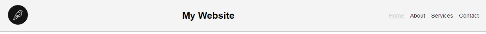
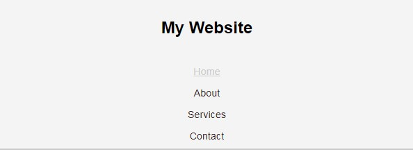
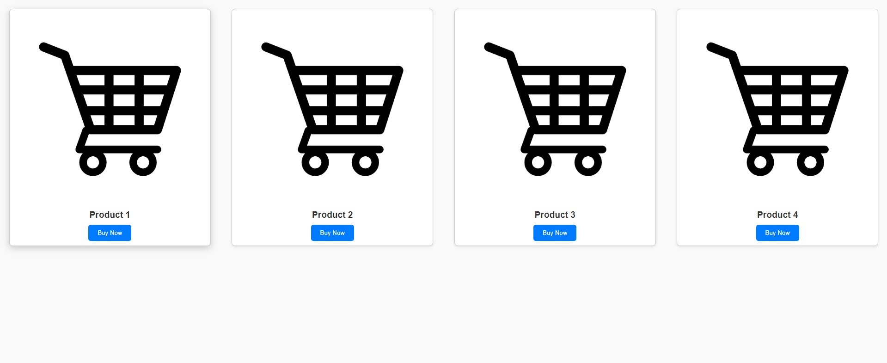
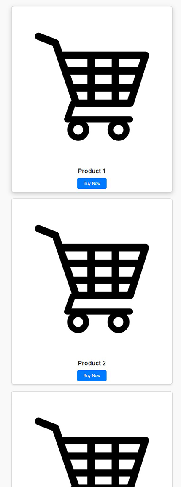
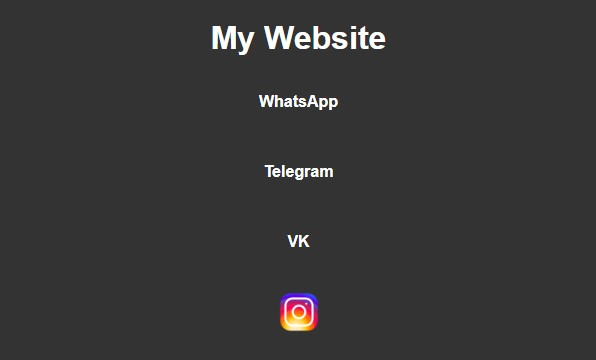

<h1 style="text-align: center;">Вопросы junior</h1>

1. Что такое HTML и какова его основная роль?
2. Назовите основные теги HTML для заголовков.
3. Какой атрибут используется для указания источника изображения?
4. Что такое атрибут alt? Зачем он нужен?
5. Какие теги относятся к блочным элементам?
6. Что такое CSS? В чем его роль?
7. Какие существуют основные способы подключения CSS?
8. Для чего используется свойство box-sizing?
9. Назовите примеры семантических тегов в HTML.
10. Каким способам можно подключить шрифт в CSS?
11. Что такое Flexbox?
12. Что такое CSS Grid Layout?
13. Для чего используется свойство `justify-content` в Flexbox?
14. Что такое медиа-запросы в CSS? Для чего они нужны?
15. Назовите основные типы `<input>` в HTML.
16. Что такое адаптивная верстка?
17. Для чего используется тег `
`? Это блочный или строчный тег?
18. Как выглядит базовый синтаксис CSS-правила?
19. Что такое атрибут `href`? Как он работает?
20. Что такое блочные и строчные элементы? Назовите по одному примеру для каждого.
21. Что делает свойство `align-items` в Flexbox?
22. Для чего используется атрибут `target` в ссылках?
23. Какие свойства можно использовать для установки отступов вокруг элемента?
24. Какие свойства можно применить для стилизации текста в CSS? Назовите основные.

-----------------------------
<h1 style="text-align: center;">Вопросы middle</h1>

1. В чем разница между атрибутами `id` и `class`? Приведите примеры.
2. Что происходит, если вложенность тегов в HTML нарушена?
3. Что такое `Box Model`? Назовите её основные составляющие.
4. Как наследуются стили в CSS? Какие свойства наследуются по умолчанию?
5. Что такое специфичность CSS? Как она влияет на применение стилей?
6. Чем отличаются псевдоклассы `:hover` и `:focus`? Приведите примеры их применения.
7. Объясните разницу между `em` и `rem`. В каких случаях их стоит использовать?
8. Для чего используется псевдоэлемент `::before`? Как он работает?
9. Что такое адаптивные единицы измерения? Назовите примеры и их особенности.
10. Объясните принцип работы `grid-area` и `grid-template-areas`. Как с их помощью можно задать сетку?
11. Как медиа-запросы помогают адаптировать макет под разные устройства?
12. Для чего используется свойство `z-index`? Как оно влияет на отображение элементов?
13. Чем отличаются внешние стили от встроенных? В каких случаях что лучше использовать?
14. Как работает свойство `grid-template-columns`? Приведите пример с фиксированными и относительными значениями.
15. Что такое точка останова в адаптивной верстке? Приведите пример.
16. Какие основные элементы входят в структуру формы (тег `form`) в HTML?
17. Что такое псевдокласс `nth-child()`? Приведите пример его использования.
18. Как работает свойство `gap` в `Flexbox` и CSS Grid?
19. Что такое семантическая разметка и зачем она нужна?
20. В чем преимущества подключения шрифтов через скаченные файлы шрифтов?
21. Чем отличаются относительные единицы измерения от абсолютных?
22. Для чего нужен атрибут `srcset` в тегах ``?
23. Какой атрибут используется, чтобы задать поведение ссылки при её открытии в новой вкладке?
24. Чем свойства `gap` отличаются от `margin` между элементами?
25. Объясните, как работает функция `repeat()` в свойствах `grid-template-columns` и `grid-template-rows`.

-----------------------------
<h1 style="text-align: center;">Практическая работа 1</h1>

### header:

- background-color: #f4f4f4;

### Навигация:

- color: #322;

### Навигация при наведении:

- color: #ccc;

### Медиа-запрос:

- Точка остановы на 600px.

### Картинки:

- 

### Результат Desktop:

- 

### Результат для точки остановы `max-width: 600px`:

- 

------------
<h1 style="text-align: center;">Практическая работа 2</h1>

### Карточка

- background-color: #ffffff;
- border: 1px solid #ccc;
- box-shadow: 0 2px 5px rgba(0, 0, 0, 0.1);

### Карточка при наведении

- box-shadow: 0 5px 15px rgba(0, 0, 0, 0.2);

### Медиа-запрос:

- Точка остановы на 600px.

### Картинки:

- 

### Результат Desktop

- 

### Результат для точки остановы `max-width: 600px`:

- 

------------
<h1 style="text-align: center;">Практическая работа 3</h1>

### footer
- background-color: #333;
- color: #fff;

### Контакты
- color: #fff;
#### `WhatsApp` при наведении:
- color: #25d366;
#### `Telegram` при наведении:
- color: #0088cc;
#### `VK` при наведении:
- color: #4c75a3;

### Медиа-запрос:

- Точка остановы на 600px.

### Картинки:

- 

### Результат Desktop

- 

### Результат для точки остановы `max-width: 600px`:

- 

--------------