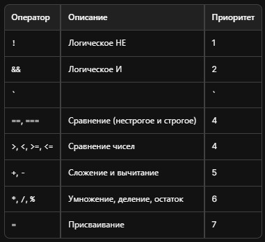

# JavaScript

# 1 Введение в JavaScript

Сценарии выполняемые на стороне клиента.

Развитие HTML от `<b>` и `<i>` до семантических тегов и разных событий таких как `:hover`.

Далее встал вопрос о внедрении компьютерных программ в гипертекст. Так как программа - это тоже текст.

К этому времени обработкой гипертекста уже занимался браузер, поэтому и программы внедряемые в этот гипертекст так же предстояло браузеру.

Появление `Сценариев`.

В начале пути ЯП работали с помощью преобразования программного кода в исполняемый код на языке компьютера. Такой код так же называют `исполняемым` (native). Такой код представляет собой файл с расширением `.exe` (`executable`). Представители компилируемых языков: С++ Delphi, Assembler, Fortran

Для лучшей совместимости программ развивалась транслирующая технология. Транслятор преобразовывал код программы в байт-код. Имея такой транслятор обеспечение совместимости стало проблемой разработчиков платформ. Для запуска такой платформы (программы) необходимо установить и запустить платформу. Примеры таких языков: Java, C#, Python и т.д.

Ни одиин ни второй сценарий не подходили для реализации кода для гипертекстовой разметки. Язык для разметки должен был просто выполнять команды, при этом не иметь доступа к системе напрямую. Схема выполнения таких программ получила название - `интерпретатора`.

Программы в виде исходного кода для интерпретирующих систем получила название `скрипт`(сценарий). В веб-разработке скриптами называют текстовые вставки в HTML документ, обрабатываемые браузером как программы.

## Разработка JavaScript

Язык JavaScript непосредственно поддерживается всеми современными браузерами и не требует никаких дополнительных подключенных библиотек или установленных расширений. Его можно добавлять прямо в тег `<script></script>`.

JavaScript имеет общирные возможности для работы с данными: арифметические, логические, символьные операции. Может управлять содержимым веб-страницы. с помощью этого языка можно связаться с сервером, отправлять и получать данные.

Ограницения JS по работе с файлами компьютера.
Ограничения JS с работой со вкладками создаными не им.
Ограничен обмен данными с сервером.

## История создания JavaScript

JavaScript был создан Бренданом Айком в мае 1995 года за рекордные десять дней. Изначально язык назывался Mocha, затем LiveScript, но в конечном итоге получил название JavaScript. Он был разработан для браузера Netscape Navigator с целью добавления динамических и интерактивных элементов на статические HTML-страницы. Переименование в JavaScript было связано с желанием привлечь внимание к языку, используя популярность Java в то время.

JavaScript основан на стандарте ECMAScript, который был разработан для обеспечения совместимости скриптовых языков, включая JavaScript. Стандарт ECMAScript стандартизирован организацией Ecma International и описывает синтаксис, типы данных, операторов и другие ключевые аспекты языка.

Первый стандарт, ECMAScript 1, был опубликован в 1997 году. С тех пор язык прошел через множество обновлений, включая значительные версии, такие как ES5 (2009) и ES6 (2015), которые добавили множество новых функций и улучшений. Начиная с 2015 года, новые версии стандарта стали обозначаться по году выпуска, например, ES2016, ES2017 и так далее.

## Что такое BOM

BOM (Browser Object Model) — это модель объектов браузера, которая позволяет JavaScript взаимодействовать с браузером и управлять его функциональностью. BOM предоставляет доступ к различным элементам браузера, таким как окно, история, местоположение и другие.

Примеры использования BOM

- Объект window:
  Позволяет управлять окнами браузера.

```javascript
window.alert("Привет, мир!"); // Показывает всплывающее окно с сообщением
```

- Объект location:
  Позволяет получать и изменять URL текущей страницы.

```javascript
console.log(window.location.href); // Выводит текущий URL
window.location.href = "https://example.com"; // Перенаправляет на новый URL
```

- Объект history:
  Позволяет управлять историей навигации.

```javascript
window.history.back(); // Возвращает на предыдущую страницу
```

## Что такое DOM

DOM (Document Object Model) — это объектная модель документа, которая представляет HTML или XML документ в виде структуры дерева. Каждый элемент документа (теги, текст, атрибуты) является узлом в этом дереве, что позволяет программно взаимодействовать с содержимым и структурой веб-страницы.

Примеры использования DOM

- Получение элемента по ID:

```javascript
const element = document.getElementById("myElement");
```

- Изменение текста элемента:

```javascript
element.textContent = "Новый текст!";
```

- Добавление обработчика события:

```javascript
element.addEventListener("click", function () {
  alert("Элемент был нажат!");
});
```

- Создание и добавление нового элемента:

```javascript
const newDiv = document.createElement("div");
newDiv.textContent = "Я новый элемент!";
document.body.appendChild(newDiv);
```

DOM позволяет динамически изменять содержимое веб-страниц без перезагрузки, что делает его важным инструментом для создания интерактивных веб-приложений.

## Тег `<noscript>`. Пример. Как отключить скрипты в браузере Chrome.

Тег `<noscript>` используется для отображения контента, если в браузере отключены скрипты или если браузер не поддерживает JavaScript. Это позволяет разработчикам предоставлять альтернативную информацию или инструкции пользователям, у которых отключены скрипты.

```html
<noscript>
  <p>
    JavaScript отключен в вашем браузере. Пожалуйста, включите его для полного
    функционала сайта.
  </p>
</noscript>
```

Как отключить скрипты в браузере Chrome:

1. Нажмите на значок меню (три вертикальные точки) в правом верхнем углу.
2. Выберите Настройки.
3. Прокрутите вниз и нажмите на Дополнительные.
4. В разделе Конфиденциальность и безопасность выберите Настройки сайтов.
5. Найдите раздел JavaScript и выберите Запретить всем сайтам запускать JavaScript.

## Основы синтаксиса. Семантика и синтаксис.

Синтаксис — это набор правил, определяющих структуру и форму программного кода. Он описывает, как правильно составлять конструкции языка, такие как операторы, выражения и команды.

Семантика — это значение и смысл синтаксических конструкций. Она определяет, что именно происходит, когда код выполняется.

Синтаксис отвечает на вопрос "Как?", а семантика — "Что?" происходит в программе.

## Ошибки семантические и синтаксические.

Синтаксические ошибки — это ошибки, возникающие из-за нарушения правил языка программирования.

```javascript
function example() {
    console.log("Hello, world!"; // Ошибка: отсутствует закрывающая скобка
}
```

Семантические ошибки — это ошибки, которые возникают, когда код синтаксически правильный, но выполняет неправильные действия или дает неверные результаты.

```javascript
let a = 10;
let b = 0;
let result = a / b; // Ошибка: деление на ноль, результат будет бесконечность
```

## Регистрозависимость

Регистрозависимость — это свойство языков программирования, при котором различается верхний и нижний регистры букв. Это означает, что идентификаторы (например, имена переменных, функций и классов) с разным регистром считаются разными.

```javascript
let variable = 5;
let Variable = 10;

console.log(variable); // Выведет 5
console.log(Variable); // Выведет 10
```

JavaScript является регистрозависимым языком программирования.

## Комментарии

В JavaScript используются два типа комментариев:

- Однострочные комментарии: начинаются с двух косых черт //. Все, что написано после этих символов до конца строки, игнорируется интерпретатором.

```javascript
// Это однострочный комментарий
let x = 5; // Переменная x равна 5
```

- Многострочные комментарии: заключаются между /_ и _/. Они могут занимать несколько строк.

```javascript
/*
Это многострочный комментарий,
который может занимать несколько строк.
*/
let y = 10;
```

## Ключевые и зарезервированные слова

Ключевые слова — это слова, которые имеют специальное значение в языке программирования и используются для выполнения определенных операций. Например, if, else, for, while, function и т.д.

Зарезервированные слова — это слова, которые нельзя использовать в качестве имен переменных, функций или других идентификаторов, так как они уже имеют предопределенное значение в языке. Использование зарезервированных слов в качестве имен приведет к ошибкам. Например: break, const, continue

## Переменные и правила их наименования

Переменные — это именованные области памяти, используемые для хранения данных. В JavaScript переменные могут хранить различные типы данных, такие как числа, строки, массивы и объекты.

Правила наименования переменных:

1. Начало с буквы, знака доллара или подчеркивания: Имя переменной должно начинаться с буквы (a-z, A-Z), знака доллара $ или подчеркивания \_. Например: `$amount = 100;`
2. Использование букв, цифр, знаков доллара и подчеркивания: После первого символа имя может содержать буквы, цифры (0-9), знаки доллара и подчеркивания. Пример: `let user1 = "John";`.
3. Регистрозависимость: Имена переменных чувствительны к регистру, то есть myVar и myvar — это разные переменные.
4. Запрет на использование ключевых и зарезервированных слов: Нельзя использовать слова, которые имеют специальное значение в JavaScript, такие как if, for, function и т.д.
5. Четкость и понятность: Имена переменных должны быть описательными и отражать суть хранимых данных. Например, вместо x лучше использовать userAge для хранения возраста пользователя.

## Стили написания переменных. Хорошие имена переменных и плохие имена переменных.

Хорошие имена переменных:

- `userAge` — ясно указывает, что переменная хранит возраст пользователя.
- `totalPrice` — понятно, что переменная содержит общую стоимость.
- `isLoggedIn` — логическое значение, указывающее, вошел ли пользователь в систему.
- `fetchUserData` — имя функции, которое четко описывает ее действие.
  Плохие имена переменных:
- `a` — слишком общее и неинформативное имя.
- `temp` — неясно, что именно временное; может быть множество значений.
- `data` — слишком расплывчатое; не указывает, какие данные хранятся.
- `x1`, `x2`, `x3` — неинформативные имена, не дающие представления о содержимом переменных.

## Типы данных. Список типов данных JavaScript. Примеры.

В JavaScript существует восемь основных типов данных, которые можно разделить на две категории: примитивные и ссылочные.

Примитивные типы данных:

- `Number`: представляет числовые значения, как целые, так и дробные.

```javascript
let age = 25; // Целое число
let price = 19.99; // Дробное число
```

- `String`: представляет последовательности символов.

```javascript
let name = "Alice"; // Строка
```

- `Boolean`: представляет логические значения: true или false.

```javascript
let isActive = true; // Логическое значение
```

- `Undefined`: тип, который указывает, что переменная была объявлена, но не инициализирована.

```javascript
let x; // x имеет значение undefined
```

- `Null`: специальное значение, которое указывает на отсутствие значения.

```javascript
let y = null; // y явно установлен в null
```

- `Symbol`: уникальный и неизменяемый тип данных, используемый для создания уникальных идентификаторов.

```javascript
let sym = Symbol("description"); // Символ
```

- `BigInt`: позволяет работать с целыми числами произвольной длины.

```javascript
let bigNumber = BigInt(123456789012345678901234567890); // Большое целое число
```

Ссылочный тип данных:

- `Object`: представляет коллекции значений и более сложные сущности.

```javascript
let person = {
  name: "Bob",
  age: 30,
}; // Объект
```

## Основные типы, предназначенными для работы с данными

## Статическая и динамическая типизация.

Типизация в языках программирования определяет, как и когда типы данных переменных проверяются и определяются. Существует два основных подхода к типизации: статическая и динамическая.

- Статическая типизация. В языках с статической типизацией тип переменной определяется на этапе компиляции, и ошибки, связанные с типами, могут быть обнаружены до выполнения программы. Это позволяет разработчикам заранее знать, какие типы данных используются, что может повысить безопасность и производительность кода.

- Динамическая типизация. В языках с динамической типизацией тип переменной определяется во время выполнения программы. Это означает, что одна и та же переменная может содержать значения разных типов в разное время. Динамическая типизация обеспечивает большую гибкость, но может привести к ошибкам, которые будут обнаружены только во время выполнения.

## Операторы. Состовные части операций.

Операторы — это специальные символы или ключевые слова, которые выполняют операции над операндами (значениями или переменными). В JavaScript операторы позволяют выполнять математические вычисления, сравнения, логические операции и другие действия.

Каждая операция в JavaScript состоит из операторов и операндов. Операнды — это значения или переменные, над которыми выполняется операция. Например, в выражении 5 + 3, + — это оператор, а 5 и 3 — операнды.

### Арифметические операторы

Арифметические операторы в JavaScript используются для выполнения математических операций над числовыми значениями (операндами). Большинство арифметических операторов являются бинарными, так как они выполняют вычисления над двумя операндами, но некоторые из них могут быть унарными.

- Сложение (+): Складывает два числа.

```javascript
let sum = 5 + 3; // sum равно 8
```

- Вычитание (-): Вычитает одно число из другого.

```javascript
let difference = 10 - 4; // difference равно 6
```

- Умножение (\*): Умножает два числа.

```javascript
let product = 7 * 2; // product равно 14
```

- Деление (/): Делит одно число на другое.

```javascript
let quotient = 20 / 4; // quotient равно 5
```

- Остаток от деления (%): Возвращает остаток от деления одного числа на другое.

```javascript
let remainder = 10 % 3; // remainder равно 1
```

- Инкремент (++): Увеличивает значение переменной на 1.

```javascript
let count = 1;
count++; // count теперь равно 2
```

- Декремент (--): Уменьшает значение переменной на 1.

```javascript
let count = 2;
count--; // count теперь равно 1
```

### Операторы отношений. Строгое и нестрогое сравнение.

В JavaScript операторы отношений используются для сравнения значений и возвращают логическое значение true или false. Основные операторы отношений включают:

- `Равно (==)`: проверяет, равны ли два значения, при этом может приводить их к одному типу.
- `Строгое равно (===)`: проверяет, равны ли два значения и имеют ли они одинаковый тип.
- `Не равно (!=)`: проверяет, не равны ли два значения, также может приводить их к одному типу.
- `Строгое не равно (!==)`: проверяет, не равны ли два значения и имеют ли они разные типы.
- `Больше (>)`, `меньше (<)`, `больше или равно (>=)`, `меньше или равно (<=)`: используются для сравнения чисел.

Примеры операторов сравнения:

- Нестрогое сравнение:

```javascript
console.log(5 == "5"); // true, так как строка '5' приводится к числу
```

- Строгое сравнение:

```javascript
console.log(5 === "5"); // false, так как типы разные (number и string)
```

- Неравенство:

```javascript
console.log(5 != "5"); // false, так как значения равны после приведения типов
```

Строгое неравенство:

```javascript
console.log(5 !== "5"); // true, так как типы разные
```

Сравнение чисел:

```javascript
console.log(10 > 5); // true
console.log(10 <= 10); // true
```

- **Нестрогое сравнение (== и !=)** приводит значения к одному типу перед сравнением. Это может привести к неожиданным результатам, если не учитывать типы данных.
- **Строгое сравнение (=== и !==)** не приводит значения к одному типу, что делает его более предсказуемым и безопасным для использования. Рекомендуется использовать строгое сравнение, чтобы избежать ошибок, связанных с неявным приведением типов.

## Сравнение чисел, сравнение строк.

### Сравнение чисел в JavaScript

В JavaScript для сравнения чисел используются операторы, такие как `>`, `<`, `>=`, `<=`, `===` и `!==`. Эти операторы работают аналогично математическим сравнениям.

Например:

- 5 > 3 вернет true, так как 5 больше 3.
- 10 <= 10 вернет true, так как 10 равно 10.

###Сравнение строк в JavaScript
Для сравнения строк в JavaScript также используются операторы >, <, >=, <=, === и !==. Однако, при сравнении строк важно учитывать, что строки сравниваются по их лексикографическому порядку, то есть по порядку символов в кодировке Unicode.

Например:

- 'Ava' < 'Zoe' вернет true, так как 'A' меньше 'Z' по порядку символов.

Рекомендуется использовать оператор === для сравнения строк, так как он проверяет как значение, так и тип данных, что помогает избежать ошибок, связанных с неявным преобразованием типов, которое происходит при использовании ==.

```javascript
// Сравнение чисел
console.log(5 > 3); // true
console.log(10 <= 10); // true

// Сравнение строк
console.log("apple" < "banana"); // true
console.log("Ava" > "Zoe"); // false

// Сравнение строк с числами
console.log("70px" > "622px"); // true, сравнение по символам
```

Когда вы сравниваете строку '6' с числом 6, JavaScript автоматически приводит строку к числу, если используется оператор ==.

```javascript
console.log("6" == 6); // true
```

если вы используете оператор строгого равенства ===, то сравнение будет учитывать типы данных, и результат будет false, так как строка и число имеют разные типы:

```javascript
console.log("6" === 6); // false
```

## Преобразование строки в число с помощью +

В JavaScript оператор + может использоваться не только для сложения чисел, но и для преобразования строк в числа. Когда вы применяете оператор + к строке, содержащей числовое значение, JavaScript автоматически преобразует эту строку в число. Например:

```javascript
let str = "6";
let num = +str; // Преобразование строки в число
console.log(num); // 6
console.log(typeof num); // 'number'
```

### Обработка некорректных строк

Если строка не может быть преобразована в число (например, если она содержит буквы или специальные символы), результатом будет NaN (Not-a-Number):

```javascript
let invalidStr = "abc";
let result = +invalidStr; // Преобразование некорректной строки
console.log(result); // NaN
```

## Логические операторы. И ИЛИ НЕ

В JavaScript логические операторы позволяют выполнять логические операции над значениями, обычно булевыми `(true или false)`. Основные логические операторы — это `И (&&)`, `ИЛИ (||)` и `НЕ (!)`.

### Оператор И (&&)

Оператор И возвращает true только в том случае, если оба операнда истинны. Если хотя бы один из операндов ложен, результат будет false. Например:

```javascript
console.log(true && true); // true
console.log(true && false); // false
console.log(false && false); // false
```

### Оператор ИЛИ (||)

Оператор ИЛИ возвращает true, если хотя бы один из операндов истинный. Он будет false только в случае, если оба операнда ложны. Например:

```javascript
console.log(true || false); // true
console.log(false || false); // false
console.log(true || true); // true
```

### Оператор НЕ (!)

Оператор НЕ инвертирует логическое значение. Если операнд истинный, он возвращает false, и наоборот. Например:

```javascript
console.log(!true); // false
console.log(!false); // true
```

## Оператор присваивания

Оператор присваивания в JavaScript используется для присвоения значения переменной. Общий синтаксис простого присваивания выглядит следующим образом:

### Ассоциативность:

Оператор присваивания имеет правую ассоциативность, что означает, что выражения справа от оператора будут вычислены первыми. Например:

```javascript
let a, b;
a = b = 10; // Сначала b присваивается 10, затем a получает значение b
console.log(a); // 10
console.log(b); // 10
```

### Множественное присваивание:

Вы можете присваивать одно и то же значение нескольким переменным одновременно:

```javascript
let x = (y = z = 5); // Все переменные x, y и z будут равны 5
```

### Комбинированные операторы присваивания:

JavaScript также поддерживает комбинированные операторы присваивания, которые позволяют выполнять операции и присваивать результат в одном выражении. Например:

```javascript
let num = 10;
num += 5; // Это эквивалентно num = num + 5;
console.log(num); // 15
```

## Приоритет операторов

Приоритет операторов определяет порядок, в котором операторы выполняются в выражениях.

Таблица операторов:



Рассмотрим пример, чтобы проиллюстрировать, как работает приоритет операторов:

```javascript
let a = 5;
let b = 10;
let c = 15;

let result = a + b * c; // Умножение выполняется первым
console.log(result); // 5 + (10 * 15) = 5 + 150 = 155
```

## Оператор typeof

Оператор typeof в JavaScript используется для определения типа данных переменной или значения. Он возвращает строку, указывающую тип операнда, который следует за оператором.

Оператор typeof может использоваться как с круглой скобкой, так и без нее. Оба варианта работают одинаково:

```javascript
console.log(typeof "Hello"); // 'string'
console.log(typeof 42); // 'number'
console.log(typeof true); // 'boolean'
console.log(typeof {}); // 'object'
console.log(typeof null); // 'object' (это известная особенность JavaScript)
console.log(typeof undefined); // 'undefined'
```

Вот несколько примеров, демонстрирующих использование оператора typeof:

```javascript
let name = "Alice";
let age = 30;
let isStudent = false;
let data = null;
let obj = { key: "value" };
let arr = [1, 2, 3];

console.log(typeof name); // 'string'
console.log(typeof age); // 'number'
console.log(typeof isStudent); // 'boolean'
console.log(typeof data); // 'object'
console.log(typeof obj); // 'object'
console.log(typeof arr); // 'object'
console.log(typeof function () {}); // 'function'
```

## Решить примеры

# 2 Взаимодействие с пользователем

## Ввод/вывод данных. Диалоговые окна. alert(). confirm(). prompt()

JavaScript предоставляет несколько встроенных методов для взаимодействия с пользователем через диалоговые окна. Основные из них — это alert(), confirm() и prompt().

### 1. Метод alert()

Метод alert() используется для отображения простого модального окна с сообщением и одной кнопкой "OK". Это окно блокирует взаимодействие с остальной частью страницы, пока пользователь не закроет его. Например:

```javascript
alert("Это сообщение для пользователя!");
```

### 2. Метод confirm()

Метод confirm() отображает диалоговое окно с сообщением и двумя кнопками: "OK" и "Cancel". Он возвращает true, если пользователь нажал "OK", и false, если нажал "Cancel". Это позволяет разработчикам запрашивать подтверждение у пользователя перед выполнением какого-либо действия. Например:

```javascript
let userConfirmed = confirm("Вы уверены, что хотите продолжить?");
if (userConfirmed) {
  console.log("Пользователь подтвердил действие.");
} else {
  console.log("Пользователь отменил действие.");
}
```

### 3. Метод prompt()

Метод prompt() выводит диалоговое окно с текстовым полем для ввода и двумя кнопками: "OK" и "Cancel". Он позволяет пользователю ввести текст, который затем можно использовать в программе. Если пользователь нажимает "OK", возвращается введенный текст; если "Cancel" — возвращается null. Например:

```javascript
let userInput = prompt("Введите ваше имя:");
if (userInput !== null) {
  console.log("Привет, " + userInput + "!");
} else {
  console.log("Пользователь отменил ввод.");
}
```

## Условия. Что такое условие?

Условие — это выражение, которое может быть истинным (true) или ложным (false).

Условия используются для управления потоком выполнения программы, позволяя выполнять определенные действия в зависимости от результата проверки.

### Оператор if

Оператор if в JavaScript позволяет выполнять блок кода только в том случае, если указанное условие истинно. Синтаксис оператора if выглядит следующим образом:

```javascript
if (условие) {
  // Код, который выполняется, если условие истинно
}
```

Если условие возвращает true, выполняется код внутри фигурных скобок. Если условие возвращает false, код пропускается.

**Пример использования оператора if**:
Рассмотрим простой пример, где мы проверяем, является ли число положительным:

```javascript
let number = 5;

if (number > 0) {
  console.log("Число положительное.");
}
```

### Условие с else

Вы также можете использовать оператор else, чтобы выполнить другой блок кода, если условие ложно:

```javascript
let number = -3;

if (number > 0) {
  console.log("Число положительное.");
} else {
  console.log("Число неположительное.");
}
```

В этом случае, поскольку number меньше нуля, будет выведено сообщение "Число неположительное."

### Условие с else if

Если вам нужно проверить несколько условий, вы можете использовать else if:

```javascript
let number = 0;

if (number > 0) {
  console.log("Число положительное.");
} else if (number < 0) {
  console.log("Число отрицательное.");
} else {
  console.log("Число равно нулю.");
}
```

В этом примере программа проверяет три условия и выводит соответствующее сообщение в зависимости от значения переменной number.

## Тернарный оператор

Тернарный оператор — это сокращенная форма условного оператора, которая позволяет выполнять условные проверки и возвращать значения в компактном виде. Он состоит из трех частей: `условия`, `значения, возвращаемого при истинном условии`, и `значения, возвращаемого при ложном условии`.

```javascript
let number = 4;
let result = number % 2 === 0 ? "Четное" : "Нечетное";
console.log(result); // "Четное"
```

Несмотря на свои преимущества, тернарный оператор не всегда является лучшим выбором. Если условие сложное или если необходимо выполнить несколько действий в зависимости от условия, лучше использовать оператор if.

## Конструкция Switch

Конструкция switch в JavaScript используется для выполнения различных действий на основе различных условий. Это удобный способ обработки множества возможных значений одной переменной, что делает код более читаемым и структурированным по сравнению с множественными операторами if.

### Синтаксис конструкции switch

```javascript
switch (выражение) {
  case значение1:
    // Код, который выполняется, если выражение равно значение1
    break;
  case значение2:
    // Код, который выполняется, если выражение равно значение2
    break;
  // Можно добавить дополнительные case
  default:
  // Код, который выполняется, если ни одно из значений не совпадает
}
```

### Пример использования

```javascript
let day = 3;
let dayName;

switch (day) {
  case 1:
    dayName = "Понедельник";
    break;
  case 2:
    dayName = "Вторник";
    break;
  case 3:
    dayName = "Среда";
    break;
  case 4:
    dayName = "Четверг";
    break;
  case 5:
    dayName = "Пятница";
    break;
  case 6:
    dayName = "Суббота";
    break;
  case 7:
    dayName = "Воскресенье";
    break;
  default:
    dayName = "Некорректный номер дня";
}

console.log(dayName); // "Среда"
```

### Примечания по использованию switch

- `break`: После каждого блока case обычно используется оператор break, чтобы предотвратить "проваливание" в следующий блок. Если break не указан, выполнение продолжится в следующем case, даже если его условие не выполнено.
- `default`: Блок default выполняется, если ни одно из условий не совпадает. Это аналогично else в конструкции if.
- `Типы данных`: Конструкция switch использует строгое сравнение (===), поэтому типы данных также должны совпадать.

# 3 Циклы

## Что такое циклы? Общая информация.

**Циклы в программировании** — это конструкции, которые позволяют многократно выполнять один и тот же набор инструкций. Они являются важным инструментом, который помогает избежать излишнего повторения кода и автоматизировать выполнение повторяющихся задач. Циклы позволяют программистам эффективно управлять потоком выполнения программы, выполняя определенные действия до тех пор, пока не будет выполнено заданное условие.

### Основные виды циклов

- Цикл с предусловием (while): Этот цикл выполняется, пока заданное условие истинно. Если условие ложно с самого начала, тело цикла может не выполниться ни разу.

```javascript
while (condition) {
  // код для выполнения
}
```

- Цикл с постусловием (do-while): Этот цикл выполняется хотя бы один раз, так как условие проверяется после выполнения тела цикла.

```javascript
do {
  // код для выполнения
} while (condition);
```

- Цикл с параметром (for): Этот цикл используется, когда известно количество итераций. Он включает инициализацию, условие и изменение счетчика в одном выражении.

```javascript
for (let i = 0; i < 10; i++) {
  // код для выполнения
}
```

Циклы позволяют:

- **Автоматизировать повторяющиеся задачи**: Например, обработка элементов массива или выполнение одной и той же операции несколько раз.
- **Упрощать код**: Вместо написания одного и того же кода несколько раз, можно использовать цикл, что делает код более чистым и понятным.
- **Управлять потоком выполнения**: Циклы позволяют динамически изменять количество итераций в зависимости от условий, что делает программы более гибкими.

## Цикл While.

Цикл while в JavaScript используется для выполнения блока кода, пока заданное условие истинно. Это позволяет многократно выполнять одну и ту же операцию без необходимости повторять код. Он особенно полезен, когда количество итераций заранее не известно.

Рассмотрим простой пример, где мы используем цикл while для создания счетчика, который выводит числа от 1 до 5:

```javascript
let counter = 1;

while (counter <= 5) {
  console.log(counter);
  counter++; // Увеличиваем счетчик на 1
}
```

### Пример: Сумма чисел

Подсчет суммы чисел от 1 до 10:

```javascript
let sum = 0;
let number = 1;

while (number <= 10) {
  sum += number; // Добавляем текущее число к сумме
  number++; // Увеличиваем число на 1
}

console.log("Сумма чисел от 1 до 10:", sum); // Вывод: 55
```

### Расчет накоплений в банке со ставкой 10%

```javascript
let initialAmount = 1000; // Начальная сумма вклада
let interestRate = 0.1; // Ставка 10% годовых
let years = 0; // Количество лет

while (initialAmount < 2000) {
  // Продолжаем, пока сумма не достигнет 2000
  let interest = initialAmount * interestRate; // Начисление процентов
  initialAmount += interest; // Добавление процентов к сумме
  years++; // Увеличение количества лет
}

console.log(`Через ${years} лет сумма вклада достигнет 2000 рублей.`);
```

В этом примере мы начинаем с начальной суммы вклада 1000 рублей и ставки 10% годовых. Пока сумма вклада не достигнет 2000 рублей, мы продолжаем начислять проценты и увеличивать количество лет. В конце мы выводим, сколько лет потребуется, чтобы сумма вклада достигла 2000 рублей.

## Цикл Do While.

Цикл do while в JavaScript выполняет блок кода как минимум один раз, а затем продолжает выполнение, пока заданное условие остается истинным. Это отличие от обычного цикла while, который может не выполниться ни разу, если условие изначально ложно.

### Счетчик с условием

Рассмотрим пример, где мы используем цикл do while для создания счетчика, который будет выводить числа от 1 до 5:

```javascript
let number = 1;

do {
  console.log(`Число: ${number}`);
  number++;
} while (number <= 5);
```

### Получение от пользователя точного ответа yes или no

```javascript
let answer;

do {
  answer = prompt("Пожалуйста, введите 'yes' или 'no':").toLowerCase();
} while (answer !== "yes" && answer !== "no");

console.log(`Вы ввели: ${answer}`);
```

В этом примере программа будет запрашивать у пользователя ввод, пока он не введет "yes" или "no". Цикл do while гарантирует, что запрос будет выполнен хотя бы один раз. После того как пользователь введет корректный ответ, программа завершит выполнение и выведет введенное значение в консоль.

## Цикл For. Все способы записи (если не указывать блоки инициализации, условия и изменение переменной). Пример для реализации: рассчет ежемесячных платежей кредита, оформленного на год со ставкой 20%.

Цикл for в JavaScript используется для выполнения блока кода несколько раз, и его синтаксис позволяет задавать три основных компонента: инициализацию, условие и изменение переменной. Однако, эти блоки могут быть опущены, что делает цикл for очень гибким.

### Пример

```javascript
for (let i = 0; i < 5; i++) {
  console.log(`Счетчик: ${i}`);
}
```

### Пример без инициализации и изменения переменной

```javascript
let i = 0;

for (; i < 5; ) {
  console.log(`Счетчик: ${i}`);
  i++;
}
```

### Пример без инициализации, условия и изменения переменной

```javascript
let i = 0;

for (;;) {
  if (i >= 5) break; // Условие выхода из цикла
  console.log(`Счетчик: ${i}`);
  i++;
}
```

### Расчет ежемесячных платежей по кредиту

```javascript
let fund = +prompt("Credit sum");
let creditBody = fund + 0.2 * fund;
let monthlyPayment = creditBody / 12;

for (let month = 1; month <= 12; month++) {
  console.log("month " + month + " payment " + monthlyPayment.toFixed(2));
}
```

Метод `toFixed(2)`: Этот метод округляет число до двух десятичных знаков и возвращает его в виде строки. Например, если monthlyPayment равно `250.5`, то `monthlyPayment.toFixed(2)` вернет строку `"250.50"`.

## Цикл For in, For of.

Циклы for...in и for...of в JavaScript используются для перебора элементов, но они предназначены для разных целей и работают с различными типами данных. Давайте рассмотрим их подробнее.

### Цикл for...in

Цикл for...in используется для перебора свойств объектов. Он возвращает ключи (имена свойств) объекта, что делает его полезным для работы с объектами.

Пример использования for...in с объектом

```javascript
let person = {
  name: "Alice",
  age: 30,
  city: "New York",
};

for (let key in person) {
  console.log(`${key}: ${person[key]}`);
}
```

### Цикл for...of

Цикл for...of используется для перебора значений итерируемых объектов, таких как массивы, строки и другие коллекции. Он возвращает значения элементов, что делает его более подходящим для работы с массивами.

Пример использования for...of с массивом

```javascript
let fruits = ["apple", "banana", "cherry", "date"];

for (let fruit of fruits) {
  console.log(`Значение: ${fruit}`);
}
```

### Сравнение for...in и for...of

- for...in:

  - Перебирает ключи (имена свойств) объекта.
  - Подходит для работы с объектами.
  - Может возвращать неожиданные результаты при использовании с массивами, если в массив добавлены нестандартные свойства.

- for...of:
  - Перебирает значения итерируемых объектов (например, массивов).
  - Подходит для работы с массивами и другими коллекциями.
  - Более предсказуем в использовании с массивами.

## Break, continue

Операторы break и continue используются для управления потоком выполнения циклов в JavaScript. Они позволяют изменять стандартное поведение циклов, что может быть полезно в различных ситуациях.

### Оператор break

Оператор break используется для преждевременного завершения цикла. Когда break выполняется, цикл немедленно прекращает свою работу, и управление передается на следующую строку кода после цикла.

```javascript
let numbers = [1, 2, 3, 4, 5, 6, 7, 8, 9, 10];

for (let i = 0; i < numbers.length; i++) {
  if (numbers[i] === 5) {
    console.log("Найдено число 5, выходим из цикла.");
    break; // Прерываем цикл
  }
  console.log(numbers[i]);
}
```

### Оператор continue

Оператор continue используется для пропуска текущей итерации цикла и перехода к следующей. Когда continue выполняется, оставшаяся часть кода в текущей итерации пропускается, и цикл продолжает выполнение со следующей итерации.

```javascript
for (let i = 1; i <= 10; i++) {
  if (i % 2 === 0) {
    continue; // Пропускаем четные числа
  }
  console.log(i);
}
```

Операторы break и continue в JavaScript являются мощными инструментами для управления потоком выполнения циклов. break позволяет завершить цикл, когда это необходимо, а continue — пропустить текущую итерацию и продолжить с следующей. Понимание этих операторов поможет вам писать более эффективный и управляемый код.

## Понятие метки

Метка в программировании — это специальный идентификатор, который используется для обозначения определенной точки в коде. Метки могут быть применены в различных контекстах, но чаще всего они используются в сочетании с операторами управления потоком, такими как break и continue, для управления выполнением вложенных циклов.

### Применение меток

Метки позволяют более точно управлять потоком выполнения программы, особенно когда у вас есть вложенные циклы. С помощью меток можно указать, из какого именно цикла нужно выйти или к какому циклу перейти.

Рассмотрим пример, где мы используем метку для выхода из вложенного цикла:

```javascript
// Это метка для внешнего цикла
outerLoop: for (let i = 0; i < 3; i++) {
  console.log(`Внешний цикл: ${i}`);
  for (let j = 0; j < 3; j++) {
    if (j === 1) {
      console.log(`Выход из внешнего цикла при j = ${j}`);
      break outerLoop; // Выход из внешнего цикла
    }
    console.log(`  Внутренний цикл: ${j}`);
  }
}
```

## Практика

# 4 Функции

## Что такое функция?

Функция в программировании — это обособленный участок кода, который выполняет определённую задачу. Функции позволяют организовать код, делая его более структурированным и удобным для понимания. Они могут принимать входные данные (аргументы), выполнять операции и возвращать результат.

#### Зачем нужны функции?

- **Повторное использование кода**: Функции позволяют избежать дублирования кода. Один и тот же участок кода можно вызывать несколько раз из разных мест программы.
- **Упрощение отладки**: Разделение кода на функции облегчает поиск и исправление ошибок, так как каждая функция отвечает за конкретную задачу.
- **Улучшение читаемости**: Код, организованный с использованием функций, становится более понятным и структурированным, что облегчает его чтение и поддержку.
- **Модульность**: Функции способствуют созданию модульного кода, где каждая функция может быть разработана и протестирована отдельно.

## Синтаксис объявления функции. Вызов функции.

В JavaScript базовая функция объявляется с помощью ключевого слова `function`, за которым следует `имя функции`, `круглые скобки` (в которых могут быть указаны параметры), и `фигурные скобки`, `содержащие тело функции`.

**Синтаксис**:

```javascript
function имяФункции() {
  // тело функции
}
```

**Пример**:

```javascript
function sayHello() {
  console.log("Привет, мир!");
}
```

### Вызов функции

Чтобы вызвать функцию, просто используйте её имя, добавив круглые скобки с аргументами, если они необходимы:

```javascript
sayHello(); // Вызов функции, вывод: Привет, мир!
```

### Функция для создания 5 заголовков:

```javascript
function createHeaders() {
  for (let i = 1; i <= 5; i++) {
    document.write("<h2>Header " + i + "</h2>");
  }
}

createHeaders(); // Вызов функции
```

## Параметры функции.

Параметры функции в JavaScript позволяют передавать значения в функцию, чтобы она могла использовать их в своем теле.

### Функция для создания заголовков с помощью document.write():

```javascript
function createHeaders(count) {
  for (let i = 1; i <= count; i++) {
    document.write("<h2>Header " + i + "</h2>");
  }
}

createHeaders(5); // Вызов функции для создания 5 заголовков
```

### Пример функции с пользовательским вводом

```javascript
function createHeaders(count, headerText) {
  for (let i = 1; i <= count; i++) {
    document.write("<h2>" + headerText + " " + i + "</h2>");
  }
}

let userInput = prompt("Текст для промпта");
createHeaders(5, userInput);
```

### Пример из материала

```javascript
function incAndLog(x) {
  x = x + 1;
  alert("inc x = " + x);
  Log.innerHTML += "<br>inc x = " + x;
}
x = 2;
Log.innerHTML = "x = " + x;
incAndLog(x);
Log.innerHTML += "<br>x = " + x;
```

## Возвращаемое значение функции. Ключевое слово return. Несколько return в одной функции.

В JavaScript функции могут возвращать значения с помощью ключевого слова return. Когда функция достигает оператора return, она завершает свое выполнение и возвращает указанное значение. Если return не указан, функция возвращает undefined.

### Простая функция с одним return:

```javascript
function add(a, b) {
  return a + b; // Возвращает сумму a и b
}

let result = add(3, 4);
console.log(result); // Вывод: 7
```

### Функция с несколькими return:

```javascript
function checkNumber(num) {
  if (num > 0) {
    return "Положительное число"; // Возвращает строку, если число положительное
  } else if (num < 0) {
    return "Отрицательное число"; // Возвращает строку, если число отрицательное
  } else {
    return "Ноль"; // Возвращает строку, если число равно нулю
  }
}

console.log(checkNumber(5)); // Вывод: Положительное число
console.log(checkNumber(-3)); // Вывод: Отрицательное число
console.log(checkNumber(0)); // Вывод: Ноль
```

### Функция с условием и возвратом:

```javascript
function getGreeting(hour) {
  if (hour < 12) {
    return "Доброе утро"; // Возвращает утреннее приветствие
  } else if (hour < 18) {
    return "Добрый день"; // Возвращает дневное приветствие
  } else {
    return "Добрый вечер"; // Возвращает вечернее приветствие
  }
}

console.log(getGreeting(10)); // Вывод: Доброе утро
console.log(getGreeting(14)); // Вывод: Добрый день
console.log(getGreeting(20)); // Вывод: Добрый вечер
```

### Пример из материала:

```javascript
function bankerRound(x) {
  if (Math.round(x) % 2 == 0) return Math.round(x);
  else {
    if (x < Math.round(x)) return Math.round(x) - 1;
    else return Math.round(x) + 1;
  }
}

console.log(bankerRound(2.7)); // 2
console.log(bankerRound(3.2)); // 4
console.log(bankerRound(4.3)); // 4
```

## Отличие `id=Log` от `class=Log`

```html
<body>
  <p id="Log"></p>
  <p class="secondLog"></p>

  <script src="app.js"></script>
</body>
```

```javascript
function addIdLog(text) {
  Log.innerHTML = `<br>${text}</br>`;
}

function addClassLog(text) {
  secondLog.innerHTML = `<h2>${text}</h2>`;
}
```

В JavaScript есть важное различие между использованием id и class

### Почему Log.innerHTML работает?

Когда вы задаете элементу атрибут `id`, браузер автоматически создает `глобальную переменную` с именем, совпадающим с этим `id`. В нашем случае, элемент с `id="Log"` становится доступным через глобальную переменную `Log`. Поэтому вызов `Log.innerHTML` работает корректно.

### Почему secondLog.innerHTML не работает?

Для элементов с классами (`class`) такой глобальной переменной не создается. Чтобы получить доступ к элементу с классом secondLog, нужно использовать методы работы с DOM, такие как `document.querySelector` или `document.getElementsByClassName`.

Например:

```javascript
function addClassLog(text) {
  const secondLog = document.querySelector(".second_log"); // Находим элемент с классом
  secondLog.innerHTML = `<h2>${text}</h2>`;
}
```

# 5 Детальнее о функциях

## Объект `arguments`

### 1. Цель и задачи объекта

Объект `arguments` представляет собой массивоподобную структуру, содержащую все аргументы, переданные функции. Основные задачи:

- Позволяет работать с переменным числом аргументов.
- Дает доступ к переданным значениям без явного указания параметров.
- Используется в старом коде, но в ES6+ предпочтительно использовать оператор `...rest`.

Пример использования `arguments`:

```js
function sum() {
  let total = 0;
  for (let i = 0; i < arguments.length; i++) {
    total += arguments[i];
  }
  return total;
}
console.log(sum(1, 2, 3, 4)); // 10
```

### 2. Свойство `length`

`arguments.length` возвращает количество аргументов, переданных в функцию.

```js
function showArgs() {
  document.getElementById(
    "output"
  ).innerHTML = `Функция вызвана с ${arguments.length} аргументами`;
}
showArgs(1, 2, 3);
```

### 3. Особенности функций в JavaScript

- В отличие от строгих языков, количество переданных аргументов может отличаться от числа объявленных параметров.
- Объект `arguments` доступен только внутри обычных функций (не стрелочных).

```js
const arrowFunc = () => {
  console.log(arguments); // Ошибка: arguments не определён
};
```

## Область видимости переменной в JavaScript

### 1. Что такое область видимости?

Область видимости (Scope) — это контекст, в котором переменные и функции доступны в коде. В JavaScript существуют три основные области видимости:

- **Глобальная** — переменные доступны во всем коде.
- **Функциональная** — переменные доступны только внутри функции.
- **Блочная** — переменные доступны только в пределах блока `{}`.

### 2. Объект `window`

Глобальные переменные в JavaScript становятся свойствами `window` (в браузере) или `globalThis` (универсально).

```js
var globalVar = "Hello";
document.getElementById("output").innerHTML = window.globalVar; // Hello
```

### 3. `var`, `let` и `const`

#### `var`

- Переменные, объявленные с `var`, поднимаются (hoisting).
- Область видимости — функция.
- Может быть переопределена.

```js
function exampleVar() {
  if (true) {
    var test = "Переменная var";
  }
  document.getElementById("output").innerHTML = test; // Доступна вне блока
}
exampleVar();
```

#### `let`

- Область видимости — блок `{}`.
- Не поднимается.
- Можно переопределить.

```js
function exampleLet() {
  if (true) {
    let test = "Переменная let";
    document.getElementById("output").innerHTML = test;
  }
  // console.log(test); // Ошибка: test не определена вне блока
}
exampleLet();
```

#### `const`

- Область видимости — блок `{}`.
- Не может быть изменена после инициализации.
- Используется для неизменяемых значений.

```js
function exampleConst() {
  const pi = 3.1415;
  document.getElementById("output").innerHTML = pi;
}
exampleConst();
```

### 4. Когда использовать `let`, `var`, `const`

- **Используйте `var`** только если нужен функциональный scope (например, в старом коде).
- **Используйте `let`**, если переменная должна изменяться.
- **Используйте `const`**, если значение переменной не должно изменяться.

## Поднятие объявлений (Hoisting)

### 1. Что такое поднятие?

Поднятие (hoisting) — это механизм JavaScript, при котором объявления переменных и функций перемещаются в начало их области видимости перед выполнением кода. Однако только объявления поднимаются, но не их инициализация.

### 2. Как работает hoisting с `var`, `let` и `const`?

#### `var`

Переменная поднимается, но инициализируется значением `undefined`:

```js
console.log(a); // undefined
var a = 5;
console.log(a); // 5
```

#### `let` и `const`

Объявления `let` и `const` поднимаются, но не инициализируются, что приводит к ошибке, если попытаться обратиться к переменной до её объявления:

```js
console.log(b); // Ошибка: Cannot access 'b' before initialization
let b = 10;
```

```js
console.log(c); // Ошибка: Cannot access 'c' before initialization
const c = 20;
```

### 3. Hoisting функций

Функции, объявленные через `function declaration`, поднимаются полностью:

```js
hello(); // Работает
function hello() {
  console.log("Привет!");
}
```

Но если использовать `function expression`, то hoisting не работает:

```js
sayHi(); // Ошибка: Cannot access 'sayHi' before initialization
var sayHi = function () {
  console.log("Привет!");
};
```

### 4. Где hoisting работает корректно, а где вызывает ошибку?

```js
console.log(num); // undefined
var num = 10;
console.log(num); // 10
```

```js
console.log(value); // Ошибка: Cannot access 'value' before initialization
let value = 20;
```

**Вывод:** Используйте `let` и `const` вместо `var`, чтобы избежать ошибок, связанных с hoisting. `var` можно применять, если нужно объявление на уровне функции, но лучше избегать его использования в современном коде.

### 5. Рекурсия

Рекурсия — это механизм, при котором функция вызывает саму себя.

Этот метод широко используется для реализации рекуррентных математических формул, где новые значения вычисляются на основе предыдущих.

#### Пример: факториал

Факториал числа n! — это произведение всех чисел от 1 до n:
n!=(n−1)!×n
Программная реализация через цикл:

```js
function factorial(n) {
  let result = 1;
  for (let i = 2; i <= n; i++) {
    result *= i;
  }
  return result;
}
```

Рекурсивный вариант:

```js
function factorial(n) {
  if (n == 1) return 1;
  return n * factorial(n - 1);
}
```

Здесь базовый случай `if(n==1) return 1;` предотвращает бесконечный вызов.

### Рекурсия вместо циклов

Рекурсия может заменить циклы, например, при выводе чисел от 1 до n:

```js
function stringWithNumbers(n) {
  if (n == 1) return "1";
  return stringWithNumbers(n - 1) + ", " + n;
}
```

Модификация для обратного порядка:

```js
function reverseNumbers(n) {
  if (n == 1) return "1";
  return n + ", " + reverseNumbers(n - 1);
}
```

### Числа Фибоначчи

Рекурсивный способ вычисления чисел Фибоначчи:

```js
function Fibonacci(n) {
  if (n < 3) return 1;
  return Fibonacci(n - 1) + Fibonacci(n - 2);
}
```

Здесь if (n < 3) return 1; задает начальные условия.

### Типы рекурсии

- `Авто-рекурсия (само-рекурсия)` – функция вызывает саму себя (пример: factorial(n)).
- `Взаимная (косвенная) рекурсия` – одна функция вызывает другую, а та снова первую (пример: A() → B() → A()).

Рекурсия может быть мощнее циклов при работе с многопоточным исполнением и сложными структурами данных.

# 6 Объекты в JavaScript

## Что такое объект?

**Объект** — это некоторая конкретная реализация какой-то сущности. Например, у нас есть некоторая общая сущность "яблоко". Объектом будет конкретное яблоко, лежащее перед нами. Или, например, сущность "автомобиль": красный автомобиль марки AUDI, который мы видим перед собой в автосалоне, это объект.

В JavaScript объекты играют ключевую роль, предоставляя возможность хранить данные в виде пар "ключ-значение". Они могут рассматриваться как ассоциативные массивы или использоваться в объектно-ориентированном стиле программирования.

## Создание объекта

Объект в JavaScript можно создать несколькими способами. Рассмотрим два основных:

### 1. Использование литерала объекта

```js
let obj = {};
```

### 2. Использование конструктора Object

```js
let obj2 = new Object();
```

Первый способ предпочтителен, так как он более лаконичный и читаемый.

## Добавление свойств в объект

Для добавления свойств можно использовать два подхода:

### 1. Использование квадратных скобок

```js
let student = {};
student["Name"] = "Vasya";
student["Age"] = 23;
console.log(student["Name"]);
console.log(student["Age"]);
```

### 2. Использование точечной нотации

```js
let firm = {};
firm.Name = "Star Inc";
firm.Address = "Somewhere street 5";
console.log(firm.Name);
console.log(firm.Address);
```

Точечная нотация удобнее, но если в ключе есть пробелы, ее использовать нельзя:

```js
let dog = {};
dog["Name of dog"] = "Caesar";
console.log(dog["Name of dog"]);
```

## Удаление свойств

Для удаления свойств используется оператор `delete`:

```js
let cat = {};
cat.Name = "Vasiliy";
cat["Age"] = 2;
delete cat.Name;
delete cat["Age"];
console.log(cat.Name); // undefined
console.log(cat.Age); // undefined
```

## Проверка существования свойства

### Оператор `in`

```js
let obj = {};
obj.Name = "Oleg";

if ("Age" in obj) {
  console.log("Exists");
} else {
  console.log("Not exists");
}
```

## Создание объекта с несколькими свойствами

Объект можно создавать сразу с набором свойств:

```js
let student = {
  name: "Dariana",
  lastName: "Kislicova",
  age: 23,
};

console.log(student.age);
```

Также можно вкладывать объекты друг в друга:

```js
let student = {
  name: "Dariana",
  lastName: "Kislicova",
  age: 23,
  address: {
    street: "Lenina 5",
    city: "Moscow",
    country: "Russia",
  },
};

console.log(student.lastName);
console.log(student.address.street);
console.log(student.address.city);
```

## Перебор свойств объекта с помощью `for...in`

Цикл `for...in` используется для перебора всех свойств объекта. На каждой итерации переменная цикла получает имя свойства объекта.

Пример:

```js
const rect = {
  x: 0,
  y: 0,
  endX: 10,
  endY: 10,
};

for (let key in rect) {
  console.log(`Ключ: ${key}, Значение: ${rect[key]}`);
}
```

**Как работает цикл `for...in`:**

1. На первой итерации `key` будет равно "x", и выведется значение `rect["x"]`.
2. На второй итерации `key` будет "y", и выведется `rect["y"]`.
3. Аналогично для "endX" и "endY".

Важно помнить, что `for...in` перебирает **все** свойства объекта, включая унаследованные. Если объект содержит свойства, унаследованные от прототипа, они тоже будут перебираться. Для фильтрации используют `Object.hasOwnProperty()`:

```js
for (let key in rect) {
  if (rect.hasOwnProperty(key)) {
    console.log(`Ключ: ${key}, Значение: ${rect[key]}`);
  }
}
```

---

# 7 "Массивы в JavaScript"

## 1. Что такое массив?

Массив — это структура данных, которая позволяет хранить набор значений под одним именем. Каждый элемент массива имеет индекс, начиная с 0. В отличие от многих языков программирования, в JavaScript массив может содержать элементы разных типов.

Пример массива с разными типами данных:

```js
let mixedArray = [42, "Hello", true, { name: "Alice" }, [1, 2, 3]];
console.log(mixedArray);
```

## 2. Создание массива

### Способ 1: Использование конструктора `Array`

```js
let arr1 = new Array(); // пустой массив
let arr2 = new Array(5); // массив с длиной 5
let arr3 = new Array("apple", "banana", "cherry");
console.log(arr3);
```

Этот метод не рекомендуется из-за двусмысленности (например, `new Array(5)` создаст пустой массив длиной 5, а `new Array(5, 10)` создаст массив с двумя числами).

### Способ 2: Использование литерала массива `[]`

```js
let arr1 = []; // пустой массив
let arr2 = [10, 20, 30];
let fruits = ["apple", "banana", "cherry"];
console.log(fruits);
```

Этот способ удобнее и является предпочтительным.

## 3. Доступ к элементам массива

Доступ к элементам массива осуществляется по индексу:

```js
let numbers = [5, 10, 15];
console.log(numbers[0]); // 5
console.log(numbers[1]); // 10
console.log(numbers[2]); // 15
```

Можно изменять элементы массива:

```js
numbers[1] = 99;
console.log(numbers); // [5, 99, 15]
```

## 4. Свойство `length`

Свойство `length` показывает количество элементов в массиве:

```js
let colors = ["red", "green", "blue"];
console.log(colors.length); // 3
```

Если изменить `length`, массив уменьшится или увеличится:

```js
colors.length = 2;
console.log(colors); // ["red", "green"]
colors.length = 5;
console.log(colors); // ["red", "green", empty × 3]
```

## 5. Перебор массива

Перебрать массив можно с помощью цикла `for`:

```js
let numbers = [10, 20, 30, 40];
for (let i = 0; i < numbers.length; i++) {
  console.log(numbers[i]);
}
```

Альтернативный способ — `forEach`:

```js
numbers.forEach(function (number) {
  console.log(number);
});
```

Или с использованием стрелочной функции:

```js
numbers.forEach((num) => console.log(num));
```

Перебор с помощью цикла for...of:

```javascript
let numbers = [10, 20, 30, 40];
for (let num of numbers) {
  console.log(num);
}
```

`forEach()` тоже удобен для обхода массива, но он не поддерживает `break` и `continue`, а `for...of` поддерживает.

## 6. Многомерные массивы

Массивы могут содержать другие массивы:

```js
let matrix = [
  [1, 2, 3],
  [4, 5, 6],
  [7, 8, 9],
];
console.log(matrix[0][1]); // 2
```

## 7. Методы массивов

### Поиск элементов

- `indexOf(value)` — возвращает индекс первого найденного элемента или `-1`, если элемента нет.
- `lastIndexOf(value)` — аналогично, но ищет с конца.
- `includes(value)` — проверяет, есть ли элемент в массиве.

Пример:

```js
let items = ["pen", "pencil", "notebook", "pen"];
console.log(items.indexOf("pen")); // 0
console.log(items.lastIndexOf("pen")); // 3
console.log(items.includes("pencil")); // true
```

### Добавление и удаление элементов

- `push(value)` — добавляет элемент в конец.
- `pop()` — удаляет последний элемент.
- `unshift(value)` — добавляет элемент в начало.
- `shift()` — удаляет первый элемент.

Пример:

```js
let numbers = [1, 2, 3];
numbers.push(4);
console.log(numbers); // [1, 2, 3, 4]
numbers.pop();
console.log(numbers); // [1, 2, 3]
```

### Изменение массива

- `splice(index, count, ...items)` — удаляет или заменяет элементы.
- `slice(start, end)` — возвращает копию части массива.

Пример:

```js
let arr = ["a", "b", "c", "d"];
console.log(arr.slice(1, 3)); // ["b", "c"]
arr.splice(2, 1, "X");
console.log(arr); // ["a", "b", "X", "d"]
```

### Сортировка массива с числами

Метод .sort() в JavaScript сортирует элементы массива как строки по умолчанию. Это приводит к некорректным результатам при работе с числами. Например:

```javascript
let numbers = [5, 12, 1, 45, 3];
console.log(numbers.sort());
// Ожидаем [1, 3, 5, 12, 45], но получаем [1, 12, 3, 45, 5]
```

Чтобы отсортировать числа правильно, нужно передать компараторную функцию:

```javascript
let arr = [1, 3, 10, 5, 2, 1, 11, 20, 31];

console.log(arr);

function compareFunc(a, b) {
  if (a > b) {
    return 1;
  } else if (b > a) {
    return -1;
  } else {
    return 0;
  }
}

arr.sort(compareFunc);
console.log(arr);
```

Второй способ записи компараторной функции:

```javascript
let arr = [3, 4, 5, 1, 2, 3, 7, 8, 2, 3, 4, 5];

arr.sort((a, b) => a - b);

console.log(arr);
```

### Итерация по массиву

- `map(callback)` — создает новый массив, применяя функцию к каждому элементу.
- `filter(callback)` — создает массив, оставляя только те элементы, для которых функция вернула `true`.
- `reduce(callback, initialValue)` — вычисляет одно значение из массива.

Пример:

```js
let numbers = [1, 2, 3, 4, 5];
let doubled = numbers.map((num) => num * 2);
console.log(doubled); // [2, 4, 6, 8, 10]

let evens = numbers.filter((num) => num % 2 === 0);
console.log(evens); // [2, 4]

let sum = numbers.reduce((acc, num) => acc + num, 0);
console.log(sum); // 15
```

### 8. Задания для практики

1. Создайте массив из 5 случайных чисел и выведите его в консоль.
2. Напишите функцию, которая принимает массив чисел и возвращает новый массив с удвоенными значениями.
3. Создайте многомерный массив (3x3) и выведите сумму всех его элементов.
4. Напишите функцию, которая принимает массив строк и возвращает массив, содержащий только те строки, длина которых больше 3 символов.
5. Напишите программу, которая проверяет, есть ли в массиве число 7.

Эта лекция поможет вам освоить массивы в JavaScript, научиться их создавать, изменять и обрабатывать с помощью встроенных методов!

# 8 "Строки в JavaScript. Объект String"

## Введение

В JavaScript строки являются основным типом данных, предназначенным для работы с текстовой информацией. В отличие от некоторых других языков, в JavaScript нет отдельного типа для символов, поэтому строка с одним символом - это все та же строка.

Строки можно записывать в одинарных (' '), двойных (" ") и шаблонных кавычках (\` \`). Использование шаблонных кавычек позволяет встраивать переменные и выражения прямо в строку. Рассмотрим примеры:

```javascript
let str1 = "Привет, мир!";
let str2 = "JavaScript - это интересно!";
let name = "Андрей";
let str3 = `Привет, ${name}!`; // Используем шаблонные строки
console.log(str3); // Привет, Андрей!
```

## Экранирование специальных символов

JavaScript поддерживает специальные escape-последовательности:

- `\n` - перенос строки
- `\t` - табуляция
- `\\` - обратный слеш
- `\"` и `\'` - кавычки внутри строки

Пример использования:

```javascript
let str = "Первая строка\nВторая строка";
console.log(str);
```

## Доступ к символам строки

Доступ к символам осуществляется через индекс (начиная с 0):

```javascript
let str = "JavaScript";
console.log(str[0]); // J
console.log(str[4]); // S
```

Строки в JavaScript **неизменяемы**. То есть, изменить отдельный символ строки нельзя, можно только создать новую строку:

```javascript
let str = "Привет";
str[0] = "Х";
console.log(str); // Все равно "Привет"
```

## Конкатенация строк

Для объединения строк используется оператор `+` или метод `concat()`:

```javascript
let first = "Hello";
let second = "World";
let result = first + " " + second;
console.log(result); // Hello World
```

## Свойства и методы String

### `length` - длина строки

```javascript
let str = "JavaScript";
console.log(str.length); // 10
```

### `charAt(index)` и `charCodeAt(index)`

```javascript
let str = "Hello";
console.log(str.charAt(1)); // e
console.log(str.charCodeAt(1)); // 101 (код символа 'e')
```

### `toUpperCase()` и `toLowerCase()`

```javascript
let str = "JavaScript";
console.log(str.toUpperCase()); // JAVASCRIPT
console.log(str.toLowerCase()); // javascript
```

### Поиск подстроки: `indexOf()` и `lastIndexOf()`

```javascript
let str = "apple, banana, cherry";
console.log(str.indexOf("banana")); // 7
console.log(str.indexOf("grape")); // -1 (не найдено)
```

### Извлечение подстроки: `substring()`, `substr()`

```javascript
let str = "Hello, World!";
console.log(str.substring(0, 5)); // Hello
console.log(str.substr(7, 5)); // World
```

### Сравнение строк: `localeCompare()`

```javascript
let str1 = "яблоко";
let str2 = "банан";
console.log(str1.localeCompare(str2)); // 1 (яблоко > банан в алфавите)
```

## Дополнительные методы объекта String.

### `includes(searchString, position)` – проверяет, содержит ли строка указанную подстроку.

```js
let str = "Hello, world!";
console.log(str.includes("world")); // true
console.log(str.includes("World")); // false (регистр имеет значение)
```

### `startsWith(searchString, position)` – проверяет, начинается ли строка с определённой подстроки.

```js
let str = "JavaScript";
console.log(str.startsWith("Java")); // true
console.log(str.startsWith("Script")); // false
```

### `endsWith(searchString, length)` – проверяет, заканчивается ли строка на указанную подстроку.

```js
let str = "example.txt";
console.log(str.endsWith(".txt")); // true
console.log(str.endsWith("example")); // false
```

### `trim()`, `trimStart()`, `trimEnd()` – удаляют пробелы в строке.

```js
let str = "   Hello, world!   ";
console.log(str.trim()); // "Hello, world!"
console.log(str.trimStart()); // "Hello, world!   "
console.log(str.trimEnd()); // "   Hello, world!"
```

### `repeat(count)` – повторяет строку указанное количество раз.

```js
let str = "Ha!";
console.log(str.repeat(3)); // "Ha!Ha!Ha!"
```

### `replace(searchValue, newValue)` и `replaceAll(searchValue, newValue)` – заменяют часть строки.

```js
let str = "I love JavaScript!";
console.log(str.replace("love", "like")); // "I like JavaScript!"
console.log("aaa".replaceAll("a", "b")); // "bbb"
```

### `split(separator, limit)` – разбивает строку на массив подстрок.

```js
let str = "apple,banana,orange";
console.log(str.split(",")); // ["apple", "banana", "orange"]
```

## Практические задания

1. Создайте строку, содержащую вашу фамилию и имя. Используйте шаблонные строки, чтобы вставить ее в другой текст.
2. Напишите код, который заменяет все пробелы в строке на `-`.
3. Проверьте, содержится ли слово "JavaScript" в строке `"Изучаем JavaScript с нуля"`.
4. Извлеките подстроку из строки `"Frontend Development"`, содержащую слово "Frontend".
5. Напишите код, который считает количество вхождений буквы "а" в строке `"Мама мыла раму"`.

# 9. "Задержки и интервалы в JavaScript"

## Введение

В JavaScript есть механизмы для выполнения кода через определенный промежуток времени. Например, в онлайн-играх можно отсчитывать время до окончания уровня, а на сайтах — обновлять данные без перезагрузки страницы. Для этого используются таймеры и интервалы.

## `setTimeout`

Функция `setTimeout` позволяет выполнить код или вызвать функцию через определенное время (в миллисекундах).

### Синтаксис:

```js
setTimeout(функция, задержка, аргумент1, аргумент2, ...);
```

- **функция** — вызываемая функция.
- **задержка** — время задержки в миллисекундах (1000 мс = 1 секунда).
- **аргументы** (необязательные) — передаются в вызываемую функцию.

### Пример: простая задержка

```js
function sayHello() {
  alert("Hello, world!");
}
setTimeout(sayHello, 2000); // Выведет сообщение через 2 секунды
```

### Пример: передача аргументов

```js
function sum(a, b) {
  alert(a + b);
}
setTimeout(sum, 1500, 5, 10); // Через 1.5 секунды покажет 15
```

### Отмена `setTimeout`

Таймер можно отменить с помощью `clearTimeout`.

```js
function showMessage() {
  alert("Это сообщение не появится");
}
var timerId = setTimeout(showMessage, 3000);
clearTimeout(timerId); // Отмена вызова
```

## `setInterval`

Функция `setInterval` выполняет код или вызывает функцию через равные промежутки времени.

### Синтаксис:

```js
setInterval(функция, интервал, аргумент1, аргумент2, ...);
```

- **функция** — вызываемая функция.
- **интервал** — промежуток времени между вызовами в миллисекундах.
- **аргументы** (необязательные) — передаются в вызываемую функцию.

### Пример: повторяющийся вызов

```js
function showTime() {
  console.log("Прошла еще одна секунда");
}
setInterval(showTime, 1000); // Сообщение в консоли каждую секунду
```

### Пример: счетчик

```js
var counter = 0;
function count() {
  counter++;
  console.log("Счетчик: " + counter);
}
var intervalId = setInterval(count, 1000);
```

### Остановка `setInterval`

Функцию можно остановить с помощью `clearInterval`.

```js
var count = 0;
function stopAfterThree() {
  count++;
  console.log("Вызов №" + count);
  if (count === 3) {
    clearInterval(intervalId);
  }
}
var intervalId = setInterval(stopAfterThree, 2000); // Остановится после 3 раз
```

## Альтернатива `setInterval` через `setTimeout`

`setTimeout` можно использовать для повторного вызова функции.

```js
var counter = 0;
function repeatAction() {
  counter++;
  console.log("Вызов №" + counter);
  if (counter < 3) {
    setTimeout(repeatAction, 2000); // Вызывает саму себя
  }
}
setTimeout(repeatAction, 2000);
```

Этот метод позволяет менять интервал между вызовами динамически.

### Пример с изменяющимся интервалом

```js
var counter = 1;
function dynamicTimeout() {
  console.log("Вызов №" + counter);
  var nextDelay = counter * 2000;
  counter++;
  if (counter <= 3) {
    setTimeout(dynamicTimeout, nextDelay);
  }
}
setTimeout(dynamicTimeout, 2000);
```

## Практические задания

1. Напишите функцию, которая через 3 секунды выведет `"Время вышло!"`.
2. Создайте таймер, который выводит число от 1 до 5 с интервалом 1 секунда, а затем останавливается.
3. Реализуйте аналог `setInterval`, используя рекурсивный `setTimeout`.

# 10. "Использование математических возможностей в JavaScript"

## Объект Math

При решении задач в программировании часто требуются математические вычисления. В JavaScript для этого предусмотрен встроенный объект `Math`. Он содержит полезные свойства и методы для выполнения различных математических операций.

## Свойства объекта Math

Рассмотрим некоторые константы объекта `Math`:

- **Math.PI** – число Пи (≈ 3.14159);
- **Math.E** – число Эйлера (≈ 2.718);
- **Math.SQRT2** – квадратный корень из 2 (≈ 1.414);
- **Math.SQRT1_2** – квадратный корень из 1/2 (≈ 0.707).

Пример использования:

```js
console.log(Math.PI); // 3.141592653589793
console.log(Math.E); // 2.718281828459045
```

## Методы объекта Math

### Округление чисел

- **Math.ceil(x)** – округляет `x` вверх;
- **Math.floor(x)** – округляет `x` вниз;
- **Math.round(x)** – округляет `x` по математическим правилам;
- **Math.trunc(x)** – отбрасывает дробную часть.

Пример:

```js
console.log(Math.ceil(4.3)); // 5
console.log(Math.floor(4.9)); // 4
console.log(Math.round(4.5)); // 5
console.log(Math.trunc(4.9)); // 4
```

### Степени и корни

- **Math.pow(x, y)** – возводит `x` в степень `y`;
- **Math.sqrt(x)** – извлекает квадратный корень из `x`.

Пример:

```js
console.log(Math.pow(2, 3)); // 8
console.log(Math.sqrt(16)); // 4
```

### Минимум, максимум и модуль числа

- **Math.min(a, b, ...)** – возвращает минимальное значение;
- **Math.max(a, b, ...)** – возвращает максимальное значение;
- **Math.abs(x)** – возвращает модуль числа `x`.

Пример:

```js
console.log(Math.min(3, -5, 10, 0)); // -5
console.log(Math.max(3, -5, 10, 0)); // 10
console.log(Math.abs(-42)); // 42
```

## Генерация случайных чисел

Для генерации случайных чисел используется метод **Math.random()**. Он возвращает число в диапазоне от 0 (включительно) до 1 (не включительно).

Примеры:

```js
console.log(Math.random()); // случайное число от 0 до 1
```

Как получить случайное число в другом диапазоне:

- **от 0 до N**: `Math.floor(Math.random() * (N + 1))`;
- **от A до B**: `Math.floor(Math.random() * (B - A + 1)) + A`.

Примеры:

```js
console.log(Math.floor(Math.random() * 10)); // число от 0 до 9
console.log(Math.floor(Math.random() * 11)); // число от 0 до 10
console.log(Math.floor(Math.random() * (50 - 20 + 1)) + 20); // число от 20 до 50
```

## Практические задания

1. Выведите в консоль значения `Math.PI`, `Math.E`, `Math.SQRT2`.
2. Напишите программу, которая принимает число и округляет его:
   - вверх (`Math.ceil`);
   - вниз (`Math.floor`);
   - по правилам математики (`Math.round`).
3. Напишите функцию, которая принимает два числа и возвращает большее из них.
4. Напишите программу, которая генерирует случайное число от 1 до 100.
5. Создайте калькулятор, который запрашивает у пользователя число и выводит его квадратный корень.

# 11. "Объект Date. Обработка даты и времени в JavaScript"

### 1. Введение

Объект `Date` в JavaScript используется для работы с датой и временем. С его помощью можно получать текущую дату, манипулировать прошлым или будущим временем, а также выполнять вычисления с датами.

### 2. Создание объектов Date

**Текущая дата и время:**

```javascript
const today = new Date();
console.log(today);
```

**Мгновенный таймштамп:**

```javascript
console.log(Date.now()); // количество миллисекунд с 1 января 1970
```

**Создание даты из строки:**

```javascript
let date1 = new Date("2021-05-17");
let date2 = new Date("06/25/2021");
let date3 = new Date("November 2, 1999 13:25:00");
let date4 = new Date("1999-11-02T13:25:00");
let date5 = new Date("02 November 1999 13:25:00");
```

**Создание даты из чисел:**

```javascript
const date6 = new Date(2022, 0, 12, 3, 45, 12, 500);
```

_Важно:_ месяц указывается от 0 (январь) до 11 (декабрь).

**Дата из количества миллисекунд:**

```javascript
const date7 = new Date(1728357351109);
```

### 3. Вычитание и сравнение дат

```javascript
console.log(date2 - date1); // миллисекунды
console.log(Math.round((date2 - date1) / 1000 / 60 / 60 / 24)); // дни
```

**Альтернативный способ:**

```javascript
console.log(Date.parse("11/08/2025"));
```

### 4. Получение вчерашней и завтрашней даты

```javascript
let today = new Date();
let yesterday = new Date(today - 24 * 60 * 60 * 1000);
let tomorrow = new Date(today.getTime() + 24 * 60 * 60 * 1000);
```

### 5. Методы получения компонентов даты

- `getFullYear()` — год
- `getMonth()` — месяц (0-11)
- `getDate()` — день месяца (1-31)
- `getDay()` — день недели (0-воскресенье до 6-суббота)
- `getHours()`, `getMinutes()`, `getSeconds()`, `getMilliseconds()`

**Пример:**

```javascript
let userBirthday = prompt("Enter your birthday (YYYY-MM-DD):", "2002-08-14");
let birthday = new Date(userBirthday);
let days = [
  "Sunday",
  "Monday",
  "Tuesday",
  "Wednesday",
  "Thursday",
  "Friday",
  "Saturday",
];
alert("You were born on " + days[birthday.getDay()]);
```

### 6. Методы установки даты

- `setFullYear(year[, month, day])`: Год, с возможностью задать месяц и день

```javascript
let d = new Date();
d.setFullYear(2020);
console.log(d); // Год станет 2020

d.setFullYear(2021, 0, 15);
console.log(d); // 15 января 2021
```

- `setMonth(month[, day])`: Месяц, с возможностью задать день

```javascript
let d = new Date();
d.setMonth(6); // Июль
console.log(d); // Месяц будет июль (текущий день сохранится)

d.setMonth(11, 25);
console.log(d); // 25 декабря
```

- `setDate(day)`: День месяца

```javascript
let d = new Date();
d.setDate(10);
console.log(d); // 10-е число текущего месяца и года

d.setDate(40);
console.log(d); // Перепрыгнет на следующий месяц (9 февраля, например)
```

- `setHours(hours[, minutes, seconds, ms])`: Часы, с возможностью задать минуты и секунды

```javascript
let d = new Date();
d.setHours(15);
console.log(d); // Установлено 15:00:00

d.setHours(10, 30, 45, 500);
console.log(d); // 10:30:45.500
```

- `setMinutes()`, `setSeconds()`, `setMilliseconds()`: Минуты, Секунды, Миллисекунды

```javascript
let d = new Date();

d.setMinutes(45);
d.setSeconds(20);
d.setMilliseconds(300);
console.log(d); // Например: 12:45:20.300
```

- `setTime(ms)` — миллисекунды с 01.01.1970: Устанавливает абсолютное время с 1970 года

```javascript
let d = new Date();
d.setTime(0);
console.log(d); // Thu Jan 01 1970 03:00:00 GMT+0300 (в зависимости от часового пояса)

let now = new Date();
let timestamp = now.getTime();

let newDate = new Date();
newDate.setTime(timestamp + 86400000); // +1 день
console.log(newDate); // Завтрашняя дата
```

### 7. Временные зоны и UTC-методы

JavaScript использует две временные зоны:

- **Local Time** — часовой пояс пользователя
- **UTC (GMT+0)** — всемирное координированное время

**UTC-методы:**

- `getUTCFullYear()`, `getUTCMonth()`, `getUTCDay()` и т.п.

### 8. Локальное отображение даты и времени

- `toLocaleString()` — дата и время
- `toLocaleDateString()` — только дата
- `toLocaleTimeString()` — только время

**Пример:**

```javascript
let date = new Date();
console.log(date.toLocaleString());
console.log(date.toLocaleDateString());
console.log(date.toLocaleTimeString());
```

### 9. Задача: Поиск совпадений дней недели

```javascript
let d = new Date("02/07/2022");
let month = d.getMonth();
let weekDay = d.getDay();

for (let i = 0; i < 12; i++) {
  if (i === month) continue;
  d.setMonth(i);
  if (d.getDay() === weekDay) {
    console.log(d.toLocaleDateString());
  }
}
```

---

## Практические задания:

1. Создайте переменную `now`, в которую запишите текущую дату и время. Выведите её в консоль.
2. Выведите количество миллисекунд, прошедших с 1 января 1970 года.
3. Создайте переменную `customDate`, в которую передайте дату вашего рождения (формат `ГГГГ-ММ-ДД`). Выведите день недели, на который оно пришлось.
4. Найдите разницу в днях между двумя датами: `2022-10-10` и `2023-02-15`.
5. Создайте переменные `yesterday` и `tomorrow`, основываясь на текущей дате. Выведите обе даты в консоль в локальном формате.
6. Составьте функцию, которая на вход принимает строку-дату и возвращает строку: "Вы родились в [день недели]".
7. Составьте цикл, который проверяет, в каких месяцах 2024 года 1-е число приходится на воскресенье, и выведите их в консоль.

# 12. "Что такое ООП?"

Объектно-ориентированное программирование подразумевает, что вы создаете некий шаблон объекта, в котором описываете его свойства (некие переменные, или ключи объекта) и методы взаимодействия с этим объектом (функции), как бы моделируя в коде поведение реальных объектов. То есть этот шаблон или фабрика по созданию объектов одного типа работает с кодом примерно так же, как реальная фабрика штампует, например, однотипные фломастеры разных цветов или выпускает намного более сложные по своей конструкции автомобили.

При объектно-ориентированном подходе в программировании каждый объект должен представлять собой интуитивно понятную сущность, у которой есть методы и свойства, четко описывающие данный объект.

Когда рассматривают ООП в различных языках программирования, то обычно говорят о создании объектов на основе классов. С 2015 года (стандарт ES6, или EcmaScript2015) классы появились и в JavaScript, хотя и до этого времени в нем можно было создавать объекты, которые наследовали свойства от некого основного объекта-прототипа. И даже с появлением классов этот механизм не слишком-то изменился. То есть в JavaScript ООП основано на прототипах. Теперь необходимо разобраться, что же такое прототип.

Прототип — это объект, который содержит данные о свойствах и методах всех объектов одного типа. Кроме того, все объекты являются наследниками класса Object, описанного в ядре JS. С помощью этого класса вы создавали литерал объекта. То есть можно сказать, что прототипом любого объекта в JS является класс Object.

Если сравнивать структуру взаимосвязи объектов, построенную на основе прототипов, с реальной семьей, то можно сказать, что в основе каждого рода (семьи) находятся 2 человека, которые определяют черты (свойства или характеристики) будущих поколений и варианты их поведения или работы. Например, в семье людей с темными волосами и карими глазами будут рождаться дети (создаваться объекты) с такими же характеристиками, хотя цвет волос можно изменить (назначить свойству новое значение). Кроме того, в одной семье могут рождаться дети с музыкальными способностями или дети, которые впоследствии станут ювелирами или сапожниками, или бизнесменами, потому что в их роду такую профессию или сферу деятельности выбирали все. С точки зрения JavaScript сфера деятельности — это уже метод, или функция, причем она наследуется всеми объектами с одним прототипом автоматически, как и музыкальные способности в семье.

Прототипы в JS — это возможность «передать по наследству» всем объектам одного типа некие характеристики, причем таким образом, чтобы каждый из объектов мог воспользоваться этими характеристиками в определенной ситуации.

Пример такой ситуации — это использование методов массива. Например, у нас есть 2 группы студентов, представленные в виде массивов. Нам нужно перевести 2-х студентов из одной группы в другую. Сделаем это с помощью методов массивов splice() и concat():

```javascript
let group1 = ['Deniels', 'Jonhson', 'Overton', 'Stufford', 'Templeton'],
    group2 = ['Greenwood','Liner','Takerman'];
let students = group1.splice(2, 2);
console.log(students);
group2 = group2.concat(students);
console.log(group1, group2);
```

Результатом наших действий будут 3 массива в консоли: первый со студентами, «удаленными» методом splice() из group1, а два других — новые массивы group1 и group2. Интересует нас сейчас больше тот факт, что прототипом каждого из массивов является объект Array с набором методов, доступных каждому массиву (т.е. объекту типа Array), но при этом для каждого из наших массивов мы использовали только тот метод, который нужен был нам, исходя из условий поставленной задачи.

А это значит, что прототип Array может хранить некое количество информации, реализованной в виде функций, но используемых по мере необходимости.

Вернусь к аналогии с семьей и музыкальными способностями. Кто-то в такой семье может играть на рояле профессионально или для себя, или петь (метод используется), кто-то ни за что не подойдет к инструменту. Однако дети этих людей могут опять-таки использовать свои музыкальные способности или никогда о них не вспоминать, но способности при этом никуда из семьи не денутся.

Так и в JavaScript — методы, реализованные в прототипе, автоматически наследуются, т.е. передаются объекту такого типа, причем вне зависимости от того, будет ли объект эти методы использовать.

Теперь перейдем к вопросу о том, как лучше создавать объекты одного типа (или с одним прототипом) в JavaScript. Так вот для того чтобы создать основу для прототипирования объекта в JavaScript, обычно используют функции-конструкторы или классы.

---

# 13. "Функции-конструкторы в JavaScript"

## 1. **Что такое функции-конструкторы?**
Функции-конструкторы используются для создания множества однотипных объектов с одинаковыми свойствами и методами.

Пример: создание объекта без конструктора:
```javascript
let student = {
   firstname: 'John',
   lastname: 'Doe',
   birthday: '01/01/2000',
   showInfo: function(){
       console.log(this.firstname + ' ' + this.lastname);
   }
};
student.showInfo();
```

## 2. **Как создать функцию-конструктор?**
Функции-конструкторы называются с заглавной буквы, а данные передаются через параметры. Свойства объекта создаются через `this`.

Пример: функция-конструктор для создания объектов Student:

```javascript
function Student(firstname, lastname, birthday) {
    this.firstname = firstname;
    this.lastname = lastname;
    this.birthday = birthday;
    this.showInfo = function() {
        console.log('Student: ' + this.firstname + ' ' + this.lastname);
    };
}
let student1 = new Student('Jane', 'Doe', '02/02/1995');
student1.showInfo();
```

## 3. **Важное отличие функции-конструктора от обычной функции**
Функции-конструкторы возвращают объект с помощью `new`, без явного использования `return`.

Пример: создание объекта без return:

```javascript
function Hotel(name, rooms, bookedRooms) {
    this.name = name;
    this.rooms = rooms;
    this.bookedRooms = bookedRooms;
    this.availableRooms = function() {
        return this.rooms - this.bookedRooms;
    };
}
let hotel = new Hotel('Grand Palace', 100, 50);
console.log(hotel.availableRooms());
```

## 4. **Оператор `this` в функциях-конструкторах**

В функциях-конструкторах оператор `this` ссылается на объект, который создается при вызове функции с использованием оператора `new`. То есть, `this` позволяет назначать значения свойств этому только что созданному объекту.

### **Как работает `this` в функции-конструкторе?**

Когда мы создаем новый объект с помощью функции-конструктора, `this` внутри функции ссылается именно на этот новый объект. Это позволяет нам добавлять свойства и методы к этому объекту.

```javascript
function Person(name, age) {
    this.name = name;  // Свойство name будет добавлено к объекту
    this.age = age;    // Свойство age будет добавлено к объекту
    this.sayHello = function() {  // Метод, который будет доступен у объекта
        console.log(`Привет, меня зовут ${this.name} и мне ${this.age} лет.`);
    };
}

let person1 = new Person('Иван', 25);
let person2 = new Person('Мария', 30);

person1.sayHello();  // Привет, меня зовут Иван и мне 25 лет.
person2.sayHello();  // Привет, меня зовут Мария и мне 30 лет.
```

### Объяснение:
- При создании нового объекта `person1` или `person2` с помощью функции-конструктора Person, `this` в функции ссылается на этот конкретный объект.

- Свойства name и age, а также метод sayHello привязываются к этому объекту, и могут быть использованы для каждого объекта, созданного через new Person().

### Важный момент:
- `this` всегда ссылается на объект, создаваемый при вызове функции-конструктора.

- Если мы не используем оператор `new`, то `this` будет ссылаться на глобальный объект (например, window в браузере).

## 5. **Прототипы в JavaScript**

В `JavaScript`, когда мы создаём объект через функцию-конструктор, этот объект автоматически получает доступ к прототипу конструктора. Прототип — это специальный объект, к которому привязываются все методы и свойства, общие для всех объектов, созданных через данный конструктор. Каждый объект, созданный с помощью конструктора, может наследовать свойства и методы, определённые в прототипе конструктора.

### Что такое прототип?
- Прототип — это скрытый объект, к которому можно добавить методы или свойства.
- Все объекты, созданные с помощью функции-конструктора, имеют ссылку на свой прототип.
- Если метод или свойство не найдено в объекте, JavaScript будет искать его в прототипе.

### Пример: добавление метода через прототип

Добавление методов в прототип полезно, когда мы хотим, чтобы все экземпляры объекта имели доступ к этим методам, а не только конкретные объекты.

Предположим, у нас есть конструктор, создающий объект Book (книга). Мы хотим добавить новый метод isOld(), который будет проверять, является ли книга старой (более 50 лет).

**Код с использованием прототипа**:
```javascript
function Book(title, author, year) {
    this.title = title;
    this.author = author;
    this.year = year;
}

// Добавляем метод isOld() в прототип конструктора Book
Book.prototype.isOld = function() {
    return new Date().getFullYear() - this.year > 50;
};

// Создаём новый объект
let book1 = new Book('1984', 'George Orwell', 1949);
let book2 = new Book('JavaScript: The Good Parts', 'Douglas Crockford', 2008);

// Проверяем, является ли книга старой
console.log(book1.isOld());  // true, книга старше 50 лет
console.log(book2.isOld());  // false, книга младше 50 лет
```

### Объяснение:
- Мы создаём конструктор Book, который принимает параметры `title`, `author` и `year`.
- Метод `isOld()` добавляется в прототип конструктора Book с помощью Book.prototype.`isOld`. Теперь все объекты, созданные с помощью new Book(), могут использовать этот метод.
- Метод `isOld()` проверяет, старше ли книга 50 лет, сравнивая текущий год с годом издания книги.

### Зачем использовать прототип?
- Оптимизация памяти: Методы, добавленные в прототип, не создаются заново для каждого экземпляра объекта. Все экземпляры делят один и тот же метод, что экономит память.
- Наследование: Прототипы позволяют объектам наследовать свойства и методы друг от друга, что способствует созданию более гибких и удобных иерархий.

### Как работает поиск по прототипу?
- Когда мы вызываем метод book1.isOld(), JavaScript сначала ищет этот метод в объекте book1. Если его там нет, поиск продолжается в прототипе, где и находится метод isOld.

## Практические задания:
1. Создайте объект студента с произвольными свойствами (имя, возраст, курс) и методом, который выводит информацию о студенте.

2. Используя прототип, добавьте всем объектам студентов метод, который возвращает их статус (например, "Студент первого курса").

3. Создайте два массива и с помощью методов массива splice() и concat() переместите элементы из одного массива в другой.

4. Создайте функцию-конструктор `Car`, которая будет иметь свойства `brand`, `model`, `year`, а также методы `getInfo()` и `getAge()`.

5. Создайте 3 объекта с помощью функции `Car` и вызовите их методы.

6. Добавьте в `Car` метод `isOld()`, который возвращает `true`, если автомобилю больше 10 лет.

7. Создайте функцию-конструктор `Book` со свойствами `title`, `author`, `year`, `pages`. Добавьте метод `getShortDescription()`.

8. Создайте массив из объектов Book и выведите краткую информацию о каждой книге.

9. В функции-конструкторе `Hotel` добавьте метод `bookRoom()`, который увеличивает число забронированных номеров на 1.

