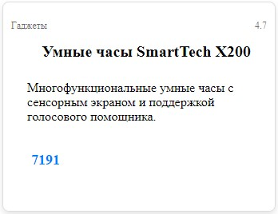

1. Создайте объект `user` с полями `name`, `age`, и `city`. Пользователь должен вводить значения с клавиатуры. Выведите информацию о пользователе в формате: `Пользователь: имя, возраст лет, город проживания`. Если возраст пользователя меньше 18 лет, добавьте к сообщению фразу: `(несовершеннолетний)`.

2. Создайте объект `product` с полями `title`, `price`, и `inStock` (логическое значение). Пользователь должен вводить значения с клавиатуры. Если пользователь ввел `да` для поля `inStock`, то записать `true`, иначе `false`. Выведите информацию о товаре в формате: `Название товара: title, цена: price руб., в наличии: да/нет`. Если товар не в наличии, выводите сообщение: `Товар закончился`.

3. Создайте объект `book` с произвольными свойствами (например, `название`, `автор`, `год` издания). Выведите на экран все ключи и значения объекта в формате: `Ключ: значение`. Используйте цикл для работы с объектом.

4. Создайте функцию `countProperties(obj)`, которая принимает объект и возвращает количество его свойств.

5. Создайте функцию `isEmpty(obj)`, которая проверяет, является ли объект пустым (не содержит свойств). Если объект пуст, функция возвращает `true`, иначе — `false`.

6. Создайте объект `user` с произвольными данными (например, `имя`, `возраст`, `город`). Напишите функцию `cloneObject(obj)`, которая создает глубокую копию объекта. Проверьте, что изменения в клоне не влияют на исходный объект.

7. Напишите функцию `removeProperty(obj, prop)`, которая удаляет свойство `prop` из объекта `obj`, если оно существует. Функция должна делать копию объекта и возвращать измененный объект.

8. Создайте функцию `renderTitle(obj)`, которая принимает объект. Если у объекта есть ключ `title`, возвращает строку: `<h2 class=${title}>Заголовок</h2>`. Если ключа нет, возвращает: `<h2 class=${title}>Неизвестный товар</h2>`.

9. Создайте функцию `renderDescription(obj)`, которая принимает объект. Если у объекта есть ключ `description`, возвращает строку: `<p class=${description}>Текст описания</p>`. Если ключа нет, возвращает: `<p class=${description}>Без описания</p>`.

10. Создайте функцию `renderPrice(obj)`, которая принимает объект. Если у объекта есть ключ price, возвращает строку: `<p class=${price}>Цена товара</p>`. Если ключа нет, возвращает: `<p class=${price}>Уточнить у продавца</p>`.

11. Создайте функцию `renderProduct(id, obj)`, которая принимает `ID` элемента и объект товара. Функция должна собирать HTML-разметку из объекта и вставлять в элемент `ID`. При реализации функции `renderProduct` используйте уже созданные функции.

    - При формировании цены учитывайте скидку в ключе объекта `discount`.
    - Функция не должна изменять передаваемый в нее объект.
    - Если ключ объекта `inStock` равен `false`, функция не должна рендерить карточку, а выводит сообщение в консоль: `Товар закончился`
    - Пример HTML-разметки:
      ```html
      <div class="card">
        <p class="category">Гаджеты</p>
        <h2 class="title">Умные часы SmartTech X200</h2>
        <p class="description">
          Многофункциональные умные часы с сенсорным экраном и поддержкой
          голосового помощника.
        </p>
        <p class="price">7191</p>
        <p class="rating">4.7</p>
      </div>
      ```
    - Пример объекта:
      ```javascript
      const product = {
        title: "Умные часы SmartTech X200",
        description:
          "Многофункциональные умные часы с сенсорным экраном и поддержкой голосового помощника.",
        price: 7990,
        category: "Гаджеты",
        rating: 4.7,
        inStock: true,
        discount: 10, // в процентах
      };
      ```

12. **Бонусное задание**. Создайте карточку с id `card` с помощью функции `renderProduct(id, obj)`. Сделайте стилизацию карточки похожую на пример ниже:


