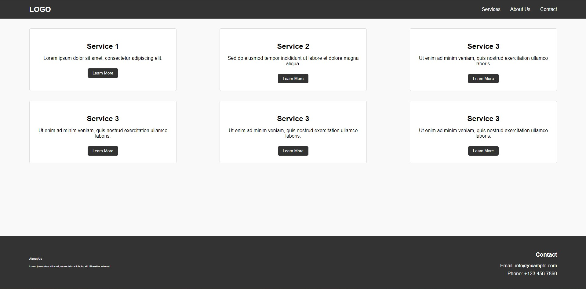
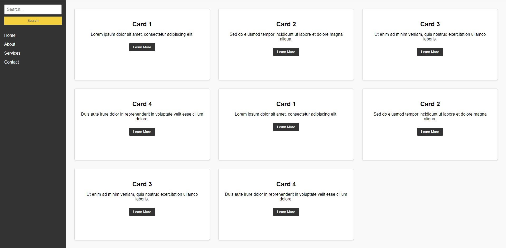
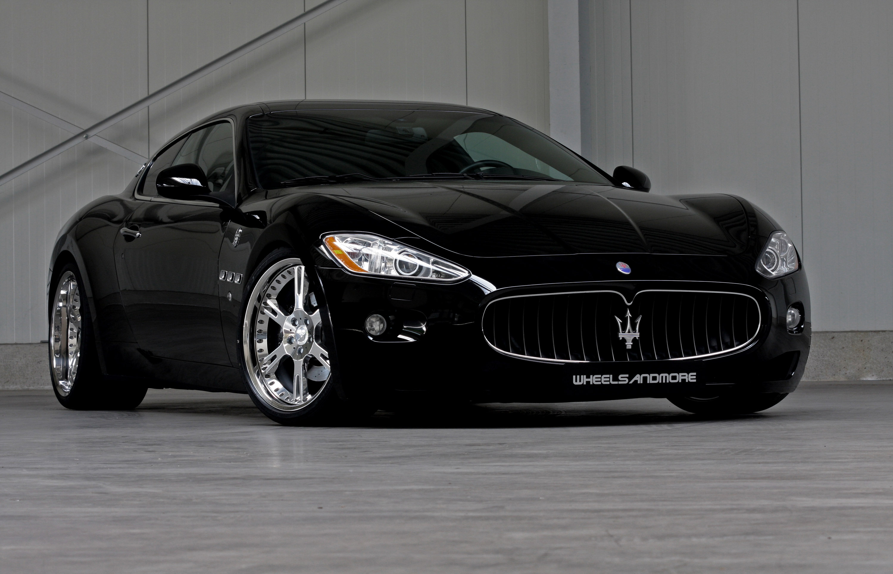
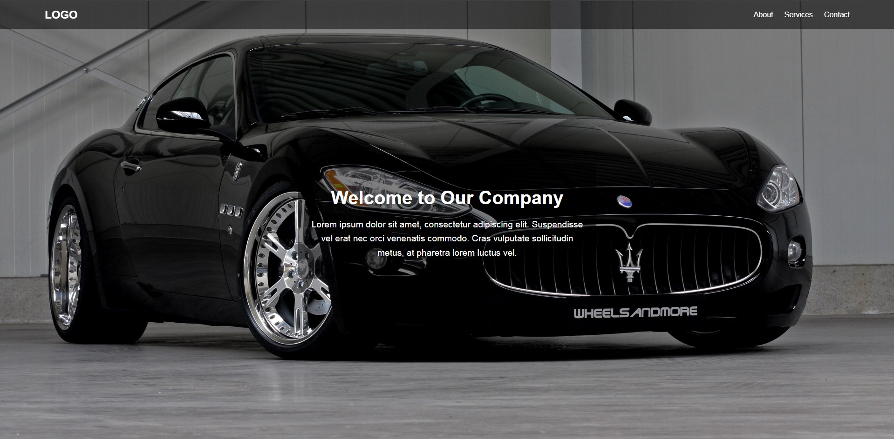

# Практика #1

## **Результат верстки**:



## **Подсказки**:

### Футтер будет прилипать к нижнему краю экрана

```css
body {
  display: flex;
  flex-direction: column;
  min-height: 100vh;
}

/* Контейнер с основным контентом */
main {
  flex: 1;
}

footer {
  margin-top: auto;
}
```

### Стилизация карточки

```css
.card {
  background-color: white;
  border: 1px solid #ddd;
  border-radius: 5px;
  padding: 1.5rem;
  text-align: center;
  flex-basis: 25%;
}
```

### Стилизация кнопки в карточке

```css
.card button {
  padding: 0.5rem 1rem;
  background-color: #333;
  color: white;
  border: none;
  border-radius: 5px;
  cursor: pointer;
  transition: background-color 0.3s;
}

.card button:hover {
  background-color: #555;
}
```

## **Разметка**:

```html
<body>
  <header class="header">
    <div class="container header-container">
      <div class="logo">LOGO</div>
      <nav class="navigation">
        <ul>
          <li><a href="#services">Services</a></li>
          <li><a href="#about">About Us</a></li>
          <li><a href="#contact">Contact</a></li>
        </ul>
      </nav>
    </div>
  </header>
  <main class="main">
    <div class="container main-container">
      <div class="card">
        <h2>Service 1</h2>
        <p>Lorem ipsum dolor sit amet, consectetur adipiscing elit.</p>
        <button>Learn More</button>
      </div>
      <div class="card">
        <h2>Service 2</h2>
        <p>
          Sed do eiusmod tempor incididunt ut labore et dolore magna aliqua.
        </p>
        <button>Learn More</button>
      </div>
      <div class="card">
        <h2>Service 3</h2>
        <p>
          Ut enim ad minim veniam, quis nostrud exercitation ullamco laboris.
        </p>
        <button>Learn More</button>
      </div>
      <div class="card">
        <h2>Service 4</h2>
        <p>
          Ut enim ad minim veniam, quis nostrud exercitation ullamco laboris.
        </p>
        <button>Learn More</button>
      </div>
      <div class="card">
        <h2>Service 5</h2>
        <p>
          Ut enim ad minim veniam, quis nostrud exercitation ullamco laboris.
        </p>
        <button>Learn More</button>
      </div>
      <div class="card">
        <h2>Service 6</h2>
        <p>
          Ut enim ad minim veniam, quis nostrud exercitation ullamco laboris.
        </p>
        <button>Learn More</button>
      </div>
    </div>
  </main>
  <footer class="footer">
    <div class="container footer-container">
      <div class="footer-about">
        <h3>About Us</h3>
        <p>
          Lorem ipsum dolor sit amet, consectetur adipiscing elit. Phasellus
          euismod.
        </p>
      </div>
      <div class="footer-contact">
        <h3>Contact</h3>
        <p>Email: info@example.com</p>
        <p>Phone: +123 456 7890</p>
      </div>
    </div>
  </footer>
</body>
```

## **Стилизация**:

```css
body {
  margin: 0;
  padding: 0;
  font-family: Arial, sans-serif;
  box-sizing: border-box;

  display: flex;
  flex-direction: column;
  min-height: 100vh;
}

ul {
  list-style: none;
  padding: 0;
  margin: 0;
}

a {
  text-decoration: none;
  color: black;
}

.container {
  width: 90%;
  margin: 0 auto;
}

.header {
  background-color: #333;
  color: white;
  padding: 1rem 0;
}

.header-container {
  display: flex;
  justify-content: space-between;
  align-items: center;
}

.logo {
  font-size: 1.5rem;
  font-weight: bold;
}

.navigation ul {
  display: flex;
  gap: 2rem;
}

.navigation a {
  color: white;
  font-size: 1rem;
  transition: color 0.3s;
}

.navigation a:hover {
  color: #f4d03f;
}

.main {
  flex: 1;
  padding: 2rem 0;
  background-color: #f9f9f9;
}

.main-container {
  display: flex;
  gap: 2rem;
  justify-content: space-between;
  flex-wrap: wrap;
}

.card {
  background-color: white;
  border: 1px solid #ddd;
  border-radius: 5px;
  padding: 1.5rem;
  text-align: center;
  flex-basis: 25%;
}

.card h2 {
  font-size: 1.5rem;
  margin-bottom: 1rem;
}

.card p {
  font-size: 1rem;
  margin-bottom: 1.5rem;
}

.card button {
  padding: 0.5rem 1rem;
  background-color: #333;
  color: white;
  border: none;
  border-radius: 5px;
  cursor: pointer;
  transition: background-color 0.3s;
}

.card button:hover {
  background-color: #555;
}

.footer {
  background-color: #333;
  color: white;
  padding: 2rem 0;
  margin-top: auto;
}

.footer-container {
  display: flex;
  justify-content: center;
  align-items: center;
  gap: 2rem;
}

.footer-about,
.footer-contact {
  flex: 1;
}

.footer .footer-about {
  font-size: 0.5em;
}

.footer .footer-contact {
  font-size: 1em;
  text-align: right;
}

.footer h3 {
  margin-bottom: 1rem;
}

.footer p {
  margin: 0.5rem 0;
}
```

# Практика #2

## **Результат верстки**:



## **Подсказки**:

### Стилизация input

```css
input {
  padding: 0.5rem;
  font-size: 1rem;
}
```

### Стилизация button в блоке с боковым меню

```css
button {
  padding: 0.5rem;
  background-color: #f4d03f;
  color: #333;
  border: none;
  cursor: pointer;
  transition: background-color 0.3s;
}

button:hover {
  background-color: #e2b90e;
}
```

### Стилизация карточки

```css
.card {
  background-color: white;
  border: 1px solid #ddd;
  border-radius: 5px;
  padding: 1.5rem;
  text-align: center;
  box-shadow: 0 2px 4px rgba(0, 0, 0, 0.1);
}
```

### Стилизация кнопки в карточке

```css
.card button {
  padding: 0.5rem 1rem;
  background-color: #333;
  color: white;
  border: none;
  border-radius: 5px;
  cursor: pointer;
  transition: background-color 0.3s;
}

.card button:hover {
  background-color: #555;
}
```

## **Разметка**:

```html
<body>
  <div class="grid-container">
    <!-- Sidebar -->
    <aside class="sidebar">
      <form class="search-form">
        <input type="text" placeholder="Search..." />
        <button type="button">Search</button>
      </form>
      <nav class="menu">
        <ul>
          <li><a href="#home">Home</a></li>
          <li><a href="#about">About</a></li>
          <li><a href="#services">Services</a></li>
          <li><a href="#contact">Contact</a></li>
        </ul>
      </nav>
    </aside>

    <!-- Main Content -->
    <main class="content">
      <div class="card">
        <h2>Card 1</h2>
        <p>Lorem ipsum dolor sit amet, consectetur adipiscing elit.</p>
        <button>Learn More</button>
      </div>
      <div class="card">
        <h2>Card 2</h2>
        <p>
          Sed do eiusmod tempor incididunt ut labore et dolore magna aliqua.
        </p>
        <button>Learn More</button>
      </div>
      <div class="card">
        <h2>Card 3</h2>
        <p>
          Ut enim ad minim veniam, quis nostrud exercitation ullamco laboris.
        </p>
        <button>Learn More</button>
      </div>
      <div class="card">
        <h2>Card 4</h2>
        <p>
          Duis aute irure dolor in reprehenderit in voluptate velit esse cillum
          dolore.
        </p>
        <button>Learn More</button>
      </div>

      <div class="card">
        <h2>Card 5</h2>
        <p>Lorem ipsum dolor sit amet, consectetur adipiscing elit.</p>
        <button>Learn More</button>
      </div>
      <div class="card">
        <h2>Card 6</h2>
        <p>
          Sed do eiusmod tempor incididunt ut labore et dolore magna aliqua.
        </p>
        <button>Learn More</button>
      </div>
      <div class="card">
        <h2>Card 7</h2>
        <p>
          Ut enim ad minim veniam, quis nostrud exercitation ullamco laboris.
        </p>
        <button>Learn More</button>
      </div>
      <div class="card">
        <h2>Card 8</h2>
        <p>
          Duis aute irure dolor in reprehenderit in voluptate velit esse cillum
          dolore.
        </p>
        <button>Learn More</button>
      </div>
    </main>
  </div>
</body>
```

## **Стилизация**:

```css
body {
  margin: 0;
  padding: 0;
  font-family: Arial, sans-serif;
  box-sizing: border-box;
}

a {
  text-decoration: none;
  color: black;
}

ul {
  list-style: none;
  padding: 0;
  margin: 0;
}

.grid-container {
  display: grid;
  grid-template-columns: 250px 1fr;
  height: 100vh;
}

.sidebar {
  background-color: #333;
  color: white;
  padding: 1rem;
  display: flex;
  flex-direction: column;
  gap: 2rem;
}

.search-form {
  display: flex;
  flex-direction: column;
  gap: 0.5rem;
}

.search-form input {
  padding: 0.5rem;
  font-size: 1rem;
}

.search-form button {
  padding: 0.5rem;
  background-color: #f4d03f;
  color: #333;
  border: none;
  cursor: pointer;
  transition: background-color 0.3s;
}

.search-form button:hover {
  background-color: #e2b90e;
}

.menu ul {
  display: flex;
  flex-direction: column;
  gap: 1rem;
}

.menu a {
  color: white;
  font-size: 1rem;
}

.menu a:hover {
  text-decoration: underline;
}

.content {
  display: grid;
  grid-template-columns: repeat(3, minmax(250px, 1fr));
  gap: 2rem;
  padding: 2rem;
  background-color: #f9f9f9;
}

.card {
  background-color: white;
  border: 1px solid #ddd;
  border-radius: 5px;
  padding: 1.5rem;
  text-align: center;
  box-shadow: 0 2px 4px rgba(0, 0, 0, 0.1);
}

.card h2 {
  font-size: 1.5rem;
  margin-bottom: 1rem;
}

.card p {
  font-size: 1rem;
  margin-bottom: 1.5rem;
}

.card button {
  padding: 0.5rem 1rem;
  background-color: #333;
  color: white;
  border: none;
  border-radius: 5px;
  cursor: pointer;
  transition: background-color 0.3s;
}

.card button:hover {
  background-color: #555;
}

@media (max-width: 768px) {
  .grid-container {
    grid-template-columns: 1fr;
  }

  .sidebar {
    grid-row: 1;
  }
}
```

# Практика #3

## Картинка для фона



## **Результат верстки**:



## **Разметка**:

```html
<body>
  <header class="header">
    <div class="container header-container">
      <div class="logo">LOGO</div>
      <nav class="navigation">
        <ul>
          <li><a href="#about">About</a></li>
          <li><a href="#services">Services</a></li>
          <li><a href="#contact">Contact</a></li>
        </ul>
      </nav>
    </div>
  </header>
  <section id="about" class="about">
    <div class="about-content">
      <h1>Welcome to Our Company</h1>
      <p>
        Lorem ipsum dolor sit amet, consectetur adipiscing elit. Suspendisse vel
        erat nec orci venenatis commodo. Cras vulputate sollicitudin metus, at
        pharetra lorem luctus vel.
      </p>
    </div>
  </section>
</body>
```

## **Стилизация**:

```css
body {
  margin: 0;
  padding: 0;
  font-family: Arial, sans-serif;
  box-sizing: border-box;
  display: flex;
  flex-direction: column;
  min-height: 100vh;
}

ul {
  list-style: none;
  padding: 0;
  margin: 0;
}

a {
  text-decoration: none;
  color: white;
}

.container {
  width: 90%;
  margin: 0 auto;
}

.header {
  position: fixed;
  top: 0;
  left: 0;
  width: 100%;
  display: flex;
  justify-content: center;
  background-color: rgba(0, 0, 0, 0.5);
  padding: 1rem 0;
  z-index: 10;
}

.header-container {
  display: flex;
  justify-content: space-between;
  align-items: center;
}

.logo {
  font-size: 1.5rem;
  font-weight: bold;
  color: white;
}

.navigation ul {
  display: flex;
  gap: 1.5rem;
}

.navigation a {
  font-size: 1rem;
  transition: color 0.3s ease;
}

.navigation a:hover {
  color: #f4d03f;
}

.about {
  flex: 1;
  display: flex;
  flex-direction: column;
  justify-content: space-around;
  align-items: center;
  height: 100vh;
  background-image: url("img/background.jpg");
  background-size: cover;
  background-position: center;
  color: white;
  text-align: center;
  padding: 2rem;
}

.about-content {
  background-color: rgba(0, 0, 0, 0.5);
  border-radius: 10px;
  max-width: 600px;
  padding: 20px;
}

.about h1 {
  font-size: 2.5rem;
  margin-bottom: 1rem;
  text-shadow: 0 2px 0 0px hsl(330, 100%, 25%);
}

.about p {
  font-size: 1.2rem;
  line-height: 1.6;
  text-shadow: 0 2px 0 0px hsl(330, 100%, 25%);
}
```
