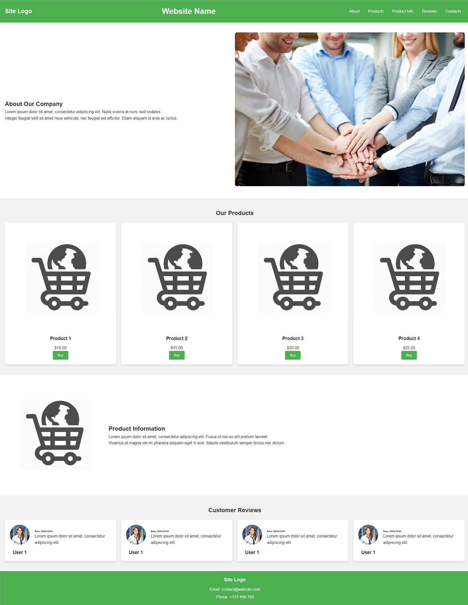

# Практика

## **Результат верстки**:



## Картинки для проекта:

- 
- 
- 

## **Разметка**:

```html
<body>
  <header>
    <div class="logo">Site Logo</div>
    <h1 class="site-title">Website Name</h1>
    <nav class="navigation">
      <a href="#about">About</a>
      <a href="#products">Products</a>
      <a href="#product-info">Product Info</a>
      <a href="#reviews">Reviews</a>
      <a href="#footer">Contacts</a>
    </nav>
  </header>
  <main>
    <section id="about" class="about">
      <div class="about-description">
        <h2>About Our Company</h2>
        <p>
          Lorem ipsum dolor sit amet, consectetur adipiscing elit. Nulla viverra
          at nunc sed sodales.
        </p>
        <p>
          Integer feugiat velit sit amet risus vehicula, nec feugiat est
          efficitur. Etiam aliquam id eros ac luctus.
        </p>
      </div>
      <div class="about-image">
        
      </div>
    </section>
    <section id="products" class="products">
      <h2>Our Products</h2>
      <div class="product-grid">
        <div class="product-card">
          
          <h3>Product 1</h3>
          <p>$10.00</p>
          <button>Buy</button>
        </div>
        <div class="product-card">
          
          <h3>Product 2</h3>
          <p>$15.00</p>
          <button>Buy</button>
        </div>
        <div class="product-card">
          
          <h3>Product 3</h3>
          <p>$20.00</p>
          <button>Buy</button>
        </div>
        <div class="product-card">
          
          <h3>Product 4</h3>
          <p>$25.00</p>
          <button>Buy</button>
        </div>
      </div>
    </section>
    <section id="product-info" class="product-info">
      <div class="product-info-image">
        
      </div>
      <div class="product-info-description">
        <h2>Product Information</h2>
        <p>
          Lorem ipsum dolor sit amet, consectetur adipiscing elit. Fusce ut nisi
          eu elit pretium laoreet.
        </p>
        <p>
          Vivamus at magna vel mi pharetra aliquam eget in erat. Mauris
          vestibulum semper lectus nec dictum.
        </p>
      </div>
    </section>
    <section id="reviews" class="reviews">
      <h2>Customer Reviews</h2>
      <div class="review-grid">
        <div class="review-card">
          <div class="review-user">
            
            <h3>User 1</h3>
          </div>
          <div class="review-info">
            <p class="date">Date: 2024-12-01</p>
            <p class="review">
              Lorem ipsum dolor sit amet, consectetur adipiscing elit.
            </p>
          </div>
        </div>

        <div class="review-card">
          <div class="review-user">
            
            <h3>User 1</h3>
          </div>
          <div class="review-info">
            <p class="date">Date: 2024-12-01</p>
            <p class="review">
              Lorem ipsum dolor sit amet, consectetur adipiscing elit.
            </p>
          </div>
        </div>

        <div class="review-card">
          <div class="review-user">
            
            <h3>User 1</h3>
          </div>
          <div class="review-info">
            <p class="date">Date: 2024-12-01</p>
            <p class="review">
              Lorem ipsum dolor sit amet, consectetur adipiscing elit.
            </p>
          </div>
        </div>

        <div class="review-card">
          <div class="review-user">
            
            <h3>User 1</h3>
          </div>
          <div class="review-info">
            <p class="date">Date: 2024-12-01</p>
            <p class="review">
              Lorem ipsum dolor sit amet, consectetur adipiscing elit.
            </p>
          </div>
        </div>
      </div>
    </section>
  </main>
  <footer id="footer">
    <div class="footer-logo">Site Logo</div>
    <div class="footer-contacts">
      <p>Email: contact@website.com</p>
      <p>Phone: +123 456 789</p>
    </div>
  </footer>
</body>
```

## **Стилизация**:

```css
/* General Reset */
* {
  margin: 0;
  padding: 0;
  box-sizing: border-box;
}
body {
  font-family: Arial, sans-serif;
  line-height: 1.6;
  color: #333;
  background-color: #f9f9f9;
}

/* Header */
header {
  display: flex;
  align-items: center;
  justify-content: space-between;
  padding: 20px;
  background-color: #4caf50;
  color: white;
}
header .logo {
  font-size: 1.5em;
  font-weight: bold;
}
header .navigation a {
  margin: 0 15px;
  text-decoration: none;
  color: white;
}
header .navigation a:hover {
  text-decoration: underline;
}

/* About Section */
.about {
  display: grid;
  grid-template-columns: 1fr 1fr;
  align-items: center;
  padding: 40px 20px;
  background-color: #ffffff;
}
.about-description {
  padding-right: 20px;
}
.about-image img {
  width: 100%;
  border-radius: 8px;
}

/* Products Section */
.products {
  padding: 40px 20px;
  background-color: #f1f1f1;
}
.products h2 {
  text-align: center;
  margin-bottom: 20px;
}
.product-grid {
  display: grid;
  grid-template-columns: repeat(auto-fit, minmax(200px, 1fr));
  gap: 20px;
}
.product-card {
  background-color: #ffffff;
  padding: 20px;
  text-align: center;
  border-radius: 8px;
  box-shadow: 0 4px 6px rgba(0, 0, 0, 0.1);
}
.product-card img {
  max-width: 100%;
  height: auto;
  border-radius: 8px;
}
.product-card h3 {
  margin: 15px 0 10px;
}
.product-card button {
  padding: 10px 20px;
  background-color: #4caf50;
  color: white;
  border: none;
  border-radius: 4px;
  cursor: pointer;
}
.product-card button:hover {
  background-color: #45a049;
}

/* Product Info Section */
.product-info {
  display: flex;
  align-items: center;
  padding: 40px 20px;
  background-color: #ffffff;
}
.product-info-image img {
  width: 100%;
  max-width: 400px;
  border-radius: 8px;
}
.product-info-description {
  flex: 1;
  padding-left: 20px;
}

/* Reviews Section */
.reviews {
  padding: 40px 20px;
  background-color: #f1f1f1;
}
.reviews h2 {
  text-align: center;
  margin-bottom: 20px;
}
.review-grid {
  display: grid;
  grid-template-columns: repeat(auto-fit, minmax(200px, 1fr));
  gap: 20px;
}
.review-card {
  display: flex;
  background-color: #ffffff;
  padding: 20px;
  text-align: center;
  border-radius: 8px;
  box-shadow: 0 4px 6px rgba(0, 0, 0, 0.1);
}
.review-card img {
  width: 80px;
  height: 80px;
  border-radius: 50%;
  margin-bottom: 10px;
}
.review-card .review-info {
  text-align: start;
  padding: 5%;
}
.review-card .review-info .date {
  font-weight: 900;
  font-size: 0.5rem;
}

/* Footer */
footer {
  padding: 20px;
  background-color: #4caf50;
  color: white;
  text-align: center;
}
footer .footer-logo {
  font-size: 1.2em;
  font-weight: bold;
  margin-bottom: 10px;
}
footer .footer-contacts p {
  margin: 5px 0;
}
```
